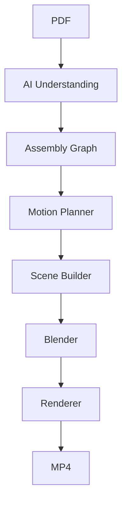

# Enterprise Overview


**Azure AI Universal Assembly Video Generator**

Enterprise Master Architecture & Handover Document

Version: 2.0

Purpose:
This document is intended to be the definitive architectural specification and project handover for the Azure AI Universal Assembly Video Generator. It consolidates the project's vision, architecture, implementation details, engineering decisions, roadmap, and future development guidance into a single document.

The project aims to accept any assembly or instruction manual, understand it using Azure AI, construct a universal assembly representation, generate a Blender animation, and render a professional instructional video.


# Project Vision

Explain the motivation, UK career portfolio goals, universal rather than template-based design, Azure-first architecture, and long-term objective of building a production-grade AI assembly platform.

Explain the motivation, UK career portfolio goals, universal rather than template-based design, Azure-first architecture, and long-term objective of building a production-grade AI assembly platform.

Explain the motivation, UK career portfolio goals, universal rather than template-based design, Azure-first architecture, and long-term objective of building a production-grade AI assembly platform.

Explain the motivation, UK career portfolio goals, universal rather than template-based design, Azure-first architecture, and long-term objective of building a production-grade AI assembly platform.

Explain the motivation, UK career portfolio goals, universal rather than template-based design, Azure-first architecture, and long-term objective of building a production-grade AI assembly platform.

Explain the motivation, UK career portfolio goals, universal rather than template-based design, Azure-first architecture, and long-term objective of building a production-grade AI assembly platform.

Explain the motivation, UK career portfolio goals, universal rather than template-based design, Azure-first architecture, and long-term objective of building a production-grade AI assembly platform.

Explain the motivation, UK career portfolio goals, universal rather than template-based design, Azure-first architecture, and long-term objective of building a production-grade AI assembly platform.

Explain the motivation, UK career portfolio goals, universal rather than template-based design, Azure-first architecture, and long-term objective of building a production-grade AI assembly platform.

Explain the motivation, UK career portfolio goals, universal rather than template-based design, Azure-first architecture, and long-term objective of building a production-grade AI assembly platform.


# Business Motivation

Discuss industrial use cases, furniture, appliances, toys, DIY kits, manufacturing, training, after-sales support, multilingual deployment.

Discuss industrial use cases, furniture, appliances, toys, DIY kits, manufacturing, training, after-sales support, multilingual deployment.

Discuss industrial use cases, furniture, appliances, toys, DIY kits, manufacturing, training, after-sales support, multilingual deployment.

Discuss industrial use cases, furniture, appliances, toys, DIY kits, manufacturing, training, after-sales support, multilingual deployment.

Discuss industrial use cases, furniture, appliances, toys, DIY kits, manufacturing, training, after-sales support, multilingual deployment.

Discuss industrial use cases, furniture, appliances, toys, DIY kits, manufacturing, training, after-sales support, multilingual deployment.

Discuss industrial use cases, furniture, appliances, toys, DIY kits, manufacturing, training, after-sales support, multilingual deployment.

Discuss industrial use cases, furniture, appliances, toys, DIY kits, manufacturing, training, after-sales support, multilingual deployment.

Discuss industrial use cases, furniture, appliances, toys, DIY kits, manufacturing, training, after-sales support, multilingual deployment.

Discuss industrial use cases, furniture, appliances, toys, DIY kits, manufacturing, training, after-sales support, multilingual deployment.


# Architecture

Describe layered architecture: ingestion, understanding, reasoning, planning, scene generation, animation, rendering, delivery.

Describe layered architecture: ingestion, understanding, reasoning, planning, scene generation, animation, rendering, delivery.

Describe layered architecture: ingestion, understanding, reasoning, planning, scene generation, animation, rendering, delivery.

Describe layered architecture: ingestion, understanding, reasoning, planning, scene generation, animation, rendering, delivery.

Describe layered architecture: ingestion, understanding, reasoning, planning, scene generation, animation, rendering, delivery.

Describe layered architecture: ingestion, understanding, reasoning, planning, scene generation, animation, rendering, delivery.

Describe layered architecture: ingestion, understanding, reasoning, planning, scene generation, animation, rendering, delivery.

Describe layered architecture: ingestion, understanding, reasoning, planning, scene generation, animation, rendering, delivery.

Describe layered architecture: ingestion, understanding, reasoning, planning, scene generation, animation, rendering, delivery.

Describe layered architecture: ingestion, understanding, reasoning, planning, scene generation, animation, rendering, delivery.

Describe layered architecture: ingestion, understanding, reasoning, planning, scene generation, animation, rendering, delivery.

Describe layered architecture: ingestion, understanding, reasoning, planning, scene generation, animation, rendering, delivery.

Describe layered architecture: ingestion, understanding, reasoning, planning, scene generation, animation, rendering, delivery.

Describe layered architecture: ingestion, understanding, reasoning, planning, scene generation, animation, rendering, delivery.

Describe layered architecture: ingestion, understanding, reasoning, planning, scene generation, animation, rendering, delivery.

Describe layered architecture: ingestion, understanding, reasoning, planning, scene generation, animation, rendering, delivery.

Describe layered architecture: ingestion, understanding, reasoning, planning, scene generation, animation, rendering, delivery.

Describe layered architecture: ingestion, understanding, reasoning, planning, scene generation, animation, rendering, delivery.

Describe layered architecture: ingestion, understanding, reasoning, planning, scene generation, animation, rendering, delivery.

Describe layered architecture: ingestion, understanding, reasoning, planning, scene generation, animation, rendering, delivery.


# Folder Structure

Document every major folder and coding convention.

Document every major folder and coding convention.

Document every major folder and coding convention.

Document every major folder and coding convention.

Document every major folder and coding convention.

Document every major folder and coding convention.

Document every major folder and coding convention.

Document every major folder and coding convention.

Document every major folder and coding convention.

Document every major folder and coding convention.

Document every major folder and coding convention.

Document every major folder and coding convention.

Document every major folder and coding convention.

Document every major folder and coding convention.

Document every major folder and coding convention.


# Agents

Describe Manual Agent, Page Classifier, Parts Agent, Tools Agent, Dimension Agent, Assembly Agent, Canonical Resolver, Object Identity Tracker, Universal Assembly Graph Builder, Motion Planner, Scene Generator, Blender Generator, Renderer, Narration Agent, QA Agent.

Describe Manual Agent, Page Classifier, Parts Agent, Tools Agent, Dimension Agent, Assembly Agent, Canonical Resolver, Object Identity Tracker, Universal Assembly Graph Builder, Motion Planner, Scene Generator, Blender Generator, Renderer, Narration Agent, QA Agent.

Describe Manual Agent, Page Classifier, Parts Agent, Tools Agent, Dimension Agent, Assembly Agent, Canonical Resolver, Object Identity Tracker, Universal Assembly Graph Builder, Motion Planner, Scene Generator, Blender Generator, Renderer, Narration Agent, QA Agent.

Describe Manual Agent, Page Classifier, Parts Agent, Tools Agent, Dimension Agent, Assembly Agent, Canonical Resolver, Object Identity Tracker, Universal Assembly Graph Builder, Motion Planner, Scene Generator, Blender Generator, Renderer, Narration Agent, QA Agent.

Describe Manual Agent, Page Classifier, Parts Agent, Tools Agent, Dimension Agent, Assembly Agent, Canonical Resolver, Object Identity Tracker, Universal Assembly Graph Builder, Motion Planner, Scene Generator, Blender Generator, Renderer, Narration Agent, QA Agent.

Describe Manual Agent, Page Classifier, Parts Agent, Tools Agent, Dimension Agent, Assembly Agent, Canonical Resolver, Object Identity Tracker, Universal Assembly Graph Builder, Motion Planner, Scene Generator, Blender Generator, Renderer, Narration Agent, QA Agent.

Describe Manual Agent, Page Classifier, Parts Agent, Tools Agent, Dimension Agent, Assembly Agent, Canonical Resolver, Object Identity Tracker, Universal Assembly Graph Builder, Motion Planner, Scene Generator, Blender Generator, Renderer, Narration Agent, QA Agent.

Describe Manual Agent, Page Classifier, Parts Agent, Tools Agent, Dimension Agent, Assembly Agent, Canonical Resolver, Object Identity Tracker, Universal Assembly Graph Builder, Motion Planner, Scene Generator, Blender Generator, Renderer, Narration Agent, QA Agent.

Describe Manual Agent, Page Classifier, Parts Agent, Tools Agent, Dimension Agent, Assembly Agent, Canonical Resolver, Object Identity Tracker, Universal Assembly Graph Builder, Motion Planner, Scene Generator, Blender Generator, Renderer, Narration Agent, QA Agent.

Describe Manual Agent, Page Classifier, Parts Agent, Tools Agent, Dimension Agent, Assembly Agent, Canonical Resolver, Object Identity Tracker, Universal Assembly Graph Builder, Motion Planner, Scene Generator, Blender Generator, Renderer, Narration Agent, QA Agent.

Describe Manual Agent, Page Classifier, Parts Agent, Tools Agent, Dimension Agent, Assembly Agent, Canonical Resolver, Object Identity Tracker, Universal Assembly Graph Builder, Motion Planner, Scene Generator, Blender Generator, Renderer, Narration Agent, QA Agent.

Describe Manual Agent, Page Classifier, Parts Agent, Tools Agent, Dimension Agent, Assembly Agent, Canonical Resolver, Object Identity Tracker, Universal Assembly Graph Builder, Motion Planner, Scene Generator, Blender Generator, Renderer, Narration Agent, QA Agent.

Describe Manual Agent, Page Classifier, Parts Agent, Tools Agent, Dimension Agent, Assembly Agent, Canonical Resolver, Object Identity Tracker, Universal Assembly Graph Builder, Motion Planner, Scene Generator, Blender Generator, Renderer, Narration Agent, QA Agent.

Describe Manual Agent, Page Classifier, Parts Agent, Tools Agent, Dimension Agent, Assembly Agent, Canonical Resolver, Object Identity Tracker, Universal Assembly Graph Builder, Motion Planner, Scene Generator, Blender Generator, Renderer, Narration Agent, QA Agent.

Describe Manual Agent, Page Classifier, Parts Agent, Tools Agent, Dimension Agent, Assembly Agent, Canonical Resolver, Object Identity Tracker, Universal Assembly Graph Builder, Motion Planner, Scene Generator, Blender Generator, Renderer, Narration Agent, QA Agent.

Describe Manual Agent, Page Classifier, Parts Agent, Tools Agent, Dimension Agent, Assembly Agent, Canonical Resolver, Object Identity Tracker, Universal Assembly Graph Builder, Motion Planner, Scene Generator, Blender Generator, Renderer, Narration Agent, QA Agent.

Describe Manual Agent, Page Classifier, Parts Agent, Tools Agent, Dimension Agent, Assembly Agent, Canonical Resolver, Object Identity Tracker, Universal Assembly Graph Builder, Motion Planner, Scene Generator, Blender Generator, Renderer, Narration Agent, QA Agent.

Describe Manual Agent, Page Classifier, Parts Agent, Tools Agent, Dimension Agent, Assembly Agent, Canonical Resolver, Object Identity Tracker, Universal Assembly Graph Builder, Motion Planner, Scene Generator, Blender Generator, Renderer, Narration Agent, QA Agent.

Describe Manual Agent, Page Classifier, Parts Agent, Tools Agent, Dimension Agent, Assembly Agent, Canonical Resolver, Object Identity Tracker, Universal Assembly Graph Builder, Motion Planner, Scene Generator, Blender Generator, Renderer, Narration Agent, QA Agent.

Describe Manual Agent, Page Classifier, Parts Agent, Tools Agent, Dimension Agent, Assembly Agent, Canonical Resolver, Object Identity Tracker, Universal Assembly Graph Builder, Motion Planner, Scene Generator, Blender Generator, Renderer, Narration Agent, QA Agent.


# JSON Contracts

Explain every JSON artifact, schemas, versioning, validation philosophy, interoperability.

Explain every JSON artifact, schemas, versioning, validation philosophy, interoperability.

Explain every JSON artifact, schemas, versioning, validation philosophy, interoperability.

Explain every JSON artifact, schemas, versioning, validation philosophy, interoperability.

Explain every JSON artifact, schemas, versioning, validation philosophy, interoperability.

Explain every JSON artifact, schemas, versioning, validation philosophy, interoperability.

Explain every JSON artifact, schemas, versioning, validation philosophy, interoperability.

Explain every JSON artifact, schemas, versioning, validation philosophy, interoperability.

Explain every JSON artifact, schemas, versioning, validation philosophy, interoperability.

Explain every JSON artifact, schemas, versioning, validation philosophy, interoperability.

Explain every JSON artifact, schemas, versioning, validation philosophy, interoperability.

Explain every JSON artifact, schemas, versioning, validation philosophy, interoperability.

Explain every JSON artifact, schemas, versioning, validation philosophy, interoperability.

Explain every JSON artifact, schemas, versioning, validation philosophy, interoperability.

Explain every JSON artifact, schemas, versioning, validation philosophy, interoperability.

Explain every JSON artifact, schemas, versioning, validation philosophy, interoperability.

Explain every JSON artifact, schemas, versioning, validation philosophy, interoperability.

Explain every JSON artifact, schemas, versioning, validation philosophy, interoperability.

Explain every JSON artifact, schemas, versioning, validation philosophy, interoperability.

Explain every JSON artifact, schemas, versioning, validation philosophy, interoperability.


# Universal Assembly Graph

Describe nodes, edges, constraints, dependencies, graph traversal, replayability, extensibility.

Describe nodes, edges, constraints, dependencies, graph traversal, replayability, extensibility.

Describe nodes, edges, constraints, dependencies, graph traversal, replayability, extensibility.

Describe nodes, edges, constraints, dependencies, graph traversal, replayability, extensibility.

Describe nodes, edges, constraints, dependencies, graph traversal, replayability, extensibility.

Describe nodes, edges, constraints, dependencies, graph traversal, replayability, extensibility.

Describe nodes, edges, constraints, dependencies, graph traversal, replayability, extensibility.

Describe nodes, edges, constraints, dependencies, graph traversal, replayability, extensibility.

Describe nodes, edges, constraints, dependencies, graph traversal, replayability, extensibility.

Describe nodes, edges, constraints, dependencies, graph traversal, replayability, extensibility.

Describe nodes, edges, constraints, dependencies, graph traversal, replayability, extensibility.

Describe nodes, edges, constraints, dependencies, graph traversal, replayability, extensibility.

Describe nodes, edges, constraints, dependencies, graph traversal, replayability, extensibility.

Describe nodes, edges, constraints, dependencies, graph traversal, replayability, extensibility.

Describe nodes, edges, constraints, dependencies, graph traversal, replayability, extensibility.

Describe nodes, edges, constraints, dependencies, graph traversal, replayability, extensibility.

Describe nodes, edges, constraints, dependencies, graph traversal, replayability, extensibility.

Describe nodes, edges, constraints, dependencies, graph traversal, replayability, extensibility.

Describe nodes, edges, constraints, dependencies, graph traversal, replayability, extensibility.

Describe nodes, edges, constraints, dependencies, graph traversal, replayability, extensibility.

Describe nodes, edges, constraints, dependencies, graph traversal, replayability, extensibility.

Describe nodes, edges, constraints, dependencies, graph traversal, replayability, extensibility.

Describe nodes, edges, constraints, dependencies, graph traversal, replayability, extensibility.

Describe nodes, edges, constraints, dependencies, graph traversal, replayability, extensibility.

Describe nodes, edges, constraints, dependencies, graph traversal, replayability, extensibility.


# Canonical Resolver

Describe identity normalization algorithms, aliases, confidence scoring, duplicate prevention.

Describe identity normalization algorithms, aliases, confidence scoring, duplicate prevention.

Describe identity normalization algorithms, aliases, confidence scoring, duplicate prevention.

Describe identity normalization algorithms, aliases, confidence scoring, duplicate prevention.

Describe identity normalization algorithms, aliases, confidence scoring, duplicate prevention.

Describe identity normalization algorithms, aliases, confidence scoring, duplicate prevention.

Describe identity normalization algorithms, aliases, confidence scoring, duplicate prevention.

Describe identity normalization algorithms, aliases, confidence scoring, duplicate prevention.

Describe identity normalization algorithms, aliases, confidence scoring, duplicate prevention.

Describe identity normalization algorithms, aliases, confidence scoring, duplicate prevention.

Describe identity normalization algorithms, aliases, confidence scoring, duplicate prevention.

Describe identity normalization algorithms, aliases, confidence scoring, duplicate prevention.

Describe identity normalization algorithms, aliases, confidence scoring, duplicate prevention.

Describe identity normalization algorithms, aliases, confidence scoring, duplicate prevention.

Describe identity normalization algorithms, aliases, confidence scoring, duplicate prevention.

Describe identity normalization algorithms, aliases, confidence scoring, duplicate prevention.

Describe identity normalization algorithms, aliases, confidence scoring, duplicate prevention.

Describe identity normalization algorithms, aliases, confidence scoring, duplicate prevention.


# Object Identity Tracker

Lifecycle, immutable IDs, parent-child relationships, transforms, history.

Lifecycle, immutable IDs, parent-child relationships, transforms, history.

Lifecycle, immutable IDs, parent-child relationships, transforms, history.

Lifecycle, immutable IDs, parent-child relationships, transforms, history.

Lifecycle, immutable IDs, parent-child relationships, transforms, history.

Lifecycle, immutable IDs, parent-child relationships, transforms, history.

Lifecycle, immutable IDs, parent-child relationships, transforms, history.

Lifecycle, immutable IDs, parent-child relationships, transforms, history.

Lifecycle, immutable IDs, parent-child relationships, transforms, history.

Lifecycle, immutable IDs, parent-child relationships, transforms, history.

Lifecycle, immutable IDs, parent-child relationships, transforms, history.

Lifecycle, immutable IDs, parent-child relationships, transforms, history.

Lifecycle, immutable IDs, parent-child relationships, transforms, history.

Lifecycle, immutable IDs, parent-child relationships, transforms, history.

Lifecycle, immutable IDs, parent-child relationships, transforms, history.

Lifecycle, immutable IDs, parent-child relationships, transforms, history.

Lifecycle, immutable IDs, parent-child relationships, transforms, history.

Lifecycle, immutable IDs, parent-child relationships, transforms, history.


# Geometry Generation

Current primitive generation, future mesh reconstruction, CAD reasoning.

Current primitive generation, future mesh reconstruction, CAD reasoning.

Current primitive generation, future mesh reconstruction, CAD reasoning.

Current primitive generation, future mesh reconstruction, CAD reasoning.

Current primitive generation, future mesh reconstruction, CAD reasoning.

Current primitive generation, future mesh reconstruction, CAD reasoning.

Current primitive generation, future mesh reconstruction, CAD reasoning.

Current primitive generation, future mesh reconstruction, CAD reasoning.

Current primitive generation, future mesh reconstruction, CAD reasoning.

Current primitive generation, future mesh reconstruction, CAD reasoning.

Current primitive generation, future mesh reconstruction, CAD reasoning.

Current primitive generation, future mesh reconstruction, CAD reasoning.

Current primitive generation, future mesh reconstruction, CAD reasoning.

Current primitive generation, future mesh reconstruction, CAD reasoning.

Current primitive generation, future mesh reconstruction, CAD reasoning.

Current primitive generation, future mesh reconstruction, CAD reasoning.

Current primitive generation, future mesh reconstruction, CAD reasoning.

Current primitive generation, future mesh reconstruction, CAD reasoning.

Current primitive generation, future mesh reconstruction, CAD reasoning.

Current primitive generation, future mesh reconstruction, CAD reasoning.


# Scene Layout

Exploded views, spacing, coordinate systems, workbench model, collision avoidance.

Exploded views, spacing, coordinate systems, workbench model, collision avoidance.

Exploded views, spacing, coordinate systems, workbench model, collision avoidance.

Exploded views, spacing, coordinate systems, workbench model, collision avoidance.

Exploded views, spacing, coordinate systems, workbench model, collision avoidance.

Exploded views, spacing, coordinate systems, workbench model, collision avoidance.

Exploded views, spacing, coordinate systems, workbench model, collision avoidance.

Exploded views, spacing, coordinate systems, workbench model, collision avoidance.

Exploded views, spacing, coordinate systems, workbench model, collision avoidance.

Exploded views, spacing, coordinate systems, workbench model, collision avoidance.

Exploded views, spacing, coordinate systems, workbench model, collision avoidance.

Exploded views, spacing, coordinate systems, workbench model, collision avoidance.

Exploded views, spacing, coordinate systems, workbench model, collision avoidance.

Exploded views, spacing, coordinate systems, workbench model, collision avoidance.

Exploded views, spacing, coordinate systems, workbench model, collision avoidance.

Exploded views, spacing, coordinate systems, workbench model, collision avoidance.

Exploded views, spacing, coordinate systems, workbench model, collision avoidance.

Exploded views, spacing, coordinate systems, workbench model, collision avoidance.

Exploded views, spacing, coordinate systems, workbench model, collision avoidance.

Exploded views, spacing, coordinate systems, workbench model, collision avoidance.


# Motion Planner

Interpolation, insertion vectors, rotations, easing, constraints, future physics.

Interpolation, insertion vectors, rotations, easing, constraints, future physics.

Interpolation, insertion vectors, rotations, easing, constraints, future physics.

Interpolation, insertion vectors, rotations, easing, constraints, future physics.

Interpolation, insertion vectors, rotations, easing, constraints, future physics.

Interpolation, insertion vectors, rotations, easing, constraints, future physics.

Interpolation, insertion vectors, rotations, easing, constraints, future physics.

Interpolation, insertion vectors, rotations, easing, constraints, future physics.

Interpolation, insertion vectors, rotations, easing, constraints, future physics.

Interpolation, insertion vectors, rotations, easing, constraints, future physics.

Interpolation, insertion vectors, rotations, easing, constraints, future physics.

Interpolation, insertion vectors, rotations, easing, constraints, future physics.

Interpolation, insertion vectors, rotations, easing, constraints, future physics.

Interpolation, insertion vectors, rotations, easing, constraints, future physics.

Interpolation, insertion vectors, rotations, easing, constraints, future physics.

Interpolation, insertion vectors, rotations, easing, constraints, future physics.

Interpolation, insertion vectors, rotations, easing, constraints, future physics.

Interpolation, insertion vectors, rotations, easing, constraints, future physics.

Interpolation, insertion vectors, rotations, easing, constraints, future physics.

Interpolation, insertion vectors, rotations, easing, constraints, future physics.

Interpolation, insertion vectors, rotations, easing, constraints, future physics.

Interpolation, insertion vectors, rotations, easing, constraints, future physics.


# Blender Pipeline

Python automation, collections, materials, cameras, lighting, keyframes, rendering.

Python automation, collections, materials, cameras, lighting, keyframes, rendering.

Python automation, collections, materials, cameras, lighting, keyframes, rendering.

Python automation, collections, materials, cameras, lighting, keyframes, rendering.

Python automation, collections, materials, cameras, lighting, keyframes, rendering.

Python automation, collections, materials, cameras, lighting, keyframes, rendering.

Python automation, collections, materials, cameras, lighting, keyframes, rendering.

Python automation, collections, materials, cameras, lighting, keyframes, rendering.

Python automation, collections, materials, cameras, lighting, keyframes, rendering.

Python automation, collections, materials, cameras, lighting, keyframes, rendering.

Python automation, collections, materials, cameras, lighting, keyframes, rendering.

Python automation, collections, materials, cameras, lighting, keyframes, rendering.

Python automation, collections, materials, cameras, lighting, keyframes, rendering.

Python automation, collections, materials, cameras, lighting, keyframes, rendering.

Python automation, collections, materials, cameras, lighting, keyframes, rendering.

Python automation, collections, materials, cameras, lighting, keyframes, rendering.

Python automation, collections, materials, cameras, lighting, keyframes, rendering.

Python automation, collections, materials, cameras, lighting, keyframes, rendering.

Python automation, collections, materials, cameras, lighting, keyframes, rendering.

Python automation, collections, materials, cameras, lighting, keyframes, rendering.

Python automation, collections, materials, cameras, lighting, keyframes, rendering.

Python automation, collections, materials, cameras, lighting, keyframes, rendering.


# Rendering Pipeline

Frames, MoviePy composition, narration, subtitles, transitions.

Frames, MoviePy composition, narration, subtitles, transitions.

Frames, MoviePy composition, narration, subtitles, transitions.

Frames, MoviePy composition, narration, subtitles, transitions.

Frames, MoviePy composition, narration, subtitles, transitions.

Frames, MoviePy composition, narration, subtitles, transitions.

Frames, MoviePy composition, narration, subtitles, transitions.

Frames, MoviePy composition, narration, subtitles, transitions.

Frames, MoviePy composition, narration, subtitles, transitions.

Frames, MoviePy composition, narration, subtitles, transitions.

Frames, MoviePy composition, narration, subtitles, transitions.

Frames, MoviePy composition, narration, subtitles, transitions.

Frames, MoviePy composition, narration, subtitles, transitions.

Frames, MoviePy composition, narration, subtitles, transitions.

Frames, MoviePy composition, narration, subtitles, transitions.

Frames, MoviePy composition, narration, subtitles, transitions.

Frames, MoviePy composition, narration, subtitles, transitions.

Frames, MoviePy composition, narration, subtitles, transitions.


# Streamlit Architecture

UI pages, state management, uploads, progress, outputs.

UI pages, state management, uploads, progress, outputs.

UI pages, state management, uploads, progress, outputs.

UI pages, state management, uploads, progress, outputs.

UI pages, state management, uploads, progress, outputs.

UI pages, state management, uploads, progress, outputs.

UI pages, state management, uploads, progress, outputs.

UI pages, state management, uploads, progress, outputs.

UI pages, state management, uploads, progress, outputs.

UI pages, state management, uploads, progress, outputs.

UI pages, state management, uploads, progress, outputs.

UI pages, state management, uploads, progress, outputs.

UI pages, state management, uploads, progress, outputs.

UI pages, state management, uploads, progress, outputs.

UI pages, state management, uploads, progress, outputs.


# Azure Architecture

Azure AI Foundry, Azure OpenAI GPT-4o Vision, Document Intelligence, Speech, Storage, Managed Identity.

Azure AI Foundry, Azure OpenAI GPT-4o Vision, Document Intelligence, Speech, Storage, Managed Identity.

Azure AI Foundry, Azure OpenAI GPT-4o Vision, Document Intelligence, Speech, Storage, Managed Identity.

Azure AI Foundry, Azure OpenAI GPT-4o Vision, Document Intelligence, Speech, Storage, Managed Identity.

Azure AI Foundry, Azure OpenAI GPT-4o Vision, Document Intelligence, Speech, Storage, Managed Identity.

Azure AI Foundry, Azure OpenAI GPT-4o Vision, Document Intelligence, Speech, Storage, Managed Identity.

Azure AI Foundry, Azure OpenAI GPT-4o Vision, Document Intelligence, Speech, Storage, Managed Identity.

Azure AI Foundry, Azure OpenAI GPT-4o Vision, Document Intelligence, Speech, Storage, Managed Identity.

Azure AI Foundry, Azure OpenAI GPT-4o Vision, Document Intelligence, Speech, Storage, Managed Identity.

Azure AI Foundry, Azure OpenAI GPT-4o Vision, Document Intelligence, Speech, Storage, Managed Identity.

Azure AI Foundry, Azure OpenAI GPT-4o Vision, Document Intelligence, Speech, Storage, Managed Identity.

Azure AI Foundry, Azure OpenAI GPT-4o Vision, Document Intelligence, Speech, Storage, Managed Identity.

Azure AI Foundry, Azure OpenAI GPT-4o Vision, Document Intelligence, Speech, Storage, Managed Identity.

Azure AI Foundry, Azure OpenAI GPT-4o Vision, Document Intelligence, Speech, Storage, Managed Identity.

Azure AI Foundry, Azure OpenAI GPT-4o Vision, Document Intelligence, Speech, Storage, Managed Identity.

Azure AI Foundry, Azure OpenAI GPT-4o Vision, Document Intelligence, Speech, Storage, Managed Identity.

Azure AI Foundry, Azure OpenAI GPT-4o Vision, Document Intelligence, Speech, Storage, Managed Identity.

Azure AI Foundry, Azure OpenAI GPT-4o Vision, Document Intelligence, Speech, Storage, Managed Identity.

Azure AI Foundry, Azure OpenAI GPT-4o Vision, Document Intelligence, Speech, Storage, Managed Identity.

Azure AI Foundry, Azure OpenAI GPT-4o Vision, Document Intelligence, Speech, Storage, Managed Identity.


# Coding Standards

SOLID principles, modularity, logging, typing, testing, JSON interfaces.

SOLID principles, modularity, logging, typing, testing, JSON interfaces.

SOLID principles, modularity, logging, typing, testing, JSON interfaces.

SOLID principles, modularity, logging, typing, testing, JSON interfaces.

SOLID principles, modularity, logging, typing, testing, JSON interfaces.

SOLID principles, modularity, logging, typing, testing, JSON interfaces.

SOLID principles, modularity, logging, typing, testing, JSON interfaces.

SOLID principles, modularity, logging, typing, testing, JSON interfaces.

SOLID principles, modularity, logging, typing, testing, JSON interfaces.

SOLID principles, modularity, logging, typing, testing, JSON interfaces.

SOLID principles, modularity, logging, typing, testing, JSON interfaces.

SOLID principles, modularity, logging, typing, testing, JSON interfaces.

SOLID principles, modularity, logging, typing, testing, JSON interfaces.

SOLID principles, modularity, logging, typing, testing, JSON interfaces.

SOLID principles, modularity, logging, typing, testing, JSON interfaces.


# Current Status

Approximately 75 percent complete, implemented features, limitations.

Approximately 75 percent complete, implemented features, limitations.

Approximately 75 percent complete, implemented features, limitations.

Approximately 75 percent complete, implemented features, limitations.

Approximately 75 percent complete, implemented features, limitations.

Approximately 75 percent complete, implemented features, limitations.

Approximately 75 percent complete, implemented features, limitations.

Approximately 75 percent complete, implemented features, limitations.

Approximately 75 percent complete, implemented features, limitations.

Approximately 75 percent complete, implemented features, limitations.

Approximately 75 percent complete, implemented features, limitations.

Approximately 75 percent complete, implemented features, limitations.

Approximately 75 percent complete, implemented features, limitations.

Approximately 75 percent complete, implemented features, limitations.

Approximately 75 percent complete, implemented features, limitations.


# Known Problems

Geometry realism, collision detection, semantic dimensions, rendering quality.

Geometry realism, collision detection, semantic dimensions, rendering quality.

Geometry realism, collision detection, semantic dimensions, rendering quality.

Geometry realism, collision detection, semantic dimensions, rendering quality.

Geometry realism, collision detection, semantic dimensions, rendering quality.

Geometry realism, collision detection, semantic dimensions, rendering quality.

Geometry realism, collision detection, semantic dimensions, rendering quality.

Geometry realism, collision detection, semantic dimensions, rendering quality.

Geometry realism, collision detection, semantic dimensions, rendering quality.

Geometry realism, collision detection, semantic dimensions, rendering quality.

Geometry realism, collision detection, semantic dimensions, rendering quality.

Geometry realism, collision detection, semantic dimensions, rendering quality.

Geometry realism, collision detection, semantic dimensions, rendering quality.

Geometry realism, collision detection, semantic dimensions, rendering quality.

Geometry realism, collision detection, semantic dimensions, rendering quality.


# Roadmap

Phase-by-phase roadmap from MVP to production.

Phase-by-phase roadmap from MVP to production.

Phase-by-phase roadmap from MVP to production.

Phase-by-phase roadmap from MVP to production.

Phase-by-phase roadmap from MVP to production.

Phase-by-phase roadmap from MVP to production.

Phase-by-phase roadmap from MVP to production.

Phase-by-phase roadmap from MVP to production.

Phase-by-phase roadmap from MVP to production.

Phase-by-phase roadmap from MVP to production.

Phase-by-phase roadmap from MVP to production.

Phase-by-phase roadmap from MVP to production.

Phase-by-phase roadmap from MVP to production.

Phase-by-phase roadmap from MVP to production.

Phase-by-phase roadmap from MVP to production.

Phase-by-phase roadmap from MVP to production.

Phase-by-phase roadmap from MVP to production.

Phase-by-phase roadmap from MVP to production.

Phase-by-phase roadmap from MVP to production.

Phase-by-phase roadmap from MVP to production.


# GitHub Structure

README, screenshots, diagrams, examples, contribution guide.

README, screenshots, diagrams, examples, contribution guide.

README, screenshots, diagrams, examples, contribution guide.

README, screenshots, diagrams, examples, contribution guide.

README, screenshots, diagrams, examples, contribution guide.

README, screenshots, diagrams, examples, contribution guide.

README, screenshots, diagrams, examples, contribution guide.

README, screenshots, diagrams, examples, contribution guide.

README, screenshots, diagrams, examples, contribution guide.

README, screenshots, diagrams, examples, contribution guide.

README, screenshots, diagrams, examples, contribution guide.

README, screenshots, diagrams, examples, contribution guide.

README, screenshots, diagrams, examples, contribution guide.

README, screenshots, diagrams, examples, contribution guide.

README, screenshots, diagrams, examples, contribution guide.


# Architecture Diagrams




```text
PDF
 │
 ▼
AI
 │
 ▼
Graph
 │
 ▼
Motion
 │
 ▼
Scene
 │
 ▼
Animation
 │
 ▼
Video
```


```text
PDF
 │
 ▼
AI
 │
 ▼
Graph
 │
 ▼
Motion
 │
 ▼
Scene
 │
 ▼
Animation
 │
 ▼
Video
```


```text
PDF
 │
 ▼
AI
 │
 ▼
Graph
 │
 ▼
Motion
 │
 ▼
Scene
 │
 ▼
Animation
 │
 ▼
Video
```


```text
PDF
 │
 ▼
AI
 │
 ▼
Graph
 │
 ▼
Motion
 │
 ▼
Scene
 │
 ▼
Animation
 │
 ▼
Video
```


```text
PDF
 │
 ▼
AI
 │
 ▼
Graph
 │
 ▼
Motion
 │
 ▼
Scene
 │
 ▼
Animation
 │
 ▼
Video
```


```text
PDF
 │
 ▼
AI
 │
 ▼
Graph
 │
 ▼
Motion
 │
 ▼
Scene
 │
 ▼
Animation
 │
 ▼
Video
```


```text
PDF
 │
 ▼
AI
 │
 ▼
Graph
 │
 ▼
Motion
 │
 ▼
Scene
 │
 ▼
Animation
 │
 ▼
Video
```


```text
PDF
 │
 ▼
AI
 │
 ▼
Graph
 │
 ▼
Motion
 │
 ▼
Scene
 │
 ▼
Animation
 │
 ▼
Video
```


# Continue Development From Here

Detailed next actions: finalize canonical resolver, stabilize graph contracts, improve motion planner, image-informed geometry, narration, QA, deployment, benchmarking, CI/CD.

Detailed next actions: finalize canonical resolver, stabilize graph contracts, improve motion planner, image-informed geometry, narration, QA, deployment, benchmarking, CI/CD.

Detailed next actions: finalize canonical resolver, stabilize graph contracts, improve motion planner, image-informed geometry, narration, QA, deployment, benchmarking, CI/CD.

Detailed next actions: finalize canonical resolver, stabilize graph contracts, improve motion planner, image-informed geometry, narration, QA, deployment, benchmarking, CI/CD.

Detailed next actions: finalize canonical resolver, stabilize graph contracts, improve motion planner, image-informed geometry, narration, QA, deployment, benchmarking, CI/CD.

Detailed next actions: finalize canonical resolver, stabilize graph contracts, improve motion planner, image-informed geometry, narration, QA, deployment, benchmarking, CI/CD.

Detailed next actions: finalize canonical resolver, stabilize graph contracts, improve motion planner, image-informed geometry, narration, QA, deployment, benchmarking, CI/CD.

Detailed next actions: finalize canonical resolver, stabilize graph contracts, improve motion planner, image-informed geometry, narration, QA, deployment, benchmarking, CI/CD.

Detailed next actions: finalize canonical resolver, stabilize graph contracts, improve motion planner, image-informed geometry, narration, QA, deployment, benchmarking, CI/CD.

Detailed next actions: finalize canonical resolver, stabilize graph contracts, improve motion planner, image-informed geometry, narration, QA, deployment, benchmarking, CI/CD.

Detailed next actions: finalize canonical resolver, stabilize graph contracts, improve motion planner, image-informed geometry, narration, QA, deployment, benchmarking, CI/CD.

Detailed next actions: finalize canonical resolver, stabilize graph contracts, improve motion planner, image-informed geometry, narration, QA, deployment, benchmarking, CI/CD.

Detailed next actions: finalize canonical resolver, stabilize graph contracts, improve motion planner, image-informed geometry, narration, QA, deployment, benchmarking, CI/CD.

Detailed next actions: finalize canonical resolver, stabilize graph contracts, improve motion planner, image-informed geometry, narration, QA, deployment, benchmarking, CI/CD.

Detailed next actions: finalize canonical resolver, stabilize graph contracts, improve motion planner, image-informed geometry, narration, QA, deployment, benchmarking, CI/CD.

Detailed next actions: finalize canonical resolver, stabilize graph contracts, improve motion planner, image-informed geometry, narration, QA, deployment, benchmarking, CI/CD.

Detailed next actions: finalize canonical resolver, stabilize graph contracts, improve motion planner, image-informed geometry, narration, QA, deployment, benchmarking, CI/CD.

Detailed next actions: finalize canonical resolver, stabilize graph contracts, improve motion planner, image-informed geometry, narration, QA, deployment, benchmarking, CI/CD.

Detailed next actions: finalize canonical resolver, stabilize graph contracts, improve motion planner, image-informed geometry, narration, QA, deployment, benchmarking, CI/CD.

Detailed next actions: finalize canonical resolver, stabilize graph contracts, improve motion planner, image-informed geometry, narration, QA, deployment, benchmarking, CI/CD.


# Appendix

## Engineering Notes 1

Development should preserve strict separation between AI reasoning and rendering. Every stage must exchange structured JSON, avoid product-specific assumptions, maintain deterministic outputs where possible, include validation, logging, and versioned schemas. Future work should prioritize universal applicability, scalability, explainability, and maintainability.

Development should preserve strict separation between AI reasoning and rendering. Every stage must exchange structured JSON, avoid product-specific assumptions, maintain deterministic outputs where possible, include validation, logging, and versioned schemas. Future work should prioritize universal applicability, scalability, explainability, and maintainability.

Development should preserve strict separation between AI reasoning and rendering. Every stage must exchange structured JSON, avoid product-specific assumptions, maintain deterministic outputs where possible, include validation, logging, and versioned schemas. Future work should prioritize universal applicability, scalability, explainability, and maintainability.

Development should preserve strict separation between AI reasoning and rendering. Every stage must exchange structured JSON, avoid product-specific assumptions, maintain deterministic outputs where possible, include validation, logging, and versioned schemas. Future work should prioritize universal applicability, scalability, explainability, and maintainability.

Development should preserve strict separation between AI reasoning and rendering. Every stage must exchange structured JSON, avoid product-specific assumptions, maintain deterministic outputs where possible, include validation, logging, and versioned schemas. Future work should prioritize universal applicability, scalability, explainability, and maintainability.

Development should preserve strict separation between AI reasoning and rendering. Every stage must exchange structured JSON, avoid product-specific assumptions, maintain deterministic outputs where possible, include validation, logging, and versioned schemas. Future work should prioritize universal applicability, scalability, explainability, and maintainability.

Development should preserve strict separation between AI reasoning and rendering. Every stage must exchange structured JSON, avoid product-specific assumptions, maintain deterministic outputs where possible, include validation, logging, and versioned schemas. Future work should prioritize universal applicability, scalability, explainability, and maintainability.

Development should preserve strict separation between AI reasoning and rendering. Every stage must exchange structured JSON, avoid product-specific assumptions, maintain deterministic outputs where possible, include validation, logging, and versioned schemas. Future work should prioritize universal applicability, scalability, explainability, and maintainability.

## Engineering Notes 2

Development should preserve strict separation between AI reasoning and rendering. Every stage must exchange structured JSON, avoid product-specific assumptions, maintain deterministic outputs where possible, include validation, logging, and versioned schemas. Future work should prioritize universal applicability, scalability, explainability, and maintainability.

Development should preserve strict separation between AI reasoning and rendering. Every stage must exchange structured JSON, avoid product-specific assumptions, maintain deterministic outputs where possible, include validation, logging, and versioned schemas. Future work should prioritize universal applicability, scalability, explainability, and maintainability.

Development should preserve strict separation between AI reasoning and rendering. Every stage must exchange structured JSON, avoid product-specific assumptions, maintain deterministic outputs where possible, include validation, logging, and versioned schemas. Future work should prioritize universal applicability, scalability, explainability, and maintainability.

Development should preserve strict separation between AI reasoning and rendering. Every stage must exchange structured JSON, avoid product-specific assumptions, maintain deterministic outputs where possible, include validation, logging, and versioned schemas. Future work should prioritize universal applicability, scalability, explainability, and maintainability.

Development should preserve strict separation between AI reasoning and rendering. Every stage must exchange structured JSON, avoid product-specific assumptions, maintain deterministic outputs where possible, include validation, logging, and versioned schemas. Future work should prioritize universal applicability, scalability, explainability, and maintainability.

Development should preserve strict separation between AI reasoning and rendering. Every stage must exchange structured JSON, avoid product-specific assumptions, maintain deterministic outputs where possible, include validation, logging, and versioned schemas. Future work should prioritize universal applicability, scalability, explainability, and maintainability.

Development should preserve strict separation between AI reasoning and rendering. Every stage must exchange structured JSON, avoid product-specific assumptions, maintain deterministic outputs where possible, include validation, logging, and versioned schemas. Future work should prioritize universal applicability, scalability, explainability, and maintainability.

Development should preserve strict separation between AI reasoning and rendering. Every stage must exchange structured JSON, avoid product-specific assumptions, maintain deterministic outputs where possible, include validation, logging, and versioned schemas. Future work should prioritize universal applicability, scalability, explainability, and maintainability.

## Engineering Notes 3

Development should preserve strict separation between AI reasoning and rendering. Every stage must exchange structured JSON, avoid product-specific assumptions, maintain deterministic outputs where possible, include validation, logging, and versioned schemas. Future work should prioritize universal applicability, scalability, explainability, and maintainability.

Development should preserve strict separation between AI reasoning and rendering. Every stage must exchange structured JSON, avoid product-specific assumptions, maintain deterministic outputs where possible, include validation, logging, and versioned schemas. Future work should prioritize universal applicability, scalability, explainability, and maintainability.

Development should preserve strict separation between AI reasoning and rendering. Every stage must exchange structured JSON, avoid product-specific assumptions, maintain deterministic outputs where possible, include validation, logging, and versioned schemas. Future work should prioritize universal applicability, scalability, explainability, and maintainability.

Development should preserve strict separation between AI reasoning and rendering. Every stage must exchange structured JSON, avoid product-specific assumptions, maintain deterministic outputs where possible, include validation, logging, and versioned schemas. Future work should prioritize universal applicability, scalability, explainability, and maintainability.

Development should preserve strict separation between AI reasoning and rendering. Every stage must exchange structured JSON, avoid product-specific assumptions, maintain deterministic outputs where possible, include validation, logging, and versioned schemas. Future work should prioritize universal applicability, scalability, explainability, and maintainability.

Development should preserve strict separation between AI reasoning and rendering. Every stage must exchange structured JSON, avoid product-specific assumptions, maintain deterministic outputs where possible, include validation, logging, and versioned schemas. Future work should prioritize universal applicability, scalability, explainability, and maintainability.

Development should preserve strict separation between AI reasoning and rendering. Every stage must exchange structured JSON, avoid product-specific assumptions, maintain deterministic outputs where possible, include validation, logging, and versioned schemas. Future work should prioritize universal applicability, scalability, explainability, and maintainability.

Development should preserve strict separation between AI reasoning and rendering. Every stage must exchange structured JSON, avoid product-specific assumptions, maintain deterministic outputs where possible, include validation, logging, and versioned schemas. Future work should prioritize universal applicability, scalability, explainability, and maintainability.

## Engineering Notes 4

Development should preserve strict separation between AI reasoning and rendering. Every stage must exchange structured JSON, avoid product-specific assumptions, maintain deterministic outputs where possible, include validation, logging, and versioned schemas. Future work should prioritize universal applicability, scalability, explainability, and maintainability.

Development should preserve strict separation between AI reasoning and rendering. Every stage must exchange structured JSON, avoid product-specific assumptions, maintain deterministic outputs where possible, include validation, logging, and versioned schemas. Future work should prioritize universal applicability, scalability, explainability, and maintainability.

Development should preserve strict separation between AI reasoning and rendering. Every stage must exchange structured JSON, avoid product-specific assumptions, maintain deterministic outputs where possible, include validation, logging, and versioned schemas. Future work should prioritize universal applicability, scalability, explainability, and maintainability.

Development should preserve strict separation between AI reasoning and rendering. Every stage must exchange structured JSON, avoid product-specific assumptions, maintain deterministic outputs where possible, include validation, logging, and versioned schemas. Future work should prioritize universal applicability, scalability, explainability, and maintainability.

Development should preserve strict separation between AI reasoning and rendering. Every stage must exchange structured JSON, avoid product-specific assumptions, maintain deterministic outputs where possible, include validation, logging, and versioned schemas. Future work should prioritize universal applicability, scalability, explainability, and maintainability.

Development should preserve strict separation between AI reasoning and rendering. Every stage must exchange structured JSON, avoid product-specific assumptions, maintain deterministic outputs where possible, include validation, logging, and versioned schemas. Future work should prioritize universal applicability, scalability, explainability, and maintainability.

Development should preserve strict separation between AI reasoning and rendering. Every stage must exchange structured JSON, avoid product-specific assumptions, maintain deterministic outputs where possible, include validation, logging, and versioned schemas. Future work should prioritize universal applicability, scalability, explainability, and maintainability.

Development should preserve strict separation between AI reasoning and rendering. Every stage must exchange structured JSON, avoid product-specific assumptions, maintain deterministic outputs where possible, include validation, logging, and versioned schemas. Future work should prioritize universal applicability, scalability, explainability, and maintainability.

## Engineering Notes 5

Development should preserve strict separation between AI reasoning and rendering. Every stage must exchange structured JSON, avoid product-specific assumptions, maintain deterministic outputs where possible, include validation, logging, and versioned schemas. Future work should prioritize universal applicability, scalability, explainability, and maintainability.

Development should preserve strict separation between AI reasoning and rendering. Every stage must exchange structured JSON, avoid product-specific assumptions, maintain deterministic outputs where possible, include validation, logging, and versioned schemas. Future work should prioritize universal applicability, scalability, explainability, and maintainability.

Development should preserve strict separation between AI reasoning and rendering. Every stage must exchange structured JSON, avoid product-specific assumptions, maintain deterministic outputs where possible, include validation, logging, and versioned schemas. Future work should prioritize universal applicability, scalability, explainability, and maintainability.

Development should preserve strict separation between AI reasoning and rendering. Every stage must exchange structured JSON, avoid product-specific assumptions, maintain deterministic outputs where possible, include validation, logging, and versioned schemas. Future work should prioritize universal applicability, scalability, explainability, and maintainability.

Development should preserve strict separation between AI reasoning and rendering. Every stage must exchange structured JSON, avoid product-specific assumptions, maintain deterministic outputs where possible, include validation, logging, and versioned schemas. Future work should prioritize universal applicability, scalability, explainability, and maintainability.

Development should preserve strict separation between AI reasoning and rendering. Every stage must exchange structured JSON, avoid product-specific assumptions, maintain deterministic outputs where possible, include validation, logging, and versioned schemas. Future work should prioritize universal applicability, scalability, explainability, and maintainability.

Development should preserve strict separation between AI reasoning and rendering. Every stage must exchange structured JSON, avoid product-specific assumptions, maintain deterministic outputs where possible, include validation, logging, and versioned schemas. Future work should prioritize universal applicability, scalability, explainability, and maintainability.

Development should preserve strict separation between AI reasoning and rendering. Every stage must exchange structured JSON, avoid product-specific assumptions, maintain deterministic outputs where possible, include validation, logging, and versioned schemas. Future work should prioritize universal applicability, scalability, explainability, and maintainability.

## Engineering Notes 6

Development should preserve strict separation between AI reasoning and rendering. Every stage must exchange structured JSON, avoid product-specific assumptions, maintain deterministic outputs where possible, include validation, logging, and versioned schemas. Future work should prioritize universal applicability, scalability, explainability, and maintainability.

Development should preserve strict separation between AI reasoning and rendering. Every stage must exchange structured JSON, avoid product-specific assumptions, maintain deterministic outputs where possible, include validation, logging, and versioned schemas. Future work should prioritize universal applicability, scalability, explainability, and maintainability.

Development should preserve strict separation between AI reasoning and rendering. Every stage must exchange structured JSON, avoid product-specific assumptions, maintain deterministic outputs where possible, include validation, logging, and versioned schemas. Future work should prioritize universal applicability, scalability, explainability, and maintainability.

Development should preserve strict separation between AI reasoning and rendering. Every stage must exchange structured JSON, avoid product-specific assumptions, maintain deterministic outputs where possible, include validation, logging, and versioned schemas. Future work should prioritize universal applicability, scalability, explainability, and maintainability.

Development should preserve strict separation between AI reasoning and rendering. Every stage must exchange structured JSON, avoid product-specific assumptions, maintain deterministic outputs where possible, include validation, logging, and versioned schemas. Future work should prioritize universal applicability, scalability, explainability, and maintainability.

Development should preserve strict separation between AI reasoning and rendering. Every stage must exchange structured JSON, avoid product-specific assumptions, maintain deterministic outputs where possible, include validation, logging, and versioned schemas. Future work should prioritize universal applicability, scalability, explainability, and maintainability.

Development should preserve strict separation between AI reasoning and rendering. Every stage must exchange structured JSON, avoid product-specific assumptions, maintain deterministic outputs where possible, include validation, logging, and versioned schemas. Future work should prioritize universal applicability, scalability, explainability, and maintainability.

Development should preserve strict separation between AI reasoning and rendering. Every stage must exchange structured JSON, avoid product-specific assumptions, maintain deterministic outputs where possible, include validation, logging, and versioned schemas. Future work should prioritize universal applicability, scalability, explainability, and maintainability.

## Engineering Notes 7

Development should preserve strict separation between AI reasoning and rendering. Every stage must exchange structured JSON, avoid product-specific assumptions, maintain deterministic outputs where possible, include validation, logging, and versioned schemas. Future work should prioritize universal applicability, scalability, explainability, and maintainability.

Development should preserve strict separation between AI reasoning and rendering. Every stage must exchange structured JSON, avoid product-specific assumptions, maintain deterministic outputs where possible, include validation, logging, and versioned schemas. Future work should prioritize universal applicability, scalability, explainability, and maintainability.

Development should preserve strict separation between AI reasoning and rendering. Every stage must exchange structured JSON, avoid product-specific assumptions, maintain deterministic outputs where possible, include validation, logging, and versioned schemas. Future work should prioritize universal applicability, scalability, explainability, and maintainability.

Development should preserve strict separation between AI reasoning and rendering. Every stage must exchange structured JSON, avoid product-specific assumptions, maintain deterministic outputs where possible, include validation, logging, and versioned schemas. Future work should prioritize universal applicability, scalability, explainability, and maintainability.

Development should preserve strict separation between AI reasoning and rendering. Every stage must exchange structured JSON, avoid product-specific assumptions, maintain deterministic outputs where possible, include validation, logging, and versioned schemas. Future work should prioritize universal applicability, scalability, explainability, and maintainability.

Development should preserve strict separation between AI reasoning and rendering. Every stage must exchange structured JSON, avoid product-specific assumptions, maintain deterministic outputs where possible, include validation, logging, and versioned schemas. Future work should prioritize universal applicability, scalability, explainability, and maintainability.

Development should preserve strict separation between AI reasoning and rendering. Every stage must exchange structured JSON, avoid product-specific assumptions, maintain deterministic outputs where possible, include validation, logging, and versioned schemas. Future work should prioritize universal applicability, scalability, explainability, and maintainability.

Development should preserve strict separation between AI reasoning and rendering. Every stage must exchange structured JSON, avoid product-specific assumptions, maintain deterministic outputs where possible, include validation, logging, and versioned schemas. Future work should prioritize universal applicability, scalability, explainability, and maintainability.

## Engineering Notes 8

Development should preserve strict separation between AI reasoning and rendering. Every stage must exchange structured JSON, avoid product-specific assumptions, maintain deterministic outputs where possible, include validation, logging, and versioned schemas. Future work should prioritize universal applicability, scalability, explainability, and maintainability.

Development should preserve strict separation between AI reasoning and rendering. Every stage must exchange structured JSON, avoid product-specific assumptions, maintain deterministic outputs where possible, include validation, logging, and versioned schemas. Future work should prioritize universal applicability, scalability, explainability, and maintainability.

Development should preserve strict separation between AI reasoning and rendering. Every stage must exchange structured JSON, avoid product-specific assumptions, maintain deterministic outputs where possible, include validation, logging, and versioned schemas. Future work should prioritize universal applicability, scalability, explainability, and maintainability.

Development should preserve strict separation between AI reasoning and rendering. Every stage must exchange structured JSON, avoid product-specific assumptions, maintain deterministic outputs where possible, include validation, logging, and versioned schemas. Future work should prioritize universal applicability, scalability, explainability, and maintainability.

Development should preserve strict separation between AI reasoning and rendering. Every stage must exchange structured JSON, avoid product-specific assumptions, maintain deterministic outputs where possible, include validation, logging, and versioned schemas. Future work should prioritize universal applicability, scalability, explainability, and maintainability.

Development should preserve strict separation between AI reasoning and rendering. Every stage must exchange structured JSON, avoid product-specific assumptions, maintain deterministic outputs where possible, include validation, logging, and versioned schemas. Future work should prioritize universal applicability, scalability, explainability, and maintainability.

Development should preserve strict separation between AI reasoning and rendering. Every stage must exchange structured JSON, avoid product-specific assumptions, maintain deterministic outputs where possible, include validation, logging, and versioned schemas. Future work should prioritize universal applicability, scalability, explainability, and maintainability.

Development should preserve strict separation between AI reasoning and rendering. Every stage must exchange structured JSON, avoid product-specific assumptions, maintain deterministic outputs where possible, include validation, logging, and versioned schemas. Future work should prioritize universal applicability, scalability, explainability, and maintainability.

## Engineering Notes 9

Development should preserve strict separation between AI reasoning and rendering. Every stage must exchange structured JSON, avoid product-specific assumptions, maintain deterministic outputs where possible, include validation, logging, and versioned schemas. Future work should prioritize universal applicability, scalability, explainability, and maintainability.

Development should preserve strict separation between AI reasoning and rendering. Every stage must exchange structured JSON, avoid product-specific assumptions, maintain deterministic outputs where possible, include validation, logging, and versioned schemas. Future work should prioritize universal applicability, scalability, explainability, and maintainability.

Development should preserve strict separation between AI reasoning and rendering. Every stage must exchange structured JSON, avoid product-specific assumptions, maintain deterministic outputs where possible, include validation, logging, and versioned schemas. Future work should prioritize universal applicability, scalability, explainability, and maintainability.

Development should preserve strict separation between AI reasoning and rendering. Every stage must exchange structured JSON, avoid product-specific assumptions, maintain deterministic outputs where possible, include validation, logging, and versioned schemas. Future work should prioritize universal applicability, scalability, explainability, and maintainability.

Development should preserve strict separation between AI reasoning and rendering. Every stage must exchange structured JSON, avoid product-specific assumptions, maintain deterministic outputs where possible, include validation, logging, and versioned schemas. Future work should prioritize universal applicability, scalability, explainability, and maintainability.

Development should preserve strict separation between AI reasoning and rendering. Every stage must exchange structured JSON, avoid product-specific assumptions, maintain deterministic outputs where possible, include validation, logging, and versioned schemas. Future work should prioritize universal applicability, scalability, explainability, and maintainability.

Development should preserve strict separation between AI reasoning and rendering. Every stage must exchange structured JSON, avoid product-specific assumptions, maintain deterministic outputs where possible, include validation, logging, and versioned schemas. Future work should prioritize universal applicability, scalability, explainability, and maintainability.

Development should preserve strict separation between AI reasoning and rendering. Every stage must exchange structured JSON, avoid product-specific assumptions, maintain deterministic outputs where possible, include validation, logging, and versioned schemas. Future work should prioritize universal applicability, scalability, explainability, and maintainability.

## Engineering Notes 10

Development should preserve strict separation between AI reasoning and rendering. Every stage must exchange structured JSON, avoid product-specific assumptions, maintain deterministic outputs where possible, include validation, logging, and versioned schemas. Future work should prioritize universal applicability, scalability, explainability, and maintainability.

Development should preserve strict separation between AI reasoning and rendering. Every stage must exchange structured JSON, avoid product-specific assumptions, maintain deterministic outputs where possible, include validation, logging, and versioned schemas. Future work should prioritize universal applicability, scalability, explainability, and maintainability.

Development should preserve strict separation between AI reasoning and rendering. Every stage must exchange structured JSON, avoid product-specific assumptions, maintain deterministic outputs where possible, include validation, logging, and versioned schemas. Future work should prioritize universal applicability, scalability, explainability, and maintainability.

Development should preserve strict separation between AI reasoning and rendering. Every stage must exchange structured JSON, avoid product-specific assumptions, maintain deterministic outputs where possible, include validation, logging, and versioned schemas. Future work should prioritize universal applicability, scalability, explainability, and maintainability.

Development should preserve strict separation between AI reasoning and rendering. Every stage must exchange structured JSON, avoid product-specific assumptions, maintain deterministic outputs where possible, include validation, logging, and versioned schemas. Future work should prioritize universal applicability, scalability, explainability, and maintainability.

Development should preserve strict separation between AI reasoning and rendering. Every stage must exchange structured JSON, avoid product-specific assumptions, maintain deterministic outputs where possible, include validation, logging, and versioned schemas. Future work should prioritize universal applicability, scalability, explainability, and maintainability.

Development should preserve strict separation between AI reasoning and rendering. Every stage must exchange structured JSON, avoid product-specific assumptions, maintain deterministic outputs where possible, include validation, logging, and versioned schemas. Future work should prioritize universal applicability, scalability, explainability, and maintainability.

Development should preserve strict separation between AI reasoning and rendering. Every stage must exchange structured JSON, avoid product-specific assumptions, maintain deterministic outputs where possible, include validation, logging, and versioned schemas. Future work should prioritize universal applicability, scalability, explainability, and maintainability.

## Engineering Notes 11

Development should preserve strict separation between AI reasoning and rendering. Every stage must exchange structured JSON, avoid product-specific assumptions, maintain deterministic outputs where possible, include validation, logging, and versioned schemas. Future work should prioritize universal applicability, scalability, explainability, and maintainability.

Development should preserve strict separation between AI reasoning and rendering. Every stage must exchange structured JSON, avoid product-specific assumptions, maintain deterministic outputs where possible, include validation, logging, and versioned schemas. Future work should prioritize universal applicability, scalability, explainability, and maintainability.

Development should preserve strict separation between AI reasoning and rendering. Every stage must exchange structured JSON, avoid product-specific assumptions, maintain deterministic outputs where possible, include validation, logging, and versioned schemas. Future work should prioritize universal applicability, scalability, explainability, and maintainability.

Development should preserve strict separation between AI reasoning and rendering. Every stage must exchange structured JSON, avoid product-specific assumptions, maintain deterministic outputs where possible, include validation, logging, and versioned schemas. Future work should prioritize universal applicability, scalability, explainability, and maintainability.

Development should preserve strict separation between AI reasoning and rendering. Every stage must exchange structured JSON, avoid product-specific assumptions, maintain deterministic outputs where possible, include validation, logging, and versioned schemas. Future work should prioritize universal applicability, scalability, explainability, and maintainability.

Development should preserve strict separation between AI reasoning and rendering. Every stage must exchange structured JSON, avoid product-specific assumptions, maintain deterministic outputs where possible, include validation, logging, and versioned schemas. Future work should prioritize universal applicability, scalability, explainability, and maintainability.

Development should preserve strict separation between AI reasoning and rendering. Every stage must exchange structured JSON, avoid product-specific assumptions, maintain deterministic outputs where possible, include validation, logging, and versioned schemas. Future work should prioritize universal applicability, scalability, explainability, and maintainability.

Development should preserve strict separation between AI reasoning and rendering. Every stage must exchange structured JSON, avoid product-specific assumptions, maintain deterministic outputs where possible, include validation, logging, and versioned schemas. Future work should prioritize universal applicability, scalability, explainability, and maintainability.

## Engineering Notes 12

Development should preserve strict separation between AI reasoning and rendering. Every stage must exchange structured JSON, avoid product-specific assumptions, maintain deterministic outputs where possible, include validation, logging, and versioned schemas. Future work should prioritize universal applicability, scalability, explainability, and maintainability.

Development should preserve strict separation between AI reasoning and rendering. Every stage must exchange structured JSON, avoid product-specific assumptions, maintain deterministic outputs where possible, include validation, logging, and versioned schemas. Future work should prioritize universal applicability, scalability, explainability, and maintainability.

Development should preserve strict separation between AI reasoning and rendering. Every stage must exchange structured JSON, avoid product-specific assumptions, maintain deterministic outputs where possible, include validation, logging, and versioned schemas. Future work should prioritize universal applicability, scalability, explainability, and maintainability.

Development should preserve strict separation between AI reasoning and rendering. Every stage must exchange structured JSON, avoid product-specific assumptions, maintain deterministic outputs where possible, include validation, logging, and versioned schemas. Future work should prioritize universal applicability, scalability, explainability, and maintainability.

Development should preserve strict separation between AI reasoning and rendering. Every stage must exchange structured JSON, avoid product-specific assumptions, maintain deterministic outputs where possible, include validation, logging, and versioned schemas. Future work should prioritize universal applicability, scalability, explainability, and maintainability.

Development should preserve strict separation between AI reasoning and rendering. Every stage must exchange structured JSON, avoid product-specific assumptions, maintain deterministic outputs where possible, include validation, logging, and versioned schemas. Future work should prioritize universal applicability, scalability, explainability, and maintainability.

Development should preserve strict separation between AI reasoning and rendering. Every stage must exchange structured JSON, avoid product-specific assumptions, maintain deterministic outputs where possible, include validation, logging, and versioned schemas. Future work should prioritize universal applicability, scalability, explainability, and maintainability.

Development should preserve strict separation between AI reasoning and rendering. Every stage must exchange structured JSON, avoid product-specific assumptions, maintain deterministic outputs where possible, include validation, logging, and versioned schemas. Future work should prioritize universal applicability, scalability, explainability, and maintainability.

## Engineering Notes 13

Development should preserve strict separation between AI reasoning and rendering. Every stage must exchange structured JSON, avoid product-specific assumptions, maintain deterministic outputs where possible, include validation, logging, and versioned schemas. Future work should prioritize universal applicability, scalability, explainability, and maintainability.

Development should preserve strict separation between AI reasoning and rendering. Every stage must exchange structured JSON, avoid product-specific assumptions, maintain deterministic outputs where possible, include validation, logging, and versioned schemas. Future work should prioritize universal applicability, scalability, explainability, and maintainability.

Development should preserve strict separation between AI reasoning and rendering. Every stage must exchange structured JSON, avoid product-specific assumptions, maintain deterministic outputs where possible, include validation, logging, and versioned schemas. Future work should prioritize universal applicability, scalability, explainability, and maintainability.

Development should preserve strict separation between AI reasoning and rendering. Every stage must exchange structured JSON, avoid product-specific assumptions, maintain deterministic outputs where possible, include validation, logging, and versioned schemas. Future work should prioritize universal applicability, scalability, explainability, and maintainability.

Development should preserve strict separation between AI reasoning and rendering. Every stage must exchange structured JSON, avoid product-specific assumptions, maintain deterministic outputs where possible, include validation, logging, and versioned schemas. Future work should prioritize universal applicability, scalability, explainability, and maintainability.

Development should preserve strict separation between AI reasoning and rendering. Every stage must exchange structured JSON, avoid product-specific assumptions, maintain deterministic outputs where possible, include validation, logging, and versioned schemas. Future work should prioritize universal applicability, scalability, explainability, and maintainability.

Development should preserve strict separation between AI reasoning and rendering. Every stage must exchange structured JSON, avoid product-specific assumptions, maintain deterministic outputs where possible, include validation, logging, and versioned schemas. Future work should prioritize universal applicability, scalability, explainability, and maintainability.

Development should preserve strict separation between AI reasoning and rendering. Every stage must exchange structured JSON, avoid product-specific assumptions, maintain deterministic outputs where possible, include validation, logging, and versioned schemas. Future work should prioritize universal applicability, scalability, explainability, and maintainability.

## Engineering Notes 14

Development should preserve strict separation between AI reasoning and rendering. Every stage must exchange structured JSON, avoid product-specific assumptions, maintain deterministic outputs where possible, include validation, logging, and versioned schemas. Future work should prioritize universal applicability, scalability, explainability, and maintainability.

Development should preserve strict separation between AI reasoning and rendering. Every stage must exchange structured JSON, avoid product-specific assumptions, maintain deterministic outputs where possible, include validation, logging, and versioned schemas. Future work should prioritize universal applicability, scalability, explainability, and maintainability.

Development should preserve strict separation between AI reasoning and rendering. Every stage must exchange structured JSON, avoid product-specific assumptions, maintain deterministic outputs where possible, include validation, logging, and versioned schemas. Future work should prioritize universal applicability, scalability, explainability, and maintainability.

Development should preserve strict separation between AI reasoning and rendering. Every stage must exchange structured JSON, avoid product-specific assumptions, maintain deterministic outputs where possible, include validation, logging, and versioned schemas. Future work should prioritize universal applicability, scalability, explainability, and maintainability.

Development should preserve strict separation between AI reasoning and rendering. Every stage must exchange structured JSON, avoid product-specific assumptions, maintain deterministic outputs where possible, include validation, logging, and versioned schemas. Future work should prioritize universal applicability, scalability, explainability, and maintainability.

Development should preserve strict separation between AI reasoning and rendering. Every stage must exchange structured JSON, avoid product-specific assumptions, maintain deterministic outputs where possible, include validation, logging, and versioned schemas. Future work should prioritize universal applicability, scalability, explainability, and maintainability.

Development should preserve strict separation between AI reasoning and rendering. Every stage must exchange structured JSON, avoid product-specific assumptions, maintain deterministic outputs where possible, include validation, logging, and versioned schemas. Future work should prioritize universal applicability, scalability, explainability, and maintainability.

Development should preserve strict separation between AI reasoning and rendering. Every stage must exchange structured JSON, avoid product-specific assumptions, maintain deterministic outputs where possible, include validation, logging, and versioned schemas. Future work should prioritize universal applicability, scalability, explainability, and maintainability.

## Engineering Notes 15

Development should preserve strict separation between AI reasoning and rendering. Every stage must exchange structured JSON, avoid product-specific assumptions, maintain deterministic outputs where possible, include validation, logging, and versioned schemas. Future work should prioritize universal applicability, scalability, explainability, and maintainability.

Development should preserve strict separation between AI reasoning and rendering. Every stage must exchange structured JSON, avoid product-specific assumptions, maintain deterministic outputs where possible, include validation, logging, and versioned schemas. Future work should prioritize universal applicability, scalability, explainability, and maintainability.

Development should preserve strict separation between AI reasoning and rendering. Every stage must exchange structured JSON, avoid product-specific assumptions, maintain deterministic outputs where possible, include validation, logging, and versioned schemas. Future work should prioritize universal applicability, scalability, explainability, and maintainability.

Development should preserve strict separation between AI reasoning and rendering. Every stage must exchange structured JSON, avoid product-specific assumptions, maintain deterministic outputs where possible, include validation, logging, and versioned schemas. Future work should prioritize universal applicability, scalability, explainability, and maintainability.

Development should preserve strict separation between AI reasoning and rendering. Every stage must exchange structured JSON, avoid product-specific assumptions, maintain deterministic outputs where possible, include validation, logging, and versioned schemas. Future work should prioritize universal applicability, scalability, explainability, and maintainability.

Development should preserve strict separation between AI reasoning and rendering. Every stage must exchange structured JSON, avoid product-specific assumptions, maintain deterministic outputs where possible, include validation, logging, and versioned schemas. Future work should prioritize universal applicability, scalability, explainability, and maintainability.

Development should preserve strict separation between AI reasoning and rendering. Every stage must exchange structured JSON, avoid product-specific assumptions, maintain deterministic outputs where possible, include validation, logging, and versioned schemas. Future work should prioritize universal applicability, scalability, explainability, and maintainability.

Development should preserve strict separation between AI reasoning and rendering. Every stage must exchange structured JSON, avoid product-specific assumptions, maintain deterministic outputs where possible, include validation, logging, and versioned schemas. Future work should prioritize universal applicability, scalability, explainability, and maintainability.

## Engineering Notes 16

Development should preserve strict separation between AI reasoning and rendering. Every stage must exchange structured JSON, avoid product-specific assumptions, maintain deterministic outputs where possible, include validation, logging, and versioned schemas. Future work should prioritize universal applicability, scalability, explainability, and maintainability.

Development should preserve strict separation between AI reasoning and rendering. Every stage must exchange structured JSON, avoid product-specific assumptions, maintain deterministic outputs where possible, include validation, logging, and versioned schemas. Future work should prioritize universal applicability, scalability, explainability, and maintainability.

Development should preserve strict separation between AI reasoning and rendering. Every stage must exchange structured JSON, avoid product-specific assumptions, maintain deterministic outputs where possible, include validation, logging, and versioned schemas. Future work should prioritize universal applicability, scalability, explainability, and maintainability.

Development should preserve strict separation between AI reasoning and rendering. Every stage must exchange structured JSON, avoid product-specific assumptions, maintain deterministic outputs where possible, include validation, logging, and versioned schemas. Future work should prioritize universal applicability, scalability, explainability, and maintainability.

Development should preserve strict separation between AI reasoning and rendering. Every stage must exchange structured JSON, avoid product-specific assumptions, maintain deterministic outputs where possible, include validation, logging, and versioned schemas. Future work should prioritize universal applicability, scalability, explainability, and maintainability.

Development should preserve strict separation between AI reasoning and rendering. Every stage must exchange structured JSON, avoid product-specific assumptions, maintain deterministic outputs where possible, include validation, logging, and versioned schemas. Future work should prioritize universal applicability, scalability, explainability, and maintainability.

Development should preserve strict separation between AI reasoning and rendering. Every stage must exchange structured JSON, avoid product-specific assumptions, maintain deterministic outputs where possible, include validation, logging, and versioned schemas. Future work should prioritize universal applicability, scalability, explainability, and maintainability.

Development should preserve strict separation between AI reasoning and rendering. Every stage must exchange structured JSON, avoid product-specific assumptions, maintain deterministic outputs where possible, include validation, logging, and versioned schemas. Future work should prioritize universal applicability, scalability, explainability, and maintainability.

## Engineering Notes 17

Development should preserve strict separation between AI reasoning and rendering. Every stage must exchange structured JSON, avoid product-specific assumptions, maintain deterministic outputs where possible, include validation, logging, and versioned schemas. Future work should prioritize universal applicability, scalability, explainability, and maintainability.

Development should preserve strict separation between AI reasoning and rendering. Every stage must exchange structured JSON, avoid product-specific assumptions, maintain deterministic outputs where possible, include validation, logging, and versioned schemas. Future work should prioritize universal applicability, scalability, explainability, and maintainability.

Development should preserve strict separation between AI reasoning and rendering. Every stage must exchange structured JSON, avoid product-specific assumptions, maintain deterministic outputs where possible, include validation, logging, and versioned schemas. Future work should prioritize universal applicability, scalability, explainability, and maintainability.

Development should preserve strict separation between AI reasoning and rendering. Every stage must exchange structured JSON, avoid product-specific assumptions, maintain deterministic outputs where possible, include validation, logging, and versioned schemas. Future work should prioritize universal applicability, scalability, explainability, and maintainability.

Development should preserve strict separation between AI reasoning and rendering. Every stage must exchange structured JSON, avoid product-specific assumptions, maintain deterministic outputs where possible, include validation, logging, and versioned schemas. Future work should prioritize universal applicability, scalability, explainability, and maintainability.

Development should preserve strict separation between AI reasoning and rendering. Every stage must exchange structured JSON, avoid product-specific assumptions, maintain deterministic outputs where possible, include validation, logging, and versioned schemas. Future work should prioritize universal applicability, scalability, explainability, and maintainability.

Development should preserve strict separation between AI reasoning and rendering. Every stage must exchange structured JSON, avoid product-specific assumptions, maintain deterministic outputs where possible, include validation, logging, and versioned schemas. Future work should prioritize universal applicability, scalability, explainability, and maintainability.

Development should preserve strict separation between AI reasoning and rendering. Every stage must exchange structured JSON, avoid product-specific assumptions, maintain deterministic outputs where possible, include validation, logging, and versioned schemas. Future work should prioritize universal applicability, scalability, explainability, and maintainability.

## Engineering Notes 18

Development should preserve strict separation between AI reasoning and rendering. Every stage must exchange structured JSON, avoid product-specific assumptions, maintain deterministic outputs where possible, include validation, logging, and versioned schemas. Future work should prioritize universal applicability, scalability, explainability, and maintainability.

Development should preserve strict separation between AI reasoning and rendering. Every stage must exchange structured JSON, avoid product-specific assumptions, maintain deterministic outputs where possible, include validation, logging, and versioned schemas. Future work should prioritize universal applicability, scalability, explainability, and maintainability.

Development should preserve strict separation between AI reasoning and rendering. Every stage must exchange structured JSON, avoid product-specific assumptions, maintain deterministic outputs where possible, include validation, logging, and versioned schemas. Future work should prioritize universal applicability, scalability, explainability, and maintainability.

Development should preserve strict separation between AI reasoning and rendering. Every stage must exchange structured JSON, avoid product-specific assumptions, maintain deterministic outputs where possible, include validation, logging, and versioned schemas. Future work should prioritize universal applicability, scalability, explainability, and maintainability.

Development should preserve strict separation between AI reasoning and rendering. Every stage must exchange structured JSON, avoid product-specific assumptions, maintain deterministic outputs where possible, include validation, logging, and versioned schemas. Future work should prioritize universal applicability, scalability, explainability, and maintainability.

Development should preserve strict separation between AI reasoning and rendering. Every stage must exchange structured JSON, avoid product-specific assumptions, maintain deterministic outputs where possible, include validation, logging, and versioned schemas. Future work should prioritize universal applicability, scalability, explainability, and maintainability.

Development should preserve strict separation between AI reasoning and rendering. Every stage must exchange structured JSON, avoid product-specific assumptions, maintain deterministic outputs where possible, include validation, logging, and versioned schemas. Future work should prioritize universal applicability, scalability, explainability, and maintainability.

Development should preserve strict separation between AI reasoning and rendering. Every stage must exchange structured JSON, avoid product-specific assumptions, maintain deterministic outputs where possible, include validation, logging, and versioned schemas. Future work should prioritize universal applicability, scalability, explainability, and maintainability.

## Engineering Notes 19

Development should preserve strict separation between AI reasoning and rendering. Every stage must exchange structured JSON, avoid product-specific assumptions, maintain deterministic outputs where possible, include validation, logging, and versioned schemas. Future work should prioritize universal applicability, scalability, explainability, and maintainability.

Development should preserve strict separation between AI reasoning and rendering. Every stage must exchange structured JSON, avoid product-specific assumptions, maintain deterministic outputs where possible, include validation, logging, and versioned schemas. Future work should prioritize universal applicability, scalability, explainability, and maintainability.

Development should preserve strict separation between AI reasoning and rendering. Every stage must exchange structured JSON, avoid product-specific assumptions, maintain deterministic outputs where possible, include validation, logging, and versioned schemas. Future work should prioritize universal applicability, scalability, explainability, and maintainability.

Development should preserve strict separation between AI reasoning and rendering. Every stage must exchange structured JSON, avoid product-specific assumptions, maintain deterministic outputs where possible, include validation, logging, and versioned schemas. Future work should prioritize universal applicability, scalability, explainability, and maintainability.

Development should preserve strict separation between AI reasoning and rendering. Every stage must exchange structured JSON, avoid product-specific assumptions, maintain deterministic outputs where possible, include validation, logging, and versioned schemas. Future work should prioritize universal applicability, scalability, explainability, and maintainability.

Development should preserve strict separation between AI reasoning and rendering. Every stage must exchange structured JSON, avoid product-specific assumptions, maintain deterministic outputs where possible, include validation, logging, and versioned schemas. Future work should prioritize universal applicability, scalability, explainability, and maintainability.

Development should preserve strict separation between AI reasoning and rendering. Every stage must exchange structured JSON, avoid product-specific assumptions, maintain deterministic outputs where possible, include validation, logging, and versioned schemas. Future work should prioritize universal applicability, scalability, explainability, and maintainability.

Development should preserve strict separation between AI reasoning and rendering. Every stage must exchange structured JSON, avoid product-specific assumptions, maintain deterministic outputs where possible, include validation, logging, and versioned schemas. Future work should prioritize universal applicability, scalability, explainability, and maintainability.

## Engineering Notes 20

Development should preserve strict separation between AI reasoning and rendering. Every stage must exchange structured JSON, avoid product-specific assumptions, maintain deterministic outputs where possible, include validation, logging, and versioned schemas. Future work should prioritize universal applicability, scalability, explainability, and maintainability.

Development should preserve strict separation between AI reasoning and rendering. Every stage must exchange structured JSON, avoid product-specific assumptions, maintain deterministic outputs where possible, include validation, logging, and versioned schemas. Future work should prioritize universal applicability, scalability, explainability, and maintainability.

Development should preserve strict separation between AI reasoning and rendering. Every stage must exchange structured JSON, avoid product-specific assumptions, maintain deterministic outputs where possible, include validation, logging, and versioned schemas. Future work should prioritize universal applicability, scalability, explainability, and maintainability.

Development should preserve strict separation between AI reasoning and rendering. Every stage must exchange structured JSON, avoid product-specific assumptions, maintain deterministic outputs where possible, include validation, logging, and versioned schemas. Future work should prioritize universal applicability, scalability, explainability, and maintainability.

Development should preserve strict separation between AI reasoning and rendering. Every stage must exchange structured JSON, avoid product-specific assumptions, maintain deterministic outputs where possible, include validation, logging, and versioned schemas. Future work should prioritize universal applicability, scalability, explainability, and maintainability.

Development should preserve strict separation between AI reasoning and rendering. Every stage must exchange structured JSON, avoid product-specific assumptions, maintain deterministic outputs where possible, include validation, logging, and versioned schemas. Future work should prioritize universal applicability, scalability, explainability, and maintainability.

Development should preserve strict separation between AI reasoning and rendering. Every stage must exchange structured JSON, avoid product-specific assumptions, maintain deterministic outputs where possible, include validation, logging, and versioned schemas. Future work should prioritize universal applicability, scalability, explainability, and maintainability.

Development should preserve strict separation between AI reasoning and rendering. Every stage must exchange structured JSON, avoid product-specific assumptions, maintain deterministic outputs where possible, include validation, logging, and versioned schemas. Future work should prioritize universal applicability, scalability, explainability, and maintainability.

## Engineering Notes 21

Development should preserve strict separation between AI reasoning and rendering. Every stage must exchange structured JSON, avoid product-specific assumptions, maintain deterministic outputs where possible, include validation, logging, and versioned schemas. Future work should prioritize universal applicability, scalability, explainability, and maintainability.

Development should preserve strict separation between AI reasoning and rendering. Every stage must exchange structured JSON, avoid product-specific assumptions, maintain deterministic outputs where possible, include validation, logging, and versioned schemas. Future work should prioritize universal applicability, scalability, explainability, and maintainability.

Development should preserve strict separation between AI reasoning and rendering. Every stage must exchange structured JSON, avoid product-specific assumptions, maintain deterministic outputs where possible, include validation, logging, and versioned schemas. Future work should prioritize universal applicability, scalability, explainability, and maintainability.

Development should preserve strict separation between AI reasoning and rendering. Every stage must exchange structured JSON, avoid product-specific assumptions, maintain deterministic outputs where possible, include validation, logging, and versioned schemas. Future work should prioritize universal applicability, scalability, explainability, and maintainability.

Development should preserve strict separation between AI reasoning and rendering. Every stage must exchange structured JSON, avoid product-specific assumptions, maintain deterministic outputs where possible, include validation, logging, and versioned schemas. Future work should prioritize universal applicability, scalability, explainability, and maintainability.

Development should preserve strict separation between AI reasoning and rendering. Every stage must exchange structured JSON, avoid product-specific assumptions, maintain deterministic outputs where possible, include validation, logging, and versioned schemas. Future work should prioritize universal applicability, scalability, explainability, and maintainability.

Development should preserve strict separation between AI reasoning and rendering. Every stage must exchange structured JSON, avoid product-specific assumptions, maintain deterministic outputs where possible, include validation, logging, and versioned schemas. Future work should prioritize universal applicability, scalability, explainability, and maintainability.

Development should preserve strict separation between AI reasoning and rendering. Every stage must exchange structured JSON, avoid product-specific assumptions, maintain deterministic outputs where possible, include validation, logging, and versioned schemas. Future work should prioritize universal applicability, scalability, explainability, and maintainability.

## Engineering Notes 22

Development should preserve strict separation between AI reasoning and rendering. Every stage must exchange structured JSON, avoid product-specific assumptions, maintain deterministic outputs where possible, include validation, logging, and versioned schemas. Future work should prioritize universal applicability, scalability, explainability, and maintainability.

Development should preserve strict separation between AI reasoning and rendering. Every stage must exchange structured JSON, avoid product-specific assumptions, maintain deterministic outputs where possible, include validation, logging, and versioned schemas. Future work should prioritize universal applicability, scalability, explainability, and maintainability.

Development should preserve strict separation between AI reasoning and rendering. Every stage must exchange structured JSON, avoid product-specific assumptions, maintain deterministic outputs where possible, include validation, logging, and versioned schemas. Future work should prioritize universal applicability, scalability, explainability, and maintainability.

Development should preserve strict separation between AI reasoning and rendering. Every stage must exchange structured JSON, avoid product-specific assumptions, maintain deterministic outputs where possible, include validation, logging, and versioned schemas. Future work should prioritize universal applicability, scalability, explainability, and maintainability.

Development should preserve strict separation between AI reasoning and rendering. Every stage must exchange structured JSON, avoid product-specific assumptions, maintain deterministic outputs where possible, include validation, logging, and versioned schemas. Future work should prioritize universal applicability, scalability, explainability, and maintainability.

Development should preserve strict separation between AI reasoning and rendering. Every stage must exchange structured JSON, avoid product-specific assumptions, maintain deterministic outputs where possible, include validation, logging, and versioned schemas. Future work should prioritize universal applicability, scalability, explainability, and maintainability.

Development should preserve strict separation between AI reasoning and rendering. Every stage must exchange structured JSON, avoid product-specific assumptions, maintain deterministic outputs where possible, include validation, logging, and versioned schemas. Future work should prioritize universal applicability, scalability, explainability, and maintainability.

Development should preserve strict separation between AI reasoning and rendering. Every stage must exchange structured JSON, avoid product-specific assumptions, maintain deterministic outputs where possible, include validation, logging, and versioned schemas. Future work should prioritize universal applicability, scalability, explainability, and maintainability.

## Engineering Notes 23

Development should preserve strict separation between AI reasoning and rendering. Every stage must exchange structured JSON, avoid product-specific assumptions, maintain deterministic outputs where possible, include validation, logging, and versioned schemas. Future work should prioritize universal applicability, scalability, explainability, and maintainability.

Development should preserve strict separation between AI reasoning and rendering. Every stage must exchange structured JSON, avoid product-specific assumptions, maintain deterministic outputs where possible, include validation, logging, and versioned schemas. Future work should prioritize universal applicability, scalability, explainability, and maintainability.

Development should preserve strict separation between AI reasoning and rendering. Every stage must exchange structured JSON, avoid product-specific assumptions, maintain deterministic outputs where possible, include validation, logging, and versioned schemas. Future work should prioritize universal applicability, scalability, explainability, and maintainability.

Development should preserve strict separation between AI reasoning and rendering. Every stage must exchange structured JSON, avoid product-specific assumptions, maintain deterministic outputs where possible, include validation, logging, and versioned schemas. Future work should prioritize universal applicability, scalability, explainability, and maintainability.

Development should preserve strict separation between AI reasoning and rendering. Every stage must exchange structured JSON, avoid product-specific assumptions, maintain deterministic outputs where possible, include validation, logging, and versioned schemas. Future work should prioritize universal applicability, scalability, explainability, and maintainability.

Development should preserve strict separation between AI reasoning and rendering. Every stage must exchange structured JSON, avoid product-specific assumptions, maintain deterministic outputs where possible, include validation, logging, and versioned schemas. Future work should prioritize universal applicability, scalability, explainability, and maintainability.

Development should preserve strict separation between AI reasoning and rendering. Every stage must exchange structured JSON, avoid product-specific assumptions, maintain deterministic outputs where possible, include validation, logging, and versioned schemas. Future work should prioritize universal applicability, scalability, explainability, and maintainability.

Development should preserve strict separation between AI reasoning and rendering. Every stage must exchange structured JSON, avoid product-specific assumptions, maintain deterministic outputs where possible, include validation, logging, and versioned schemas. Future work should prioritize universal applicability, scalability, explainability, and maintainability.

## Engineering Notes 24

Development should preserve strict separation between AI reasoning and rendering. Every stage must exchange structured JSON, avoid product-specific assumptions, maintain deterministic outputs where possible, include validation, logging, and versioned schemas. Future work should prioritize universal applicability, scalability, explainability, and maintainability.

Development should preserve strict separation between AI reasoning and rendering. Every stage must exchange structured JSON, avoid product-specific assumptions, maintain deterministic outputs where possible, include validation, logging, and versioned schemas. Future work should prioritize universal applicability, scalability, explainability, and maintainability.

Development should preserve strict separation between AI reasoning and rendering. Every stage must exchange structured JSON, avoid product-specific assumptions, maintain deterministic outputs where possible, include validation, logging, and versioned schemas. Future work should prioritize universal applicability, scalability, explainability, and maintainability.

Development should preserve strict separation between AI reasoning and rendering. Every stage must exchange structured JSON, avoid product-specific assumptions, maintain deterministic outputs where possible, include validation, logging, and versioned schemas. Future work should prioritize universal applicability, scalability, explainability, and maintainability.

Development should preserve strict separation between AI reasoning and rendering. Every stage must exchange structured JSON, avoid product-specific assumptions, maintain deterministic outputs where possible, include validation, logging, and versioned schemas. Future work should prioritize universal applicability, scalability, explainability, and maintainability.

Development should preserve strict separation between AI reasoning and rendering. Every stage must exchange structured JSON, avoid product-specific assumptions, maintain deterministic outputs where possible, include validation, logging, and versioned schemas. Future work should prioritize universal applicability, scalability, explainability, and maintainability.

Development should preserve strict separation between AI reasoning and rendering. Every stage must exchange structured JSON, avoid product-specific assumptions, maintain deterministic outputs where possible, include validation, logging, and versioned schemas. Future work should prioritize universal applicability, scalability, explainability, and maintainability.

Development should preserve strict separation between AI reasoning and rendering. Every stage must exchange structured JSON, avoid product-specific assumptions, maintain deterministic outputs where possible, include validation, logging, and versioned schemas. Future work should prioritize universal applicability, scalability, explainability, and maintainability.

## Engineering Notes 25

Development should preserve strict separation between AI reasoning and rendering. Every stage must exchange structured JSON, avoid product-specific assumptions, maintain deterministic outputs where possible, include validation, logging, and versioned schemas. Future work should prioritize universal applicability, scalability, explainability, and maintainability.

Development should preserve strict separation between AI reasoning and rendering. Every stage must exchange structured JSON, avoid product-specific assumptions, maintain deterministic outputs where possible, include validation, logging, and versioned schemas. Future work should prioritize universal applicability, scalability, explainability, and maintainability.

Development should preserve strict separation between AI reasoning and rendering. Every stage must exchange structured JSON, avoid product-specific assumptions, maintain deterministic outputs where possible, include validation, logging, and versioned schemas. Future work should prioritize universal applicability, scalability, explainability, and maintainability.

Development should preserve strict separation between AI reasoning and rendering. Every stage must exchange structured JSON, avoid product-specific assumptions, maintain deterministic outputs where possible, include validation, logging, and versioned schemas. Future work should prioritize universal applicability, scalability, explainability, and maintainability.

Development should preserve strict separation between AI reasoning and rendering. Every stage must exchange structured JSON, avoid product-specific assumptions, maintain deterministic outputs where possible, include validation, logging, and versioned schemas. Future work should prioritize universal applicability, scalability, explainability, and maintainability.

Development should preserve strict separation between AI reasoning and rendering. Every stage must exchange structured JSON, avoid product-specific assumptions, maintain deterministic outputs where possible, include validation, logging, and versioned schemas. Future work should prioritize universal applicability, scalability, explainability, and maintainability.

Development should preserve strict separation between AI reasoning and rendering. Every stage must exchange structured JSON, avoid product-specific assumptions, maintain deterministic outputs where possible, include validation, logging, and versioned schemas. Future work should prioritize universal applicability, scalability, explainability, and maintainability.

Development should preserve strict separation between AI reasoning and rendering. Every stage must exchange structured JSON, avoid product-specific assumptions, maintain deterministic outputs where possible, include validation, logging, and versioned schemas. Future work should prioritize universal applicability, scalability, explainability, and maintainability.

## Engineering Notes 26

Development should preserve strict separation between AI reasoning and rendering. Every stage must exchange structured JSON, avoid product-specific assumptions, maintain deterministic outputs where possible, include validation, logging, and versioned schemas. Future work should prioritize universal applicability, scalability, explainability, and maintainability.

Development should preserve strict separation between AI reasoning and rendering. Every stage must exchange structured JSON, avoid product-specific assumptions, maintain deterministic outputs where possible, include validation, logging, and versioned schemas. Future work should prioritize universal applicability, scalability, explainability, and maintainability.

Development should preserve strict separation between AI reasoning and rendering. Every stage must exchange structured JSON, avoid product-specific assumptions, maintain deterministic outputs where possible, include validation, logging, and versioned schemas. Future work should prioritize universal applicability, scalability, explainability, and maintainability.

Development should preserve strict separation between AI reasoning and rendering. Every stage must exchange structured JSON, avoid product-specific assumptions, maintain deterministic outputs where possible, include validation, logging, and versioned schemas. Future work should prioritize universal applicability, scalability, explainability, and maintainability.

Development should preserve strict separation between AI reasoning and rendering. Every stage must exchange structured JSON, avoid product-specific assumptions, maintain deterministic outputs where possible, include validation, logging, and versioned schemas. Future work should prioritize universal applicability, scalability, explainability, and maintainability.

Development should preserve strict separation between AI reasoning and rendering. Every stage must exchange structured JSON, avoid product-specific assumptions, maintain deterministic outputs where possible, include validation, logging, and versioned schemas. Future work should prioritize universal applicability, scalability, explainability, and maintainability.

Development should preserve strict separation between AI reasoning and rendering. Every stage must exchange structured JSON, avoid product-specific assumptions, maintain deterministic outputs where possible, include validation, logging, and versioned schemas. Future work should prioritize universal applicability, scalability, explainability, and maintainability.

Development should preserve strict separation between AI reasoning and rendering. Every stage must exchange structured JSON, avoid product-specific assumptions, maintain deterministic outputs where possible, include validation, logging, and versioned schemas. Future work should prioritize universal applicability, scalability, explainability, and maintainability.

## Engineering Notes 27

Development should preserve strict separation between AI reasoning and rendering. Every stage must exchange structured JSON, avoid product-specific assumptions, maintain deterministic outputs where possible, include validation, logging, and versioned schemas. Future work should prioritize universal applicability, scalability, explainability, and maintainability.

Development should preserve strict separation between AI reasoning and rendering. Every stage must exchange structured JSON, avoid product-specific assumptions, maintain deterministic outputs where possible, include validation, logging, and versioned schemas. Future work should prioritize universal applicability, scalability, explainability, and maintainability.

Development should preserve strict separation between AI reasoning and rendering. Every stage must exchange structured JSON, avoid product-specific assumptions, maintain deterministic outputs where possible, include validation, logging, and versioned schemas. Future work should prioritize universal applicability, scalability, explainability, and maintainability.

Development should preserve strict separation between AI reasoning and rendering. Every stage must exchange structured JSON, avoid product-specific assumptions, maintain deterministic outputs where possible, include validation, logging, and versioned schemas. Future work should prioritize universal applicability, scalability, explainability, and maintainability.

Development should preserve strict separation between AI reasoning and rendering. Every stage must exchange structured JSON, avoid product-specific assumptions, maintain deterministic outputs where possible, include validation, logging, and versioned schemas. Future work should prioritize universal applicability, scalability, explainability, and maintainability.

Development should preserve strict separation between AI reasoning and rendering. Every stage must exchange structured JSON, avoid product-specific assumptions, maintain deterministic outputs where possible, include validation, logging, and versioned schemas. Future work should prioritize universal applicability, scalability, explainability, and maintainability.

Development should preserve strict separation between AI reasoning and rendering. Every stage must exchange structured JSON, avoid product-specific assumptions, maintain deterministic outputs where possible, include validation, logging, and versioned schemas. Future work should prioritize universal applicability, scalability, explainability, and maintainability.

Development should preserve strict separation between AI reasoning and rendering. Every stage must exchange structured JSON, avoid product-specific assumptions, maintain deterministic outputs where possible, include validation, logging, and versioned schemas. Future work should prioritize universal applicability, scalability, explainability, and maintainability.

## Engineering Notes 28

Development should preserve strict separation between AI reasoning and rendering. Every stage must exchange structured JSON, avoid product-specific assumptions, maintain deterministic outputs where possible, include validation, logging, and versioned schemas. Future work should prioritize universal applicability, scalability, explainability, and maintainability.

Development should preserve strict separation between AI reasoning and rendering. Every stage must exchange structured JSON, avoid product-specific assumptions, maintain deterministic outputs where possible, include validation, logging, and versioned schemas. Future work should prioritize universal applicability, scalability, explainability, and maintainability.

Development should preserve strict separation between AI reasoning and rendering. Every stage must exchange structured JSON, avoid product-specific assumptions, maintain deterministic outputs where possible, include validation, logging, and versioned schemas. Future work should prioritize universal applicability, scalability, explainability, and maintainability.

Development should preserve strict separation between AI reasoning and rendering. Every stage must exchange structured JSON, avoid product-specific assumptions, maintain deterministic outputs where possible, include validation, logging, and versioned schemas. Future work should prioritize universal applicability, scalability, explainability, and maintainability.

Development should preserve strict separation between AI reasoning and rendering. Every stage must exchange structured JSON, avoid product-specific assumptions, maintain deterministic outputs where possible, include validation, logging, and versioned schemas. Future work should prioritize universal applicability, scalability, explainability, and maintainability.

Development should preserve strict separation between AI reasoning and rendering. Every stage must exchange structured JSON, avoid product-specific assumptions, maintain deterministic outputs where possible, include validation, logging, and versioned schemas. Future work should prioritize universal applicability, scalability, explainability, and maintainability.

Development should preserve strict separation between AI reasoning and rendering. Every stage must exchange structured JSON, avoid product-specific assumptions, maintain deterministic outputs where possible, include validation, logging, and versioned schemas. Future work should prioritize universal applicability, scalability, explainability, and maintainability.

Development should preserve strict separation between AI reasoning and rendering. Every stage must exchange structured JSON, avoid product-specific assumptions, maintain deterministic outputs where possible, include validation, logging, and versioned schemas. Future work should prioritize universal applicability, scalability, explainability, and maintainability.

## Engineering Notes 29

Development should preserve strict separation between AI reasoning and rendering. Every stage must exchange structured JSON, avoid product-specific assumptions, maintain deterministic outputs where possible, include validation, logging, and versioned schemas. Future work should prioritize universal applicability, scalability, explainability, and maintainability.

Development should preserve strict separation between AI reasoning and rendering. Every stage must exchange structured JSON, avoid product-specific assumptions, maintain deterministic outputs where possible, include validation, logging, and versioned schemas. Future work should prioritize universal applicability, scalability, explainability, and maintainability.

Development should preserve strict separation between AI reasoning and rendering. Every stage must exchange structured JSON, avoid product-specific assumptions, maintain deterministic outputs where possible, include validation, logging, and versioned schemas. Future work should prioritize universal applicability, scalability, explainability, and maintainability.

Development should preserve strict separation between AI reasoning and rendering. Every stage must exchange structured JSON, avoid product-specific assumptions, maintain deterministic outputs where possible, include validation, logging, and versioned schemas. Future work should prioritize universal applicability, scalability, explainability, and maintainability.

Development should preserve strict separation between AI reasoning and rendering. Every stage must exchange structured JSON, avoid product-specific assumptions, maintain deterministic outputs where possible, include validation, logging, and versioned schemas. Future work should prioritize universal applicability, scalability, explainability, and maintainability.

Development should preserve strict separation between AI reasoning and rendering. Every stage must exchange structured JSON, avoid product-specific assumptions, maintain deterministic outputs where possible, include validation, logging, and versioned schemas. Future work should prioritize universal applicability, scalability, explainability, and maintainability.

Development should preserve strict separation between AI reasoning and rendering. Every stage must exchange structured JSON, avoid product-specific assumptions, maintain deterministic outputs where possible, include validation, logging, and versioned schemas. Future work should prioritize universal applicability, scalability, explainability, and maintainability.

Development should preserve strict separation between AI reasoning and rendering. Every stage must exchange structured JSON, avoid product-specific assumptions, maintain deterministic outputs where possible, include validation, logging, and versioned schemas. Future work should prioritize universal applicability, scalability, explainability, and maintainability.

## Engineering Notes 30

Development should preserve strict separation between AI reasoning and rendering. Every stage must exchange structured JSON, avoid product-specific assumptions, maintain deterministic outputs where possible, include validation, logging, and versioned schemas. Future work should prioritize universal applicability, scalability, explainability, and maintainability.

Development should preserve strict separation between AI reasoning and rendering. Every stage must exchange structured JSON, avoid product-specific assumptions, maintain deterministic outputs where possible, include validation, logging, and versioned schemas. Future work should prioritize universal applicability, scalability, explainability, and maintainability.

Development should preserve strict separation between AI reasoning and rendering. Every stage must exchange structured JSON, avoid product-specific assumptions, maintain deterministic outputs where possible, include validation, logging, and versioned schemas. Future work should prioritize universal applicability, scalability, explainability, and maintainability.

Development should preserve strict separation between AI reasoning and rendering. Every stage must exchange structured JSON, avoid product-specific assumptions, maintain deterministic outputs where possible, include validation, logging, and versioned schemas. Future work should prioritize universal applicability, scalability, explainability, and maintainability.

Development should preserve strict separation between AI reasoning and rendering. Every stage must exchange structured JSON, avoid product-specific assumptions, maintain deterministic outputs where possible, include validation, logging, and versioned schemas. Future work should prioritize universal applicability, scalability, explainability, and maintainability.

Development should preserve strict separation between AI reasoning and rendering. Every stage must exchange structured JSON, avoid product-specific assumptions, maintain deterministic outputs where possible, include validation, logging, and versioned schemas. Future work should prioritize universal applicability, scalability, explainability, and maintainability.

Development should preserve strict separation between AI reasoning and rendering. Every stage must exchange structured JSON, avoid product-specific assumptions, maintain deterministic outputs where possible, include validation, logging, and versioned schemas. Future work should prioritize universal applicability, scalability, explainability, and maintainability.

Development should preserve strict separation between AI reasoning and rendering. Every stage must exchange structured JSON, avoid product-specific assumptions, maintain deterministic outputs where possible, include validation, logging, and versioned schemas. Future work should prioritize universal applicability, scalability, explainability, and maintainability.

## Engineering Notes 31

Development should preserve strict separation between AI reasoning and rendering. Every stage must exchange structured JSON, avoid product-specific assumptions, maintain deterministic outputs where possible, include validation, logging, and versioned schemas. Future work should prioritize universal applicability, scalability, explainability, and maintainability.

Development should preserve strict separation between AI reasoning and rendering. Every stage must exchange structured JSON, avoid product-specific assumptions, maintain deterministic outputs where possible, include validation, logging, and versioned schemas. Future work should prioritize universal applicability, scalability, explainability, and maintainability.

Development should preserve strict separation between AI reasoning and rendering. Every stage must exchange structured JSON, avoid product-specific assumptions, maintain deterministic outputs where possible, include validation, logging, and versioned schemas. Future work should prioritize universal applicability, scalability, explainability, and maintainability.

Development should preserve strict separation between AI reasoning and rendering. Every stage must exchange structured JSON, avoid product-specific assumptions, maintain deterministic outputs where possible, include validation, logging, and versioned schemas. Future work should prioritize universal applicability, scalability, explainability, and maintainability.

Development should preserve strict separation between AI reasoning and rendering. Every stage must exchange structured JSON, avoid product-specific assumptions, maintain deterministic outputs where possible, include validation, logging, and versioned schemas. Future work should prioritize universal applicability, scalability, explainability, and maintainability.

Development should preserve strict separation between AI reasoning and rendering. Every stage must exchange structured JSON, avoid product-specific assumptions, maintain deterministic outputs where possible, include validation, logging, and versioned schemas. Future work should prioritize universal applicability, scalability, explainability, and maintainability.

Development should preserve strict separation between AI reasoning and rendering. Every stage must exchange structured JSON, avoid product-specific assumptions, maintain deterministic outputs where possible, include validation, logging, and versioned schemas. Future work should prioritize universal applicability, scalability, explainability, and maintainability.

Development should preserve strict separation between AI reasoning and rendering. Every stage must exchange structured JSON, avoid product-specific assumptions, maintain deterministic outputs where possible, include validation, logging, and versioned schemas. Future work should prioritize universal applicability, scalability, explainability, and maintainability.

## Engineering Notes 32

Development should preserve strict separation between AI reasoning and rendering. Every stage must exchange structured JSON, avoid product-specific assumptions, maintain deterministic outputs where possible, include validation, logging, and versioned schemas. Future work should prioritize universal applicability, scalability, explainability, and maintainability.

Development should preserve strict separation between AI reasoning and rendering. Every stage must exchange structured JSON, avoid product-specific assumptions, maintain deterministic outputs where possible, include validation, logging, and versioned schemas. Future work should prioritize universal applicability, scalability, explainability, and maintainability.

Development should preserve strict separation between AI reasoning and rendering. Every stage must exchange structured JSON, avoid product-specific assumptions, maintain deterministic outputs where possible, include validation, logging, and versioned schemas. Future work should prioritize universal applicability, scalability, explainability, and maintainability.

Development should preserve strict separation between AI reasoning and rendering. Every stage must exchange structured JSON, avoid product-specific assumptions, maintain deterministic outputs where possible, include validation, logging, and versioned schemas. Future work should prioritize universal applicability, scalability, explainability, and maintainability.

Development should preserve strict separation between AI reasoning and rendering. Every stage must exchange structured JSON, avoid product-specific assumptions, maintain deterministic outputs where possible, include validation, logging, and versioned schemas. Future work should prioritize universal applicability, scalability, explainability, and maintainability.

Development should preserve strict separation between AI reasoning and rendering. Every stage must exchange structured JSON, avoid product-specific assumptions, maintain deterministic outputs where possible, include validation, logging, and versioned schemas. Future work should prioritize universal applicability, scalability, explainability, and maintainability.

Development should preserve strict separation between AI reasoning and rendering. Every stage must exchange structured JSON, avoid product-specific assumptions, maintain deterministic outputs where possible, include validation, logging, and versioned schemas. Future work should prioritize universal applicability, scalability, explainability, and maintainability.

Development should preserve strict separation between AI reasoning and rendering. Every stage must exchange structured JSON, avoid product-specific assumptions, maintain deterministic outputs where possible, include validation, logging, and versioned schemas. Future work should prioritize universal applicability, scalability, explainability, and maintainability.

## Engineering Notes 33

Development should preserve strict separation between AI reasoning and rendering. Every stage must exchange structured JSON, avoid product-specific assumptions, maintain deterministic outputs where possible, include validation, logging, and versioned schemas. Future work should prioritize universal applicability, scalability, explainability, and maintainability.

Development should preserve strict separation between AI reasoning and rendering. Every stage must exchange structured JSON, avoid product-specific assumptions, maintain deterministic outputs where possible, include validation, logging, and versioned schemas. Future work should prioritize universal applicability, scalability, explainability, and maintainability.

Development should preserve strict separation between AI reasoning and rendering. Every stage must exchange structured JSON, avoid product-specific assumptions, maintain deterministic outputs where possible, include validation, logging, and versioned schemas. Future work should prioritize universal applicability, scalability, explainability, and maintainability.

Development should preserve strict separation between AI reasoning and rendering. Every stage must exchange structured JSON, avoid product-specific assumptions, maintain deterministic outputs where possible, include validation, logging, and versioned schemas. Future work should prioritize universal applicability, scalability, explainability, and maintainability.

Development should preserve strict separation between AI reasoning and rendering. Every stage must exchange structured JSON, avoid product-specific assumptions, maintain deterministic outputs where possible, include validation, logging, and versioned schemas. Future work should prioritize universal applicability, scalability, explainability, and maintainability.

Development should preserve strict separation between AI reasoning and rendering. Every stage must exchange structured JSON, avoid product-specific assumptions, maintain deterministic outputs where possible, include validation, logging, and versioned schemas. Future work should prioritize universal applicability, scalability, explainability, and maintainability.

Development should preserve strict separation between AI reasoning and rendering. Every stage must exchange structured JSON, avoid product-specific assumptions, maintain deterministic outputs where possible, include validation, logging, and versioned schemas. Future work should prioritize universal applicability, scalability, explainability, and maintainability.

Development should preserve strict separation between AI reasoning and rendering. Every stage must exchange structured JSON, avoid product-specific assumptions, maintain deterministic outputs where possible, include validation, logging, and versioned schemas. Future work should prioritize universal applicability, scalability, explainability, and maintainability.

## Engineering Notes 34

Development should preserve strict separation between AI reasoning and rendering. Every stage must exchange structured JSON, avoid product-specific assumptions, maintain deterministic outputs where possible, include validation, logging, and versioned schemas. Future work should prioritize universal applicability, scalability, explainability, and maintainability.

Development should preserve strict separation between AI reasoning and rendering. Every stage must exchange structured JSON, avoid product-specific assumptions, maintain deterministic outputs where possible, include validation, logging, and versioned schemas. Future work should prioritize universal applicability, scalability, explainability, and maintainability.

Development should preserve strict separation between AI reasoning and rendering. Every stage must exchange structured JSON, avoid product-specific assumptions, maintain deterministic outputs where possible, include validation, logging, and versioned schemas. Future work should prioritize universal applicability, scalability, explainability, and maintainability.

Development should preserve strict separation between AI reasoning and rendering. Every stage must exchange structured JSON, avoid product-specific assumptions, maintain deterministic outputs where possible, include validation, logging, and versioned schemas. Future work should prioritize universal applicability, scalability, explainability, and maintainability.

Development should preserve strict separation between AI reasoning and rendering. Every stage must exchange structured JSON, avoid product-specific assumptions, maintain deterministic outputs where possible, include validation, logging, and versioned schemas. Future work should prioritize universal applicability, scalability, explainability, and maintainability.

Development should preserve strict separation between AI reasoning and rendering. Every stage must exchange structured JSON, avoid product-specific assumptions, maintain deterministic outputs where possible, include validation, logging, and versioned schemas. Future work should prioritize universal applicability, scalability, explainability, and maintainability.

Development should preserve strict separation between AI reasoning and rendering. Every stage must exchange structured JSON, avoid product-specific assumptions, maintain deterministic outputs where possible, include validation, logging, and versioned schemas. Future work should prioritize universal applicability, scalability, explainability, and maintainability.

Development should preserve strict separation between AI reasoning and rendering. Every stage must exchange structured JSON, avoid product-specific assumptions, maintain deterministic outputs where possible, include validation, logging, and versioned schemas. Future work should prioritize universal applicability, scalability, explainability, and maintainability.

## Engineering Notes 35

Development should preserve strict separation between AI reasoning and rendering. Every stage must exchange structured JSON, avoid product-specific assumptions, maintain deterministic outputs where possible, include validation, logging, and versioned schemas. Future work should prioritize universal applicability, scalability, explainability, and maintainability.

Development should preserve strict separation between AI reasoning and rendering. Every stage must exchange structured JSON, avoid product-specific assumptions, maintain deterministic outputs where possible, include validation, logging, and versioned schemas. Future work should prioritize universal applicability, scalability, explainability, and maintainability.

Development should preserve strict separation between AI reasoning and rendering. Every stage must exchange structured JSON, avoid product-specific assumptions, maintain deterministic outputs where possible, include validation, logging, and versioned schemas. Future work should prioritize universal applicability, scalability, explainability, and maintainability.

Development should preserve strict separation between AI reasoning and rendering. Every stage must exchange structured JSON, avoid product-specific assumptions, maintain deterministic outputs where possible, include validation, logging, and versioned schemas. Future work should prioritize universal applicability, scalability, explainability, and maintainability.

Development should preserve strict separation between AI reasoning and rendering. Every stage must exchange structured JSON, avoid product-specific assumptions, maintain deterministic outputs where possible, include validation, logging, and versioned schemas. Future work should prioritize universal applicability, scalability, explainability, and maintainability.

Development should preserve strict separation between AI reasoning and rendering. Every stage must exchange structured JSON, avoid product-specific assumptions, maintain deterministic outputs where possible, include validation, logging, and versioned schemas. Future work should prioritize universal applicability, scalability, explainability, and maintainability.

Development should preserve strict separation between AI reasoning and rendering. Every stage must exchange structured JSON, avoid product-specific assumptions, maintain deterministic outputs where possible, include validation, logging, and versioned schemas. Future work should prioritize universal applicability, scalability, explainability, and maintainability.

Development should preserve strict separation between AI reasoning and rendering. Every stage must exchange structured JSON, avoid product-specific assumptions, maintain deterministic outputs where possible, include validation, logging, and versioned schemas. Future work should prioritize universal applicability, scalability, explainability, and maintainability.

## Engineering Notes 36

Development should preserve strict separation between AI reasoning and rendering. Every stage must exchange structured JSON, avoid product-specific assumptions, maintain deterministic outputs where possible, include validation, logging, and versioned schemas. Future work should prioritize universal applicability, scalability, explainability, and maintainability.

Development should preserve strict separation between AI reasoning and rendering. Every stage must exchange structured JSON, avoid product-specific assumptions, maintain deterministic outputs where possible, include validation, logging, and versioned schemas. Future work should prioritize universal applicability, scalability, explainability, and maintainability.

Development should preserve strict separation between AI reasoning and rendering. Every stage must exchange structured JSON, avoid product-specific assumptions, maintain deterministic outputs where possible, include validation, logging, and versioned schemas. Future work should prioritize universal applicability, scalability, explainability, and maintainability.

Development should preserve strict separation between AI reasoning and rendering. Every stage must exchange structured JSON, avoid product-specific assumptions, maintain deterministic outputs where possible, include validation, logging, and versioned schemas. Future work should prioritize universal applicability, scalability, explainability, and maintainability.

Development should preserve strict separation between AI reasoning and rendering. Every stage must exchange structured JSON, avoid product-specific assumptions, maintain deterministic outputs where possible, include validation, logging, and versioned schemas. Future work should prioritize universal applicability, scalability, explainability, and maintainability.

Development should preserve strict separation between AI reasoning and rendering. Every stage must exchange structured JSON, avoid product-specific assumptions, maintain deterministic outputs where possible, include validation, logging, and versioned schemas. Future work should prioritize universal applicability, scalability, explainability, and maintainability.

Development should preserve strict separation between AI reasoning and rendering. Every stage must exchange structured JSON, avoid product-specific assumptions, maintain deterministic outputs where possible, include validation, logging, and versioned schemas. Future work should prioritize universal applicability, scalability, explainability, and maintainability.

Development should preserve strict separation between AI reasoning and rendering. Every stage must exchange structured JSON, avoid product-specific assumptions, maintain deterministic outputs where possible, include validation, logging, and versioned schemas. Future work should prioritize universal applicability, scalability, explainability, and maintainability.

## Engineering Notes 37

Development should preserve strict separation between AI reasoning and rendering. Every stage must exchange structured JSON, avoid product-specific assumptions, maintain deterministic outputs where possible, include validation, logging, and versioned schemas. Future work should prioritize universal applicability, scalability, explainability, and maintainability.

Development should preserve strict separation between AI reasoning and rendering. Every stage must exchange structured JSON, avoid product-specific assumptions, maintain deterministic outputs where possible, include validation, logging, and versioned schemas. Future work should prioritize universal applicability, scalability, explainability, and maintainability.

Development should preserve strict separation between AI reasoning and rendering. Every stage must exchange structured JSON, avoid product-specific assumptions, maintain deterministic outputs where possible, include validation, logging, and versioned schemas. Future work should prioritize universal applicability, scalability, explainability, and maintainability.

Development should preserve strict separation between AI reasoning and rendering. Every stage must exchange structured JSON, avoid product-specific assumptions, maintain deterministic outputs where possible, include validation, logging, and versioned schemas. Future work should prioritize universal applicability, scalability, explainability, and maintainability.

Development should preserve strict separation between AI reasoning and rendering. Every stage must exchange structured JSON, avoid product-specific assumptions, maintain deterministic outputs where possible, include validation, logging, and versioned schemas. Future work should prioritize universal applicability, scalability, explainability, and maintainability.

Development should preserve strict separation between AI reasoning and rendering. Every stage must exchange structured JSON, avoid product-specific assumptions, maintain deterministic outputs where possible, include validation, logging, and versioned schemas. Future work should prioritize universal applicability, scalability, explainability, and maintainability.

Development should preserve strict separation between AI reasoning and rendering. Every stage must exchange structured JSON, avoid product-specific assumptions, maintain deterministic outputs where possible, include validation, logging, and versioned schemas. Future work should prioritize universal applicability, scalability, explainability, and maintainability.

Development should preserve strict separation between AI reasoning and rendering. Every stage must exchange structured JSON, avoid product-specific assumptions, maintain deterministic outputs where possible, include validation, logging, and versioned schemas. Future work should prioritize universal applicability, scalability, explainability, and maintainability.

## Engineering Notes 38

Development should preserve strict separation between AI reasoning and rendering. Every stage must exchange structured JSON, avoid product-specific assumptions, maintain deterministic outputs where possible, include validation, logging, and versioned schemas. Future work should prioritize universal applicability, scalability, explainability, and maintainability.

Development should preserve strict separation between AI reasoning and rendering. Every stage must exchange structured JSON, avoid product-specific assumptions, maintain deterministic outputs where possible, include validation, logging, and versioned schemas. Future work should prioritize universal applicability, scalability, explainability, and maintainability.

Development should preserve strict separation between AI reasoning and rendering. Every stage must exchange structured JSON, avoid product-specific assumptions, maintain deterministic outputs where possible, include validation, logging, and versioned schemas. Future work should prioritize universal applicability, scalability, explainability, and maintainability.

Development should preserve strict separation between AI reasoning and rendering. Every stage must exchange structured JSON, avoid product-specific assumptions, maintain deterministic outputs where possible, include validation, logging, and versioned schemas. Future work should prioritize universal applicability, scalability, explainability, and maintainability.

Development should preserve strict separation between AI reasoning and rendering. Every stage must exchange structured JSON, avoid product-specific assumptions, maintain deterministic outputs where possible, include validation, logging, and versioned schemas. Future work should prioritize universal applicability, scalability, explainability, and maintainability.

Development should preserve strict separation between AI reasoning and rendering. Every stage must exchange structured JSON, avoid product-specific assumptions, maintain deterministic outputs where possible, include validation, logging, and versioned schemas. Future work should prioritize universal applicability, scalability, explainability, and maintainability.

Development should preserve strict separation between AI reasoning and rendering. Every stage must exchange structured JSON, avoid product-specific assumptions, maintain deterministic outputs where possible, include validation, logging, and versioned schemas. Future work should prioritize universal applicability, scalability, explainability, and maintainability.

Development should preserve strict separation between AI reasoning and rendering. Every stage must exchange structured JSON, avoid product-specific assumptions, maintain deterministic outputs where possible, include validation, logging, and versioned schemas. Future work should prioritize universal applicability, scalability, explainability, and maintainability.

## Engineering Notes 39

Development should preserve strict separation between AI reasoning and rendering. Every stage must exchange structured JSON, avoid product-specific assumptions, maintain deterministic outputs where possible, include validation, logging, and versioned schemas. Future work should prioritize universal applicability, scalability, explainability, and maintainability.

Development should preserve strict separation between AI reasoning and rendering. Every stage must exchange structured JSON, avoid product-specific assumptions, maintain deterministic outputs where possible, include validation, logging, and versioned schemas. Future work should prioritize universal applicability, scalability, explainability, and maintainability.

Development should preserve strict separation between AI reasoning and rendering. Every stage must exchange structured JSON, avoid product-specific assumptions, maintain deterministic outputs where possible, include validation, logging, and versioned schemas. Future work should prioritize universal applicability, scalability, explainability, and maintainability.

Development should preserve strict separation between AI reasoning and rendering. Every stage must exchange structured JSON, avoid product-specific assumptions, maintain deterministic outputs where possible, include validation, logging, and versioned schemas. Future work should prioritize universal applicability, scalability, explainability, and maintainability.

Development should preserve strict separation between AI reasoning and rendering. Every stage must exchange structured JSON, avoid product-specific assumptions, maintain deterministic outputs where possible, include validation, logging, and versioned schemas. Future work should prioritize universal applicability, scalability, explainability, and maintainability.

Development should preserve strict separation between AI reasoning and rendering. Every stage must exchange structured JSON, avoid product-specific assumptions, maintain deterministic outputs where possible, include validation, logging, and versioned schemas. Future work should prioritize universal applicability, scalability, explainability, and maintainability.

Development should preserve strict separation between AI reasoning and rendering. Every stage must exchange structured JSON, avoid product-specific assumptions, maintain deterministic outputs where possible, include validation, logging, and versioned schemas. Future work should prioritize universal applicability, scalability, explainability, and maintainability.

Development should preserve strict separation between AI reasoning and rendering. Every stage must exchange structured JSON, avoid product-specific assumptions, maintain deterministic outputs where possible, include validation, logging, and versioned schemas. Future work should prioritize universal applicability, scalability, explainability, and maintainability.

## Engineering Notes 40

Development should preserve strict separation between AI reasoning and rendering. Every stage must exchange structured JSON, avoid product-specific assumptions, maintain deterministic outputs where possible, include validation, logging, and versioned schemas. Future work should prioritize universal applicability, scalability, explainability, and maintainability.

Development should preserve strict separation between AI reasoning and rendering. Every stage must exchange structured JSON, avoid product-specific assumptions, maintain deterministic outputs where possible, include validation, logging, and versioned schemas. Future work should prioritize universal applicability, scalability, explainability, and maintainability.

Development should preserve strict separation between AI reasoning and rendering. Every stage must exchange structured JSON, avoid product-specific assumptions, maintain deterministic outputs where possible, include validation, logging, and versioned schemas. Future work should prioritize universal applicability, scalability, explainability, and maintainability.

Development should preserve strict separation between AI reasoning and rendering. Every stage must exchange structured JSON, avoid product-specific assumptions, maintain deterministic outputs where possible, include validation, logging, and versioned schemas. Future work should prioritize universal applicability, scalability, explainability, and maintainability.

Development should preserve strict separation between AI reasoning and rendering. Every stage must exchange structured JSON, avoid product-specific assumptions, maintain deterministic outputs where possible, include validation, logging, and versioned schemas. Future work should prioritize universal applicability, scalability, explainability, and maintainability.

Development should preserve strict separation between AI reasoning and rendering. Every stage must exchange structured JSON, avoid product-specific assumptions, maintain deterministic outputs where possible, include validation, logging, and versioned schemas. Future work should prioritize universal applicability, scalability, explainability, and maintainability.

Development should preserve strict separation between AI reasoning and rendering. Every stage must exchange structured JSON, avoid product-specific assumptions, maintain deterministic outputs where possible, include validation, logging, and versioned schemas. Future work should prioritize universal applicability, scalability, explainability, and maintainability.

Development should preserve strict separation between AI reasoning and rendering. Every stage must exchange structured JSON, avoid product-specific assumptions, maintain deterministic outputs where possible, include validation, logging, and versioned schemas. Future work should prioritize universal applicability, scalability, explainability, and maintainability.

## Engineering Notes 41

Development should preserve strict separation between AI reasoning and rendering. Every stage must exchange structured JSON, avoid product-specific assumptions, maintain deterministic outputs where possible, include validation, logging, and versioned schemas. Future work should prioritize universal applicability, scalability, explainability, and maintainability.

Development should preserve strict separation between AI reasoning and rendering. Every stage must exchange structured JSON, avoid product-specific assumptions, maintain deterministic outputs where possible, include validation, logging, and versioned schemas. Future work should prioritize universal applicability, scalability, explainability, and maintainability.

Development should preserve strict separation between AI reasoning and rendering. Every stage must exchange structured JSON, avoid product-specific assumptions, maintain deterministic outputs where possible, include validation, logging, and versioned schemas. Future work should prioritize universal applicability, scalability, explainability, and maintainability.

Development should preserve strict separation between AI reasoning and rendering. Every stage must exchange structured JSON, avoid product-specific assumptions, maintain deterministic outputs where possible, include validation, logging, and versioned schemas. Future work should prioritize universal applicability, scalability, explainability, and maintainability.

Development should preserve strict separation between AI reasoning and rendering. Every stage must exchange structured JSON, avoid product-specific assumptions, maintain deterministic outputs where possible, include validation, logging, and versioned schemas. Future work should prioritize universal applicability, scalability, explainability, and maintainability.

Development should preserve strict separation between AI reasoning and rendering. Every stage must exchange structured JSON, avoid product-specific assumptions, maintain deterministic outputs where possible, include validation, logging, and versioned schemas. Future work should prioritize universal applicability, scalability, explainability, and maintainability.

Development should preserve strict separation between AI reasoning and rendering. Every stage must exchange structured JSON, avoid product-specific assumptions, maintain deterministic outputs where possible, include validation, logging, and versioned schemas. Future work should prioritize universal applicability, scalability, explainability, and maintainability.

Development should preserve strict separation between AI reasoning and rendering. Every stage must exchange structured JSON, avoid product-specific assumptions, maintain deterministic outputs where possible, include validation, logging, and versioned schemas. Future work should prioritize universal applicability, scalability, explainability, and maintainability.

## Engineering Notes 42

Development should preserve strict separation between AI reasoning and rendering. Every stage must exchange structured JSON, avoid product-specific assumptions, maintain deterministic outputs where possible, include validation, logging, and versioned schemas. Future work should prioritize universal applicability, scalability, explainability, and maintainability.

Development should preserve strict separation between AI reasoning and rendering. Every stage must exchange structured JSON, avoid product-specific assumptions, maintain deterministic outputs where possible, include validation, logging, and versioned schemas. Future work should prioritize universal applicability, scalability, explainability, and maintainability.

Development should preserve strict separation between AI reasoning and rendering. Every stage must exchange structured JSON, avoid product-specific assumptions, maintain deterministic outputs where possible, include validation, logging, and versioned schemas. Future work should prioritize universal applicability, scalability, explainability, and maintainability.

Development should preserve strict separation between AI reasoning and rendering. Every stage must exchange structured JSON, avoid product-specific assumptions, maintain deterministic outputs where possible, include validation, logging, and versioned schemas. Future work should prioritize universal applicability, scalability, explainability, and maintainability.

Development should preserve strict separation between AI reasoning and rendering. Every stage must exchange structured JSON, avoid product-specific assumptions, maintain deterministic outputs where possible, include validation, logging, and versioned schemas. Future work should prioritize universal applicability, scalability, explainability, and maintainability.

Development should preserve strict separation between AI reasoning and rendering. Every stage must exchange structured JSON, avoid product-specific assumptions, maintain deterministic outputs where possible, include validation, logging, and versioned schemas. Future work should prioritize universal applicability, scalability, explainability, and maintainability.

Development should preserve strict separation between AI reasoning and rendering. Every stage must exchange structured JSON, avoid product-specific assumptions, maintain deterministic outputs where possible, include validation, logging, and versioned schemas. Future work should prioritize universal applicability, scalability, explainability, and maintainability.

Development should preserve strict separation between AI reasoning and rendering. Every stage must exchange structured JSON, avoid product-specific assumptions, maintain deterministic outputs where possible, include validation, logging, and versioned schemas. Future work should prioritize universal applicability, scalability, explainability, and maintainability.

## Engineering Notes 43

Development should preserve strict separation between AI reasoning and rendering. Every stage must exchange structured JSON, avoid product-specific assumptions, maintain deterministic outputs where possible, include validation, logging, and versioned schemas. Future work should prioritize universal applicability, scalability, explainability, and maintainability.

Development should preserve strict separation between AI reasoning and rendering. Every stage must exchange structured JSON, avoid product-specific assumptions, maintain deterministic outputs where possible, include validation, logging, and versioned schemas. Future work should prioritize universal applicability, scalability, explainability, and maintainability.

Development should preserve strict separation between AI reasoning and rendering. Every stage must exchange structured JSON, avoid product-specific assumptions, maintain deterministic outputs where possible, include validation, logging, and versioned schemas. Future work should prioritize universal applicability, scalability, explainability, and maintainability.

Development should preserve strict separation between AI reasoning and rendering. Every stage must exchange structured JSON, avoid product-specific assumptions, maintain deterministic outputs where possible, include validation, logging, and versioned schemas. Future work should prioritize universal applicability, scalability, explainability, and maintainability.

Development should preserve strict separation between AI reasoning and rendering. Every stage must exchange structured JSON, avoid product-specific assumptions, maintain deterministic outputs where possible, include validation, logging, and versioned schemas. Future work should prioritize universal applicability, scalability, explainability, and maintainability.

Development should preserve strict separation between AI reasoning and rendering. Every stage must exchange structured JSON, avoid product-specific assumptions, maintain deterministic outputs where possible, include validation, logging, and versioned schemas. Future work should prioritize universal applicability, scalability, explainability, and maintainability.

Development should preserve strict separation between AI reasoning and rendering. Every stage must exchange structured JSON, avoid product-specific assumptions, maintain deterministic outputs where possible, include validation, logging, and versioned schemas. Future work should prioritize universal applicability, scalability, explainability, and maintainability.

Development should preserve strict separation between AI reasoning and rendering. Every stage must exchange structured JSON, avoid product-specific assumptions, maintain deterministic outputs where possible, include validation, logging, and versioned schemas. Future work should prioritize universal applicability, scalability, explainability, and maintainability.

## Engineering Notes 44

Development should preserve strict separation between AI reasoning and rendering. Every stage must exchange structured JSON, avoid product-specific assumptions, maintain deterministic outputs where possible, include validation, logging, and versioned schemas. Future work should prioritize universal applicability, scalability, explainability, and maintainability.

Development should preserve strict separation between AI reasoning and rendering. Every stage must exchange structured JSON, avoid product-specific assumptions, maintain deterministic outputs where possible, include validation, logging, and versioned schemas. Future work should prioritize universal applicability, scalability, explainability, and maintainability.

Development should preserve strict separation between AI reasoning and rendering. Every stage must exchange structured JSON, avoid product-specific assumptions, maintain deterministic outputs where possible, include validation, logging, and versioned schemas. Future work should prioritize universal applicability, scalability, explainability, and maintainability.

Development should preserve strict separation between AI reasoning and rendering. Every stage must exchange structured JSON, avoid product-specific assumptions, maintain deterministic outputs where possible, include validation, logging, and versioned schemas. Future work should prioritize universal applicability, scalability, explainability, and maintainability.

Development should preserve strict separation between AI reasoning and rendering. Every stage must exchange structured JSON, avoid product-specific assumptions, maintain deterministic outputs where possible, include validation, logging, and versioned schemas. Future work should prioritize universal applicability, scalability, explainability, and maintainability.

Development should preserve strict separation between AI reasoning and rendering. Every stage must exchange structured JSON, avoid product-specific assumptions, maintain deterministic outputs where possible, include validation, logging, and versioned schemas. Future work should prioritize universal applicability, scalability, explainability, and maintainability.

Development should preserve strict separation between AI reasoning and rendering. Every stage must exchange structured JSON, avoid product-specific assumptions, maintain deterministic outputs where possible, include validation, logging, and versioned schemas. Future work should prioritize universal applicability, scalability, explainability, and maintainability.

Development should preserve strict separation between AI reasoning and rendering. Every stage must exchange structured JSON, avoid product-specific assumptions, maintain deterministic outputs where possible, include validation, logging, and versioned schemas. Future work should prioritize universal applicability, scalability, explainability, and maintainability.

## Engineering Notes 45

Development should preserve strict separation between AI reasoning and rendering. Every stage must exchange structured JSON, avoid product-specific assumptions, maintain deterministic outputs where possible, include validation, logging, and versioned schemas. Future work should prioritize universal applicability, scalability, explainability, and maintainability.

Development should preserve strict separation between AI reasoning and rendering. Every stage must exchange structured JSON, avoid product-specific assumptions, maintain deterministic outputs where possible, include validation, logging, and versioned schemas. Future work should prioritize universal applicability, scalability, explainability, and maintainability.

Development should preserve strict separation between AI reasoning and rendering. Every stage must exchange structured JSON, avoid product-specific assumptions, maintain deterministic outputs where possible, include validation, logging, and versioned schemas. Future work should prioritize universal applicability, scalability, explainability, and maintainability.

Development should preserve strict separation between AI reasoning and rendering. Every stage must exchange structured JSON, avoid product-specific assumptions, maintain deterministic outputs where possible, include validation, logging, and versioned schemas. Future work should prioritize universal applicability, scalability, explainability, and maintainability.

Development should preserve strict separation between AI reasoning and rendering. Every stage must exchange structured JSON, avoid product-specific assumptions, maintain deterministic outputs where possible, include validation, logging, and versioned schemas. Future work should prioritize universal applicability, scalability, explainability, and maintainability.

Development should preserve strict separation between AI reasoning and rendering. Every stage must exchange structured JSON, avoid product-specific assumptions, maintain deterministic outputs where possible, include validation, logging, and versioned schemas. Future work should prioritize universal applicability, scalability, explainability, and maintainability.

Development should preserve strict separation between AI reasoning and rendering. Every stage must exchange structured JSON, avoid product-specific assumptions, maintain deterministic outputs where possible, include validation, logging, and versioned schemas. Future work should prioritize universal applicability, scalability, explainability, and maintainability.

Development should preserve strict separation between AI reasoning and rendering. Every stage must exchange structured JSON, avoid product-specific assumptions, maintain deterministic outputs where possible, include validation, logging, and versioned schemas. Future work should prioritize universal applicability, scalability, explainability, and maintainability.

## Engineering Notes 46

Development should preserve strict separation between AI reasoning and rendering. Every stage must exchange structured JSON, avoid product-specific assumptions, maintain deterministic outputs where possible, include validation, logging, and versioned schemas. Future work should prioritize universal applicability, scalability, explainability, and maintainability.

Development should preserve strict separation between AI reasoning and rendering. Every stage must exchange structured JSON, avoid product-specific assumptions, maintain deterministic outputs where possible, include validation, logging, and versioned schemas. Future work should prioritize universal applicability, scalability, explainability, and maintainability.

Development should preserve strict separation between AI reasoning and rendering. Every stage must exchange structured JSON, avoid product-specific assumptions, maintain deterministic outputs where possible, include validation, logging, and versioned schemas. Future work should prioritize universal applicability, scalability, explainability, and maintainability.

Development should preserve strict separation between AI reasoning and rendering. Every stage must exchange structured JSON, avoid product-specific assumptions, maintain deterministic outputs where possible, include validation, logging, and versioned schemas. Future work should prioritize universal applicability, scalability, explainability, and maintainability.

Development should preserve strict separation between AI reasoning and rendering. Every stage must exchange structured JSON, avoid product-specific assumptions, maintain deterministic outputs where possible, include validation, logging, and versioned schemas. Future work should prioritize universal applicability, scalability, explainability, and maintainability.

Development should preserve strict separation between AI reasoning and rendering. Every stage must exchange structured JSON, avoid product-specific assumptions, maintain deterministic outputs where possible, include validation, logging, and versioned schemas. Future work should prioritize universal applicability, scalability, explainability, and maintainability.

Development should preserve strict separation between AI reasoning and rendering. Every stage must exchange structured JSON, avoid product-specific assumptions, maintain deterministic outputs where possible, include validation, logging, and versioned schemas. Future work should prioritize universal applicability, scalability, explainability, and maintainability.

Development should preserve strict separation between AI reasoning and rendering. Every stage must exchange structured JSON, avoid product-specific assumptions, maintain deterministic outputs where possible, include validation, logging, and versioned schemas. Future work should prioritize universal applicability, scalability, explainability, and maintainability.

## Engineering Notes 47

Development should preserve strict separation between AI reasoning and rendering. Every stage must exchange structured JSON, avoid product-specific assumptions, maintain deterministic outputs where possible, include validation, logging, and versioned schemas. Future work should prioritize universal applicability, scalability, explainability, and maintainability.

Development should preserve strict separation between AI reasoning and rendering. Every stage must exchange structured JSON, avoid product-specific assumptions, maintain deterministic outputs where possible, include validation, logging, and versioned schemas. Future work should prioritize universal applicability, scalability, explainability, and maintainability.

Development should preserve strict separation between AI reasoning and rendering. Every stage must exchange structured JSON, avoid product-specific assumptions, maintain deterministic outputs where possible, include validation, logging, and versioned schemas. Future work should prioritize universal applicability, scalability, explainability, and maintainability.

Development should preserve strict separation between AI reasoning and rendering. Every stage must exchange structured JSON, avoid product-specific assumptions, maintain deterministic outputs where possible, include validation, logging, and versioned schemas. Future work should prioritize universal applicability, scalability, explainability, and maintainability.

Development should preserve strict separation between AI reasoning and rendering. Every stage must exchange structured JSON, avoid product-specific assumptions, maintain deterministic outputs where possible, include validation, logging, and versioned schemas. Future work should prioritize universal applicability, scalability, explainability, and maintainability.

Development should preserve strict separation between AI reasoning and rendering. Every stage must exchange structured JSON, avoid product-specific assumptions, maintain deterministic outputs where possible, include validation, logging, and versioned schemas. Future work should prioritize universal applicability, scalability, explainability, and maintainability.

Development should preserve strict separation between AI reasoning and rendering. Every stage must exchange structured JSON, avoid product-specific assumptions, maintain deterministic outputs where possible, include validation, logging, and versioned schemas. Future work should prioritize universal applicability, scalability, explainability, and maintainability.

Development should preserve strict separation between AI reasoning and rendering. Every stage must exchange structured JSON, avoid product-specific assumptions, maintain deterministic outputs where possible, include validation, logging, and versioned schemas. Future work should prioritize universal applicability, scalability, explainability, and maintainability.

## Engineering Notes 48

Development should preserve strict separation between AI reasoning and rendering. Every stage must exchange structured JSON, avoid product-specific assumptions, maintain deterministic outputs where possible, include validation, logging, and versioned schemas. Future work should prioritize universal applicability, scalability, explainability, and maintainability.

Development should preserve strict separation between AI reasoning and rendering. Every stage must exchange structured JSON, avoid product-specific assumptions, maintain deterministic outputs where possible, include validation, logging, and versioned schemas. Future work should prioritize universal applicability, scalability, explainability, and maintainability.

Development should preserve strict separation between AI reasoning and rendering. Every stage must exchange structured JSON, avoid product-specific assumptions, maintain deterministic outputs where possible, include validation, logging, and versioned schemas. Future work should prioritize universal applicability, scalability, explainability, and maintainability.

Development should preserve strict separation between AI reasoning and rendering. Every stage must exchange structured JSON, avoid product-specific assumptions, maintain deterministic outputs where possible, include validation, logging, and versioned schemas. Future work should prioritize universal applicability, scalability, explainability, and maintainability.

Development should preserve strict separation between AI reasoning and rendering. Every stage must exchange structured JSON, avoid product-specific assumptions, maintain deterministic outputs where possible, include validation, logging, and versioned schemas. Future work should prioritize universal applicability, scalability, explainability, and maintainability.

Development should preserve strict separation between AI reasoning and rendering. Every stage must exchange structured JSON, avoid product-specific assumptions, maintain deterministic outputs where possible, include validation, logging, and versioned schemas. Future work should prioritize universal applicability, scalability, explainability, and maintainability.

Development should preserve strict separation between AI reasoning and rendering. Every stage must exchange structured JSON, avoid product-specific assumptions, maintain deterministic outputs where possible, include validation, logging, and versioned schemas. Future work should prioritize universal applicability, scalability, explainability, and maintainability.

Development should preserve strict separation between AI reasoning and rendering. Every stage must exchange structured JSON, avoid product-specific assumptions, maintain deterministic outputs where possible, include validation, logging, and versioned schemas. Future work should prioritize universal applicability, scalability, explainability, and maintainability.

## Engineering Notes 49

Development should preserve strict separation between AI reasoning and rendering. Every stage must exchange structured JSON, avoid product-specific assumptions, maintain deterministic outputs where possible, include validation, logging, and versioned schemas. Future work should prioritize universal applicability, scalability, explainability, and maintainability.

Development should preserve strict separation between AI reasoning and rendering. Every stage must exchange structured JSON, avoid product-specific assumptions, maintain deterministic outputs where possible, include validation, logging, and versioned schemas. Future work should prioritize universal applicability, scalability, explainability, and maintainability.

Development should preserve strict separation between AI reasoning and rendering. Every stage must exchange structured JSON, avoid product-specific assumptions, maintain deterministic outputs where possible, include validation, logging, and versioned schemas. Future work should prioritize universal applicability, scalability, explainability, and maintainability.

Development should preserve strict separation between AI reasoning and rendering. Every stage must exchange structured JSON, avoid product-specific assumptions, maintain deterministic outputs where possible, include validation, logging, and versioned schemas. Future work should prioritize universal applicability, scalability, explainability, and maintainability.

Development should preserve strict separation between AI reasoning and rendering. Every stage must exchange structured JSON, avoid product-specific assumptions, maintain deterministic outputs where possible, include validation, logging, and versioned schemas. Future work should prioritize universal applicability, scalability, explainability, and maintainability.

Development should preserve strict separation between AI reasoning and rendering. Every stage must exchange structured JSON, avoid product-specific assumptions, maintain deterministic outputs where possible, include validation, logging, and versioned schemas. Future work should prioritize universal applicability, scalability, explainability, and maintainability.

Development should preserve strict separation between AI reasoning and rendering. Every stage must exchange structured JSON, avoid product-specific assumptions, maintain deterministic outputs where possible, include validation, logging, and versioned schemas. Future work should prioritize universal applicability, scalability, explainability, and maintainability.

Development should preserve strict separation between AI reasoning and rendering. Every stage must exchange structured JSON, avoid product-specific assumptions, maintain deterministic outputs where possible, include validation, logging, and versioned schemas. Future work should prioritize universal applicability, scalability, explainability, and maintainability.

## Engineering Notes 50

Development should preserve strict separation between AI reasoning and rendering. Every stage must exchange structured JSON, avoid product-specific assumptions, maintain deterministic outputs where possible, include validation, logging, and versioned schemas. Future work should prioritize universal applicability, scalability, explainability, and maintainability.

Development should preserve strict separation between AI reasoning and rendering. Every stage must exchange structured JSON, avoid product-specific assumptions, maintain deterministic outputs where possible, include validation, logging, and versioned schemas. Future work should prioritize universal applicability, scalability, explainability, and maintainability.

Development should preserve strict separation between AI reasoning and rendering. Every stage must exchange structured JSON, avoid product-specific assumptions, maintain deterministic outputs where possible, include validation, logging, and versioned schemas. Future work should prioritize universal applicability, scalability, explainability, and maintainability.

Development should preserve strict separation between AI reasoning and rendering. Every stage must exchange structured JSON, avoid product-specific assumptions, maintain deterministic outputs where possible, include validation, logging, and versioned schemas. Future work should prioritize universal applicability, scalability, explainability, and maintainability.

Development should preserve strict separation between AI reasoning and rendering. Every stage must exchange structured JSON, avoid product-specific assumptions, maintain deterministic outputs where possible, include validation, logging, and versioned schemas. Future work should prioritize universal applicability, scalability, explainability, and maintainability.

Development should preserve strict separation between AI reasoning and rendering. Every stage must exchange structured JSON, avoid product-specific assumptions, maintain deterministic outputs where possible, include validation, logging, and versioned schemas. Future work should prioritize universal applicability, scalability, explainability, and maintainability.

Development should preserve strict separation between AI reasoning and rendering. Every stage must exchange structured JSON, avoid product-specific assumptions, maintain deterministic outputs where possible, include validation, logging, and versioned schemas. Future work should prioritize universal applicability, scalability, explainability, and maintainability.

Development should preserve strict separation between AI reasoning and rendering. Every stage must exchange structured JSON, avoid product-specific assumptions, maintain deterministic outputs where possible, include validation, logging, and versioned schemas. Future work should prioritize universal applicability, scalability, explainability, and maintainability.

## Engineering Notes 51

Development should preserve strict separation between AI reasoning and rendering. Every stage must exchange structured JSON, avoid product-specific assumptions, maintain deterministic outputs where possible, include validation, logging, and versioned schemas. Future work should prioritize universal applicability, scalability, explainability, and maintainability.

Development should preserve strict separation between AI reasoning and rendering. Every stage must exchange structured JSON, avoid product-specific assumptions, maintain deterministic outputs where possible, include validation, logging, and versioned schemas. Future work should prioritize universal applicability, scalability, explainability, and maintainability.

Development should preserve strict separation between AI reasoning and rendering. Every stage must exchange structured JSON, avoid product-specific assumptions, maintain deterministic outputs where possible, include validation, logging, and versioned schemas. Future work should prioritize universal applicability, scalability, explainability, and maintainability.

Development should preserve strict separation between AI reasoning and rendering. Every stage must exchange structured JSON, avoid product-specific assumptions, maintain deterministic outputs where possible, include validation, logging, and versioned schemas. Future work should prioritize universal applicability, scalability, explainability, and maintainability.

Development should preserve strict separation between AI reasoning and rendering. Every stage must exchange structured JSON, avoid product-specific assumptions, maintain deterministic outputs where possible, include validation, logging, and versioned schemas. Future work should prioritize universal applicability, scalability, explainability, and maintainability.

Development should preserve strict separation between AI reasoning and rendering. Every stage must exchange structured JSON, avoid product-specific assumptions, maintain deterministic outputs where possible, include validation, logging, and versioned schemas. Future work should prioritize universal applicability, scalability, explainability, and maintainability.

Development should preserve strict separation between AI reasoning and rendering. Every stage must exchange structured JSON, avoid product-specific assumptions, maintain deterministic outputs where possible, include validation, logging, and versioned schemas. Future work should prioritize universal applicability, scalability, explainability, and maintainability.

Development should preserve strict separation between AI reasoning and rendering. Every stage must exchange structured JSON, avoid product-specific assumptions, maintain deterministic outputs where possible, include validation, logging, and versioned schemas. Future work should prioritize universal applicability, scalability, explainability, and maintainability.

## Engineering Notes 52

Development should preserve strict separation between AI reasoning and rendering. Every stage must exchange structured JSON, avoid product-specific assumptions, maintain deterministic outputs where possible, include validation, logging, and versioned schemas. Future work should prioritize universal applicability, scalability, explainability, and maintainability.

Development should preserve strict separation between AI reasoning and rendering. Every stage must exchange structured JSON, avoid product-specific assumptions, maintain deterministic outputs where possible, include validation, logging, and versioned schemas. Future work should prioritize universal applicability, scalability, explainability, and maintainability.

Development should preserve strict separation between AI reasoning and rendering. Every stage must exchange structured JSON, avoid product-specific assumptions, maintain deterministic outputs where possible, include validation, logging, and versioned schemas. Future work should prioritize universal applicability, scalability, explainability, and maintainability.

Development should preserve strict separation between AI reasoning and rendering. Every stage must exchange structured JSON, avoid product-specific assumptions, maintain deterministic outputs where possible, include validation, logging, and versioned schemas. Future work should prioritize universal applicability, scalability, explainability, and maintainability.

Development should preserve strict separation between AI reasoning and rendering. Every stage must exchange structured JSON, avoid product-specific assumptions, maintain deterministic outputs where possible, include validation, logging, and versioned schemas. Future work should prioritize universal applicability, scalability, explainability, and maintainability.

Development should preserve strict separation between AI reasoning and rendering. Every stage must exchange structured JSON, avoid product-specific assumptions, maintain deterministic outputs where possible, include validation, logging, and versioned schemas. Future work should prioritize universal applicability, scalability, explainability, and maintainability.

Development should preserve strict separation between AI reasoning and rendering. Every stage must exchange structured JSON, avoid product-specific assumptions, maintain deterministic outputs where possible, include validation, logging, and versioned schemas. Future work should prioritize universal applicability, scalability, explainability, and maintainability.

Development should preserve strict separation between AI reasoning and rendering. Every stage must exchange structured JSON, avoid product-specific assumptions, maintain deterministic outputs where possible, include validation, logging, and versioned schemas. Future work should prioritize universal applicability, scalability, explainability, and maintainability.

## Engineering Notes 53

Development should preserve strict separation between AI reasoning and rendering. Every stage must exchange structured JSON, avoid product-specific assumptions, maintain deterministic outputs where possible, include validation, logging, and versioned schemas. Future work should prioritize universal applicability, scalability, explainability, and maintainability.

Development should preserve strict separation between AI reasoning and rendering. Every stage must exchange structured JSON, avoid product-specific assumptions, maintain deterministic outputs where possible, include validation, logging, and versioned schemas. Future work should prioritize universal applicability, scalability, explainability, and maintainability.

Development should preserve strict separation between AI reasoning and rendering. Every stage must exchange structured JSON, avoid product-specific assumptions, maintain deterministic outputs where possible, include validation, logging, and versioned schemas. Future work should prioritize universal applicability, scalability, explainability, and maintainability.

Development should preserve strict separation between AI reasoning and rendering. Every stage must exchange structured JSON, avoid product-specific assumptions, maintain deterministic outputs where possible, include validation, logging, and versioned schemas. Future work should prioritize universal applicability, scalability, explainability, and maintainability.

Development should preserve strict separation between AI reasoning and rendering. Every stage must exchange structured JSON, avoid product-specific assumptions, maintain deterministic outputs where possible, include validation, logging, and versioned schemas. Future work should prioritize universal applicability, scalability, explainability, and maintainability.

Development should preserve strict separation between AI reasoning and rendering. Every stage must exchange structured JSON, avoid product-specific assumptions, maintain deterministic outputs where possible, include validation, logging, and versioned schemas. Future work should prioritize universal applicability, scalability, explainability, and maintainability.

Development should preserve strict separation between AI reasoning and rendering. Every stage must exchange structured JSON, avoid product-specific assumptions, maintain deterministic outputs where possible, include validation, logging, and versioned schemas. Future work should prioritize universal applicability, scalability, explainability, and maintainability.

Development should preserve strict separation between AI reasoning and rendering. Every stage must exchange structured JSON, avoid product-specific assumptions, maintain deterministic outputs where possible, include validation, logging, and versioned schemas. Future work should prioritize universal applicability, scalability, explainability, and maintainability.

## Engineering Notes 54

Development should preserve strict separation between AI reasoning and rendering. Every stage must exchange structured JSON, avoid product-specific assumptions, maintain deterministic outputs where possible, include validation, logging, and versioned schemas. Future work should prioritize universal applicability, scalability, explainability, and maintainability.

Development should preserve strict separation between AI reasoning and rendering. Every stage must exchange structured JSON, avoid product-specific assumptions, maintain deterministic outputs where possible, include validation, logging, and versioned schemas. Future work should prioritize universal applicability, scalability, explainability, and maintainability.

Development should preserve strict separation between AI reasoning and rendering. Every stage must exchange structured JSON, avoid product-specific assumptions, maintain deterministic outputs where possible, include validation, logging, and versioned schemas. Future work should prioritize universal applicability, scalability, explainability, and maintainability.

Development should preserve strict separation between AI reasoning and rendering. Every stage must exchange structured JSON, avoid product-specific assumptions, maintain deterministic outputs where possible, include validation, logging, and versioned schemas. Future work should prioritize universal applicability, scalability, explainability, and maintainability.

Development should preserve strict separation between AI reasoning and rendering. Every stage must exchange structured JSON, avoid product-specific assumptions, maintain deterministic outputs where possible, include validation, logging, and versioned schemas. Future work should prioritize universal applicability, scalability, explainability, and maintainability.

Development should preserve strict separation between AI reasoning and rendering. Every stage must exchange structured JSON, avoid product-specific assumptions, maintain deterministic outputs where possible, include validation, logging, and versioned schemas. Future work should prioritize universal applicability, scalability, explainability, and maintainability.

Development should preserve strict separation between AI reasoning and rendering. Every stage must exchange structured JSON, avoid product-specific assumptions, maintain deterministic outputs where possible, include validation, logging, and versioned schemas. Future work should prioritize universal applicability, scalability, explainability, and maintainability.

Development should preserve strict separation between AI reasoning and rendering. Every stage must exchange structured JSON, avoid product-specific assumptions, maintain deterministic outputs where possible, include validation, logging, and versioned schemas. Future work should prioritize universal applicability, scalability, explainability, and maintainability.

## Engineering Notes 55

Development should preserve strict separation between AI reasoning and rendering. Every stage must exchange structured JSON, avoid product-specific assumptions, maintain deterministic outputs where possible, include validation, logging, and versioned schemas. Future work should prioritize universal applicability, scalability, explainability, and maintainability.

Development should preserve strict separation between AI reasoning and rendering. Every stage must exchange structured JSON, avoid product-specific assumptions, maintain deterministic outputs where possible, include validation, logging, and versioned schemas. Future work should prioritize universal applicability, scalability, explainability, and maintainability.

Development should preserve strict separation between AI reasoning and rendering. Every stage must exchange structured JSON, avoid product-specific assumptions, maintain deterministic outputs where possible, include validation, logging, and versioned schemas. Future work should prioritize universal applicability, scalability, explainability, and maintainability.

Development should preserve strict separation between AI reasoning and rendering. Every stage must exchange structured JSON, avoid product-specific assumptions, maintain deterministic outputs where possible, include validation, logging, and versioned schemas. Future work should prioritize universal applicability, scalability, explainability, and maintainability.

Development should preserve strict separation between AI reasoning and rendering. Every stage must exchange structured JSON, avoid product-specific assumptions, maintain deterministic outputs where possible, include validation, logging, and versioned schemas. Future work should prioritize universal applicability, scalability, explainability, and maintainability.

Development should preserve strict separation between AI reasoning and rendering. Every stage must exchange structured JSON, avoid product-specific assumptions, maintain deterministic outputs where possible, include validation, logging, and versioned schemas. Future work should prioritize universal applicability, scalability, explainability, and maintainability.

Development should preserve strict separation between AI reasoning and rendering. Every stage must exchange structured JSON, avoid product-specific assumptions, maintain deterministic outputs where possible, include validation, logging, and versioned schemas. Future work should prioritize universal applicability, scalability, explainability, and maintainability.

Development should preserve strict separation between AI reasoning and rendering. Every stage must exchange structured JSON, avoid product-specific assumptions, maintain deterministic outputs where possible, include validation, logging, and versioned schemas. Future work should prioritize universal applicability, scalability, explainability, and maintainability.

## Engineering Notes 56

Development should preserve strict separation between AI reasoning and rendering. Every stage must exchange structured JSON, avoid product-specific assumptions, maintain deterministic outputs where possible, include validation, logging, and versioned schemas. Future work should prioritize universal applicability, scalability, explainability, and maintainability.

Development should preserve strict separation between AI reasoning and rendering. Every stage must exchange structured JSON, avoid product-specific assumptions, maintain deterministic outputs where possible, include validation, logging, and versioned schemas. Future work should prioritize universal applicability, scalability, explainability, and maintainability.

Development should preserve strict separation between AI reasoning and rendering. Every stage must exchange structured JSON, avoid product-specific assumptions, maintain deterministic outputs where possible, include validation, logging, and versioned schemas. Future work should prioritize universal applicability, scalability, explainability, and maintainability.

Development should preserve strict separation between AI reasoning and rendering. Every stage must exchange structured JSON, avoid product-specific assumptions, maintain deterministic outputs where possible, include validation, logging, and versioned schemas. Future work should prioritize universal applicability, scalability, explainability, and maintainability.

Development should preserve strict separation between AI reasoning and rendering. Every stage must exchange structured JSON, avoid product-specific assumptions, maintain deterministic outputs where possible, include validation, logging, and versioned schemas. Future work should prioritize universal applicability, scalability, explainability, and maintainability.

Development should preserve strict separation between AI reasoning and rendering. Every stage must exchange structured JSON, avoid product-specific assumptions, maintain deterministic outputs where possible, include validation, logging, and versioned schemas. Future work should prioritize universal applicability, scalability, explainability, and maintainability.

Development should preserve strict separation between AI reasoning and rendering. Every stage must exchange structured JSON, avoid product-specific assumptions, maintain deterministic outputs where possible, include validation, logging, and versioned schemas. Future work should prioritize universal applicability, scalability, explainability, and maintainability.

Development should preserve strict separation between AI reasoning and rendering. Every stage must exchange structured JSON, avoid product-specific assumptions, maintain deterministic outputs where possible, include validation, logging, and versioned schemas. Future work should prioritize universal applicability, scalability, explainability, and maintainability.

## Engineering Notes 57

Development should preserve strict separation between AI reasoning and rendering. Every stage must exchange structured JSON, avoid product-specific assumptions, maintain deterministic outputs where possible, include validation, logging, and versioned schemas. Future work should prioritize universal applicability, scalability, explainability, and maintainability.

Development should preserve strict separation between AI reasoning and rendering. Every stage must exchange structured JSON, avoid product-specific assumptions, maintain deterministic outputs where possible, include validation, logging, and versioned schemas. Future work should prioritize universal applicability, scalability, explainability, and maintainability.

Development should preserve strict separation between AI reasoning and rendering. Every stage must exchange structured JSON, avoid product-specific assumptions, maintain deterministic outputs where possible, include validation, logging, and versioned schemas. Future work should prioritize universal applicability, scalability, explainability, and maintainability.

Development should preserve strict separation between AI reasoning and rendering. Every stage must exchange structured JSON, avoid product-specific assumptions, maintain deterministic outputs where possible, include validation, logging, and versioned schemas. Future work should prioritize universal applicability, scalability, explainability, and maintainability.

Development should preserve strict separation between AI reasoning and rendering. Every stage must exchange structured JSON, avoid product-specific assumptions, maintain deterministic outputs where possible, include validation, logging, and versioned schemas. Future work should prioritize universal applicability, scalability, explainability, and maintainability.

Development should preserve strict separation between AI reasoning and rendering. Every stage must exchange structured JSON, avoid product-specific assumptions, maintain deterministic outputs where possible, include validation, logging, and versioned schemas. Future work should prioritize universal applicability, scalability, explainability, and maintainability.

Development should preserve strict separation between AI reasoning and rendering. Every stage must exchange structured JSON, avoid product-specific assumptions, maintain deterministic outputs where possible, include validation, logging, and versioned schemas. Future work should prioritize universal applicability, scalability, explainability, and maintainability.

Development should preserve strict separation between AI reasoning and rendering. Every stage must exchange structured JSON, avoid product-specific assumptions, maintain deterministic outputs where possible, include validation, logging, and versioned schemas. Future work should prioritize universal applicability, scalability, explainability, and maintainability.

## Engineering Notes 58

Development should preserve strict separation between AI reasoning and rendering. Every stage must exchange structured JSON, avoid product-specific assumptions, maintain deterministic outputs where possible, include validation, logging, and versioned schemas. Future work should prioritize universal applicability, scalability, explainability, and maintainability.

Development should preserve strict separation between AI reasoning and rendering. Every stage must exchange structured JSON, avoid product-specific assumptions, maintain deterministic outputs where possible, include validation, logging, and versioned schemas. Future work should prioritize universal applicability, scalability, explainability, and maintainability.

Development should preserve strict separation between AI reasoning and rendering. Every stage must exchange structured JSON, avoid product-specific assumptions, maintain deterministic outputs where possible, include validation, logging, and versioned schemas. Future work should prioritize universal applicability, scalability, explainability, and maintainability.

Development should preserve strict separation between AI reasoning and rendering. Every stage must exchange structured JSON, avoid product-specific assumptions, maintain deterministic outputs where possible, include validation, logging, and versioned schemas. Future work should prioritize universal applicability, scalability, explainability, and maintainability.

Development should preserve strict separation between AI reasoning and rendering. Every stage must exchange structured JSON, avoid product-specific assumptions, maintain deterministic outputs where possible, include validation, logging, and versioned schemas. Future work should prioritize universal applicability, scalability, explainability, and maintainability.

Development should preserve strict separation between AI reasoning and rendering. Every stage must exchange structured JSON, avoid product-specific assumptions, maintain deterministic outputs where possible, include validation, logging, and versioned schemas. Future work should prioritize universal applicability, scalability, explainability, and maintainability.

Development should preserve strict separation between AI reasoning and rendering. Every stage must exchange structured JSON, avoid product-specific assumptions, maintain deterministic outputs where possible, include validation, logging, and versioned schemas. Future work should prioritize universal applicability, scalability, explainability, and maintainability.

Development should preserve strict separation between AI reasoning and rendering. Every stage must exchange structured JSON, avoid product-specific assumptions, maintain deterministic outputs where possible, include validation, logging, and versioned schemas. Future work should prioritize universal applicability, scalability, explainability, and maintainability.

## Engineering Notes 59

Development should preserve strict separation between AI reasoning and rendering. Every stage must exchange structured JSON, avoid product-specific assumptions, maintain deterministic outputs where possible, include validation, logging, and versioned schemas. Future work should prioritize universal applicability, scalability, explainability, and maintainability.

Development should preserve strict separation between AI reasoning and rendering. Every stage must exchange structured JSON, avoid product-specific assumptions, maintain deterministic outputs where possible, include validation, logging, and versioned schemas. Future work should prioritize universal applicability, scalability, explainability, and maintainability.

Development should preserve strict separation between AI reasoning and rendering. Every stage must exchange structured JSON, avoid product-specific assumptions, maintain deterministic outputs where possible, include validation, logging, and versioned schemas. Future work should prioritize universal applicability, scalability, explainability, and maintainability.

Development should preserve strict separation between AI reasoning and rendering. Every stage must exchange structured JSON, avoid product-specific assumptions, maintain deterministic outputs where possible, include validation, logging, and versioned schemas. Future work should prioritize universal applicability, scalability, explainability, and maintainability.

Development should preserve strict separation between AI reasoning and rendering. Every stage must exchange structured JSON, avoid product-specific assumptions, maintain deterministic outputs where possible, include validation, logging, and versioned schemas. Future work should prioritize universal applicability, scalability, explainability, and maintainability.

Development should preserve strict separation between AI reasoning and rendering. Every stage must exchange structured JSON, avoid product-specific assumptions, maintain deterministic outputs where possible, include validation, logging, and versioned schemas. Future work should prioritize universal applicability, scalability, explainability, and maintainability.

Development should preserve strict separation between AI reasoning and rendering. Every stage must exchange structured JSON, avoid product-specific assumptions, maintain deterministic outputs where possible, include validation, logging, and versioned schemas. Future work should prioritize universal applicability, scalability, explainability, and maintainability.

Development should preserve strict separation between AI reasoning and rendering. Every stage must exchange structured JSON, avoid product-specific assumptions, maintain deterministic outputs where possible, include validation, logging, and versioned schemas. Future work should prioritize universal applicability, scalability, explainability, and maintainability.

## Engineering Notes 60

Development should preserve strict separation between AI reasoning and rendering. Every stage must exchange structured JSON, avoid product-specific assumptions, maintain deterministic outputs where possible, include validation, logging, and versioned schemas. Future work should prioritize universal applicability, scalability, explainability, and maintainability.

Development should preserve strict separation between AI reasoning and rendering. Every stage must exchange structured JSON, avoid product-specific assumptions, maintain deterministic outputs where possible, include validation, logging, and versioned schemas. Future work should prioritize universal applicability, scalability, explainability, and maintainability.

Development should preserve strict separation between AI reasoning and rendering. Every stage must exchange structured JSON, avoid product-specific assumptions, maintain deterministic outputs where possible, include validation, logging, and versioned schemas. Future work should prioritize universal applicability, scalability, explainability, and maintainability.

Development should preserve strict separation between AI reasoning and rendering. Every stage must exchange structured JSON, avoid product-specific assumptions, maintain deterministic outputs where possible, include validation, logging, and versioned schemas. Future work should prioritize universal applicability, scalability, explainability, and maintainability.

Development should preserve strict separation between AI reasoning and rendering. Every stage must exchange structured JSON, avoid product-specific assumptions, maintain deterministic outputs where possible, include validation, logging, and versioned schemas. Future work should prioritize universal applicability, scalability, explainability, and maintainability.

Development should preserve strict separation between AI reasoning and rendering. Every stage must exchange structured JSON, avoid product-specific assumptions, maintain deterministic outputs where possible, include validation, logging, and versioned schemas. Future work should prioritize universal applicability, scalability, explainability, and maintainability.

Development should preserve strict separation between AI reasoning and rendering. Every stage must exchange structured JSON, avoid product-specific assumptions, maintain deterministic outputs where possible, include validation, logging, and versioned schemas. Future work should prioritize universal applicability, scalability, explainability, and maintainability.

Development should preserve strict separation between AI reasoning and rendering. Every stage must exchange structured JSON, avoid product-specific assumptions, maintain deterministic outputs where possible, include validation, logging, and versioned schemas. Future work should prioritize universal applicability, scalability, explainability, and maintainability.

## Engineering Notes 61

Development should preserve strict separation between AI reasoning and rendering. Every stage must exchange structured JSON, avoid product-specific assumptions, maintain deterministic outputs where possible, include validation, logging, and versioned schemas. Future work should prioritize universal applicability, scalability, explainability, and maintainability.

Development should preserve strict separation between AI reasoning and rendering. Every stage must exchange structured JSON, avoid product-specific assumptions, maintain deterministic outputs where possible, include validation, logging, and versioned schemas. Future work should prioritize universal applicability, scalability, explainability, and maintainability.

Development should preserve strict separation between AI reasoning and rendering. Every stage must exchange structured JSON, avoid product-specific assumptions, maintain deterministic outputs where possible, include validation, logging, and versioned schemas. Future work should prioritize universal applicability, scalability, explainability, and maintainability.

Development should preserve strict separation between AI reasoning and rendering. Every stage must exchange structured JSON, avoid product-specific assumptions, maintain deterministic outputs where possible, include validation, logging, and versioned schemas. Future work should prioritize universal applicability, scalability, explainability, and maintainability.

Development should preserve strict separation between AI reasoning and rendering. Every stage must exchange structured JSON, avoid product-specific assumptions, maintain deterministic outputs where possible, include validation, logging, and versioned schemas. Future work should prioritize universal applicability, scalability, explainability, and maintainability.

Development should preserve strict separation between AI reasoning and rendering. Every stage must exchange structured JSON, avoid product-specific assumptions, maintain deterministic outputs where possible, include validation, logging, and versioned schemas. Future work should prioritize universal applicability, scalability, explainability, and maintainability.

Development should preserve strict separation between AI reasoning and rendering. Every stage must exchange structured JSON, avoid product-specific assumptions, maintain deterministic outputs where possible, include validation, logging, and versioned schemas. Future work should prioritize universal applicability, scalability, explainability, and maintainability.

Development should preserve strict separation between AI reasoning and rendering. Every stage must exchange structured JSON, avoid product-specific assumptions, maintain deterministic outputs where possible, include validation, logging, and versioned schemas. Future work should prioritize universal applicability, scalability, explainability, and maintainability.

## Engineering Notes 62

Development should preserve strict separation between AI reasoning and rendering. Every stage must exchange structured JSON, avoid product-specific assumptions, maintain deterministic outputs where possible, include validation, logging, and versioned schemas. Future work should prioritize universal applicability, scalability, explainability, and maintainability.

Development should preserve strict separation between AI reasoning and rendering. Every stage must exchange structured JSON, avoid product-specific assumptions, maintain deterministic outputs where possible, include validation, logging, and versioned schemas. Future work should prioritize universal applicability, scalability, explainability, and maintainability.

Development should preserve strict separation between AI reasoning and rendering. Every stage must exchange structured JSON, avoid product-specific assumptions, maintain deterministic outputs where possible, include validation, logging, and versioned schemas. Future work should prioritize universal applicability, scalability, explainability, and maintainability.

Development should preserve strict separation between AI reasoning and rendering. Every stage must exchange structured JSON, avoid product-specific assumptions, maintain deterministic outputs where possible, include validation, logging, and versioned schemas. Future work should prioritize universal applicability, scalability, explainability, and maintainability.

Development should preserve strict separation between AI reasoning and rendering. Every stage must exchange structured JSON, avoid product-specific assumptions, maintain deterministic outputs where possible, include validation, logging, and versioned schemas. Future work should prioritize universal applicability, scalability, explainability, and maintainability.

Development should preserve strict separation between AI reasoning and rendering. Every stage must exchange structured JSON, avoid product-specific assumptions, maintain deterministic outputs where possible, include validation, logging, and versioned schemas. Future work should prioritize universal applicability, scalability, explainability, and maintainability.

Development should preserve strict separation between AI reasoning and rendering. Every stage must exchange structured JSON, avoid product-specific assumptions, maintain deterministic outputs where possible, include validation, logging, and versioned schemas. Future work should prioritize universal applicability, scalability, explainability, and maintainability.

Development should preserve strict separation between AI reasoning and rendering. Every stage must exchange structured JSON, avoid product-specific assumptions, maintain deterministic outputs where possible, include validation, logging, and versioned schemas. Future work should prioritize universal applicability, scalability, explainability, and maintainability.

## Engineering Notes 63

Development should preserve strict separation between AI reasoning and rendering. Every stage must exchange structured JSON, avoid product-specific assumptions, maintain deterministic outputs where possible, include validation, logging, and versioned schemas. Future work should prioritize universal applicability, scalability, explainability, and maintainability.

Development should preserve strict separation between AI reasoning and rendering. Every stage must exchange structured JSON, avoid product-specific assumptions, maintain deterministic outputs where possible, include validation, logging, and versioned schemas. Future work should prioritize universal applicability, scalability, explainability, and maintainability.

Development should preserve strict separation between AI reasoning and rendering. Every stage must exchange structured JSON, avoid product-specific assumptions, maintain deterministic outputs where possible, include validation, logging, and versioned schemas. Future work should prioritize universal applicability, scalability, explainability, and maintainability.

Development should preserve strict separation between AI reasoning and rendering. Every stage must exchange structured JSON, avoid product-specific assumptions, maintain deterministic outputs where possible, include validation, logging, and versioned schemas. Future work should prioritize universal applicability, scalability, explainability, and maintainability.

Development should preserve strict separation between AI reasoning and rendering. Every stage must exchange structured JSON, avoid product-specific assumptions, maintain deterministic outputs where possible, include validation, logging, and versioned schemas. Future work should prioritize universal applicability, scalability, explainability, and maintainability.

Development should preserve strict separation between AI reasoning and rendering. Every stage must exchange structured JSON, avoid product-specific assumptions, maintain deterministic outputs where possible, include validation, logging, and versioned schemas. Future work should prioritize universal applicability, scalability, explainability, and maintainability.

Development should preserve strict separation between AI reasoning and rendering. Every stage must exchange structured JSON, avoid product-specific assumptions, maintain deterministic outputs where possible, include validation, logging, and versioned schemas. Future work should prioritize universal applicability, scalability, explainability, and maintainability.

Development should preserve strict separation between AI reasoning and rendering. Every stage must exchange structured JSON, avoid product-specific assumptions, maintain deterministic outputs where possible, include validation, logging, and versioned schemas. Future work should prioritize universal applicability, scalability, explainability, and maintainability.

## Engineering Notes 64

Development should preserve strict separation between AI reasoning and rendering. Every stage must exchange structured JSON, avoid product-specific assumptions, maintain deterministic outputs where possible, include validation, logging, and versioned schemas. Future work should prioritize universal applicability, scalability, explainability, and maintainability.

Development should preserve strict separation between AI reasoning and rendering. Every stage must exchange structured JSON, avoid product-specific assumptions, maintain deterministic outputs where possible, include validation, logging, and versioned schemas. Future work should prioritize universal applicability, scalability, explainability, and maintainability.

Development should preserve strict separation between AI reasoning and rendering. Every stage must exchange structured JSON, avoid product-specific assumptions, maintain deterministic outputs where possible, include validation, logging, and versioned schemas. Future work should prioritize universal applicability, scalability, explainability, and maintainability.

Development should preserve strict separation between AI reasoning and rendering. Every stage must exchange structured JSON, avoid product-specific assumptions, maintain deterministic outputs where possible, include validation, logging, and versioned schemas. Future work should prioritize universal applicability, scalability, explainability, and maintainability.

Development should preserve strict separation between AI reasoning and rendering. Every stage must exchange structured JSON, avoid product-specific assumptions, maintain deterministic outputs where possible, include validation, logging, and versioned schemas. Future work should prioritize universal applicability, scalability, explainability, and maintainability.

Development should preserve strict separation between AI reasoning and rendering. Every stage must exchange structured JSON, avoid product-specific assumptions, maintain deterministic outputs where possible, include validation, logging, and versioned schemas. Future work should prioritize universal applicability, scalability, explainability, and maintainability.

Development should preserve strict separation between AI reasoning and rendering. Every stage must exchange structured JSON, avoid product-specific assumptions, maintain deterministic outputs where possible, include validation, logging, and versioned schemas. Future work should prioritize universal applicability, scalability, explainability, and maintainability.

Development should preserve strict separation between AI reasoning and rendering. Every stage must exchange structured JSON, avoid product-specific assumptions, maintain deterministic outputs where possible, include validation, logging, and versioned schemas. Future work should prioritize universal applicability, scalability, explainability, and maintainability.

## Engineering Notes 65

Development should preserve strict separation between AI reasoning and rendering. Every stage must exchange structured JSON, avoid product-specific assumptions, maintain deterministic outputs where possible, include validation, logging, and versioned schemas. Future work should prioritize universal applicability, scalability, explainability, and maintainability.

Development should preserve strict separation between AI reasoning and rendering. Every stage must exchange structured JSON, avoid product-specific assumptions, maintain deterministic outputs where possible, include validation, logging, and versioned schemas. Future work should prioritize universal applicability, scalability, explainability, and maintainability.

Development should preserve strict separation between AI reasoning and rendering. Every stage must exchange structured JSON, avoid product-specific assumptions, maintain deterministic outputs where possible, include validation, logging, and versioned schemas. Future work should prioritize universal applicability, scalability, explainability, and maintainability.

Development should preserve strict separation between AI reasoning and rendering. Every stage must exchange structured JSON, avoid product-specific assumptions, maintain deterministic outputs where possible, include validation, logging, and versioned schemas. Future work should prioritize universal applicability, scalability, explainability, and maintainability.

Development should preserve strict separation between AI reasoning and rendering. Every stage must exchange structured JSON, avoid product-specific assumptions, maintain deterministic outputs where possible, include validation, logging, and versioned schemas. Future work should prioritize universal applicability, scalability, explainability, and maintainability.

Development should preserve strict separation between AI reasoning and rendering. Every stage must exchange structured JSON, avoid product-specific assumptions, maintain deterministic outputs where possible, include validation, logging, and versioned schemas. Future work should prioritize universal applicability, scalability, explainability, and maintainability.

Development should preserve strict separation between AI reasoning and rendering. Every stage must exchange structured JSON, avoid product-specific assumptions, maintain deterministic outputs where possible, include validation, logging, and versioned schemas. Future work should prioritize universal applicability, scalability, explainability, and maintainability.

Development should preserve strict separation between AI reasoning and rendering. Every stage must exchange structured JSON, avoid product-specific assumptions, maintain deterministic outputs where possible, include validation, logging, and versioned schemas. Future work should prioritize universal applicability, scalability, explainability, and maintainability.

## Engineering Notes 66

Development should preserve strict separation between AI reasoning and rendering. Every stage must exchange structured JSON, avoid product-specific assumptions, maintain deterministic outputs where possible, include validation, logging, and versioned schemas. Future work should prioritize universal applicability, scalability, explainability, and maintainability.

Development should preserve strict separation between AI reasoning and rendering. Every stage must exchange structured JSON, avoid product-specific assumptions, maintain deterministic outputs where possible, include validation, logging, and versioned schemas. Future work should prioritize universal applicability, scalability, explainability, and maintainability.

Development should preserve strict separation between AI reasoning and rendering. Every stage must exchange structured JSON, avoid product-specific assumptions, maintain deterministic outputs where possible, include validation, logging, and versioned schemas. Future work should prioritize universal applicability, scalability, explainability, and maintainability.

Development should preserve strict separation between AI reasoning and rendering. Every stage must exchange structured JSON, avoid product-specific assumptions, maintain deterministic outputs where possible, include validation, logging, and versioned schemas. Future work should prioritize universal applicability, scalability, explainability, and maintainability.

Development should preserve strict separation between AI reasoning and rendering. Every stage must exchange structured JSON, avoid product-specific assumptions, maintain deterministic outputs where possible, include validation, logging, and versioned schemas. Future work should prioritize universal applicability, scalability, explainability, and maintainability.

Development should preserve strict separation between AI reasoning and rendering. Every stage must exchange structured JSON, avoid product-specific assumptions, maintain deterministic outputs where possible, include validation, logging, and versioned schemas. Future work should prioritize universal applicability, scalability, explainability, and maintainability.

Development should preserve strict separation between AI reasoning and rendering. Every stage must exchange structured JSON, avoid product-specific assumptions, maintain deterministic outputs where possible, include validation, logging, and versioned schemas. Future work should prioritize universal applicability, scalability, explainability, and maintainability.

Development should preserve strict separation between AI reasoning and rendering. Every stage must exchange structured JSON, avoid product-specific assumptions, maintain deterministic outputs where possible, include validation, logging, and versioned schemas. Future work should prioritize universal applicability, scalability, explainability, and maintainability.

## Engineering Notes 67

Development should preserve strict separation between AI reasoning and rendering. Every stage must exchange structured JSON, avoid product-specific assumptions, maintain deterministic outputs where possible, include validation, logging, and versioned schemas. Future work should prioritize universal applicability, scalability, explainability, and maintainability.

Development should preserve strict separation between AI reasoning and rendering. Every stage must exchange structured JSON, avoid product-specific assumptions, maintain deterministic outputs where possible, include validation, logging, and versioned schemas. Future work should prioritize universal applicability, scalability, explainability, and maintainability.

Development should preserve strict separation between AI reasoning and rendering. Every stage must exchange structured JSON, avoid product-specific assumptions, maintain deterministic outputs where possible, include validation, logging, and versioned schemas. Future work should prioritize universal applicability, scalability, explainability, and maintainability.

Development should preserve strict separation between AI reasoning and rendering. Every stage must exchange structured JSON, avoid product-specific assumptions, maintain deterministic outputs where possible, include validation, logging, and versioned schemas. Future work should prioritize universal applicability, scalability, explainability, and maintainability.

Development should preserve strict separation between AI reasoning and rendering. Every stage must exchange structured JSON, avoid product-specific assumptions, maintain deterministic outputs where possible, include validation, logging, and versioned schemas. Future work should prioritize universal applicability, scalability, explainability, and maintainability.

Development should preserve strict separation between AI reasoning and rendering. Every stage must exchange structured JSON, avoid product-specific assumptions, maintain deterministic outputs where possible, include validation, logging, and versioned schemas. Future work should prioritize universal applicability, scalability, explainability, and maintainability.

Development should preserve strict separation between AI reasoning and rendering. Every stage must exchange structured JSON, avoid product-specific assumptions, maintain deterministic outputs where possible, include validation, logging, and versioned schemas. Future work should prioritize universal applicability, scalability, explainability, and maintainability.

Development should preserve strict separation between AI reasoning and rendering. Every stage must exchange structured JSON, avoid product-specific assumptions, maintain deterministic outputs where possible, include validation, logging, and versioned schemas. Future work should prioritize universal applicability, scalability, explainability, and maintainability.

## Engineering Notes 68

Development should preserve strict separation between AI reasoning and rendering. Every stage must exchange structured JSON, avoid product-specific assumptions, maintain deterministic outputs where possible, include validation, logging, and versioned schemas. Future work should prioritize universal applicability, scalability, explainability, and maintainability.

Development should preserve strict separation between AI reasoning and rendering. Every stage must exchange structured JSON, avoid product-specific assumptions, maintain deterministic outputs where possible, include validation, logging, and versioned schemas. Future work should prioritize universal applicability, scalability, explainability, and maintainability.

Development should preserve strict separation between AI reasoning and rendering. Every stage must exchange structured JSON, avoid product-specific assumptions, maintain deterministic outputs where possible, include validation, logging, and versioned schemas. Future work should prioritize universal applicability, scalability, explainability, and maintainability.

Development should preserve strict separation between AI reasoning and rendering. Every stage must exchange structured JSON, avoid product-specific assumptions, maintain deterministic outputs where possible, include validation, logging, and versioned schemas. Future work should prioritize universal applicability, scalability, explainability, and maintainability.

Development should preserve strict separation between AI reasoning and rendering. Every stage must exchange structured JSON, avoid product-specific assumptions, maintain deterministic outputs where possible, include validation, logging, and versioned schemas. Future work should prioritize universal applicability, scalability, explainability, and maintainability.

Development should preserve strict separation between AI reasoning and rendering. Every stage must exchange structured JSON, avoid product-specific assumptions, maintain deterministic outputs where possible, include validation, logging, and versioned schemas. Future work should prioritize universal applicability, scalability, explainability, and maintainability.

Development should preserve strict separation between AI reasoning and rendering. Every stage must exchange structured JSON, avoid product-specific assumptions, maintain deterministic outputs where possible, include validation, logging, and versioned schemas. Future work should prioritize universal applicability, scalability, explainability, and maintainability.

Development should preserve strict separation between AI reasoning and rendering. Every stage must exchange structured JSON, avoid product-specific assumptions, maintain deterministic outputs where possible, include validation, logging, and versioned schemas. Future work should prioritize universal applicability, scalability, explainability, and maintainability.

## Engineering Notes 69

Development should preserve strict separation between AI reasoning and rendering. Every stage must exchange structured JSON, avoid product-specific assumptions, maintain deterministic outputs where possible, include validation, logging, and versioned schemas. Future work should prioritize universal applicability, scalability, explainability, and maintainability.

Development should preserve strict separation between AI reasoning and rendering. Every stage must exchange structured JSON, avoid product-specific assumptions, maintain deterministic outputs where possible, include validation, logging, and versioned schemas. Future work should prioritize universal applicability, scalability, explainability, and maintainability.

Development should preserve strict separation between AI reasoning and rendering. Every stage must exchange structured JSON, avoid product-specific assumptions, maintain deterministic outputs where possible, include validation, logging, and versioned schemas. Future work should prioritize universal applicability, scalability, explainability, and maintainability.

Development should preserve strict separation between AI reasoning and rendering. Every stage must exchange structured JSON, avoid product-specific assumptions, maintain deterministic outputs where possible, include validation, logging, and versioned schemas. Future work should prioritize universal applicability, scalability, explainability, and maintainability.

Development should preserve strict separation between AI reasoning and rendering. Every stage must exchange structured JSON, avoid product-specific assumptions, maintain deterministic outputs where possible, include validation, logging, and versioned schemas. Future work should prioritize universal applicability, scalability, explainability, and maintainability.

Development should preserve strict separation between AI reasoning and rendering. Every stage must exchange structured JSON, avoid product-specific assumptions, maintain deterministic outputs where possible, include validation, logging, and versioned schemas. Future work should prioritize universal applicability, scalability, explainability, and maintainability.

Development should preserve strict separation between AI reasoning and rendering. Every stage must exchange structured JSON, avoid product-specific assumptions, maintain deterministic outputs where possible, include validation, logging, and versioned schemas. Future work should prioritize universal applicability, scalability, explainability, and maintainability.

Development should preserve strict separation between AI reasoning and rendering. Every stage must exchange structured JSON, avoid product-specific assumptions, maintain deterministic outputs where possible, include validation, logging, and versioned schemas. Future work should prioritize universal applicability, scalability, explainability, and maintainability.

## Engineering Notes 70

Development should preserve strict separation between AI reasoning and rendering. Every stage must exchange structured JSON, avoid product-specific assumptions, maintain deterministic outputs where possible, include validation, logging, and versioned schemas. Future work should prioritize universal applicability, scalability, explainability, and maintainability.

Development should preserve strict separation between AI reasoning and rendering. Every stage must exchange structured JSON, avoid product-specific assumptions, maintain deterministic outputs where possible, include validation, logging, and versioned schemas. Future work should prioritize universal applicability, scalability, explainability, and maintainability.

Development should preserve strict separation between AI reasoning and rendering. Every stage must exchange structured JSON, avoid product-specific assumptions, maintain deterministic outputs where possible, include validation, logging, and versioned schemas. Future work should prioritize universal applicability, scalability, explainability, and maintainability.

Development should preserve strict separation between AI reasoning and rendering. Every stage must exchange structured JSON, avoid product-specific assumptions, maintain deterministic outputs where possible, include validation, logging, and versioned schemas. Future work should prioritize universal applicability, scalability, explainability, and maintainability.

Development should preserve strict separation between AI reasoning and rendering. Every stage must exchange structured JSON, avoid product-specific assumptions, maintain deterministic outputs where possible, include validation, logging, and versioned schemas. Future work should prioritize universal applicability, scalability, explainability, and maintainability.

Development should preserve strict separation between AI reasoning and rendering. Every stage must exchange structured JSON, avoid product-specific assumptions, maintain deterministic outputs where possible, include validation, logging, and versioned schemas. Future work should prioritize universal applicability, scalability, explainability, and maintainability.

Development should preserve strict separation between AI reasoning and rendering. Every stage must exchange structured JSON, avoid product-specific assumptions, maintain deterministic outputs where possible, include validation, logging, and versioned schemas. Future work should prioritize universal applicability, scalability, explainability, and maintainability.

Development should preserve strict separation between AI reasoning and rendering. Every stage must exchange structured JSON, avoid product-specific assumptions, maintain deterministic outputs where possible, include validation, logging, and versioned schemas. Future work should prioritize universal applicability, scalability, explainability, and maintainability.

## Engineering Notes 71

Development should preserve strict separation between AI reasoning and rendering. Every stage must exchange structured JSON, avoid product-specific assumptions, maintain deterministic outputs where possible, include validation, logging, and versioned schemas. Future work should prioritize universal applicability, scalability, explainability, and maintainability.

Development should preserve strict separation between AI reasoning and rendering. Every stage must exchange structured JSON, avoid product-specific assumptions, maintain deterministic outputs where possible, include validation, logging, and versioned schemas. Future work should prioritize universal applicability, scalability, explainability, and maintainability.

Development should preserve strict separation between AI reasoning and rendering. Every stage must exchange structured JSON, avoid product-specific assumptions, maintain deterministic outputs where possible, include validation, logging, and versioned schemas. Future work should prioritize universal applicability, scalability, explainability, and maintainability.

Development should preserve strict separation between AI reasoning and rendering. Every stage must exchange structured JSON, avoid product-specific assumptions, maintain deterministic outputs where possible, include validation, logging, and versioned schemas. Future work should prioritize universal applicability, scalability, explainability, and maintainability.

Development should preserve strict separation between AI reasoning and rendering. Every stage must exchange structured JSON, avoid product-specific assumptions, maintain deterministic outputs where possible, include validation, logging, and versioned schemas. Future work should prioritize universal applicability, scalability, explainability, and maintainability.

Development should preserve strict separation between AI reasoning and rendering. Every stage must exchange structured JSON, avoid product-specific assumptions, maintain deterministic outputs where possible, include validation, logging, and versioned schemas. Future work should prioritize universal applicability, scalability, explainability, and maintainability.

Development should preserve strict separation between AI reasoning and rendering. Every stage must exchange structured JSON, avoid product-specific assumptions, maintain deterministic outputs where possible, include validation, logging, and versioned schemas. Future work should prioritize universal applicability, scalability, explainability, and maintainability.

Development should preserve strict separation between AI reasoning and rendering. Every stage must exchange structured JSON, avoid product-specific assumptions, maintain deterministic outputs where possible, include validation, logging, and versioned schemas. Future work should prioritize universal applicability, scalability, explainability, and maintainability.

## Engineering Notes 72

Development should preserve strict separation between AI reasoning and rendering. Every stage must exchange structured JSON, avoid product-specific assumptions, maintain deterministic outputs where possible, include validation, logging, and versioned schemas. Future work should prioritize universal applicability, scalability, explainability, and maintainability.

Development should preserve strict separation between AI reasoning and rendering. Every stage must exchange structured JSON, avoid product-specific assumptions, maintain deterministic outputs where possible, include validation, logging, and versioned schemas. Future work should prioritize universal applicability, scalability, explainability, and maintainability.

Development should preserve strict separation between AI reasoning and rendering. Every stage must exchange structured JSON, avoid product-specific assumptions, maintain deterministic outputs where possible, include validation, logging, and versioned schemas. Future work should prioritize universal applicability, scalability, explainability, and maintainability.

Development should preserve strict separation between AI reasoning and rendering. Every stage must exchange structured JSON, avoid product-specific assumptions, maintain deterministic outputs where possible, include validation, logging, and versioned schemas. Future work should prioritize universal applicability, scalability, explainability, and maintainability.

Development should preserve strict separation between AI reasoning and rendering. Every stage must exchange structured JSON, avoid product-specific assumptions, maintain deterministic outputs where possible, include validation, logging, and versioned schemas. Future work should prioritize universal applicability, scalability, explainability, and maintainability.

Development should preserve strict separation between AI reasoning and rendering. Every stage must exchange structured JSON, avoid product-specific assumptions, maintain deterministic outputs where possible, include validation, logging, and versioned schemas. Future work should prioritize universal applicability, scalability, explainability, and maintainability.

Development should preserve strict separation between AI reasoning and rendering. Every stage must exchange structured JSON, avoid product-specific assumptions, maintain deterministic outputs where possible, include validation, logging, and versioned schemas. Future work should prioritize universal applicability, scalability, explainability, and maintainability.

Development should preserve strict separation between AI reasoning and rendering. Every stage must exchange structured JSON, avoid product-specific assumptions, maintain deterministic outputs where possible, include validation, logging, and versioned schemas. Future work should prioritize universal applicability, scalability, explainability, and maintainability.

## Engineering Notes 73

Development should preserve strict separation between AI reasoning and rendering. Every stage must exchange structured JSON, avoid product-specific assumptions, maintain deterministic outputs where possible, include validation, logging, and versioned schemas. Future work should prioritize universal applicability, scalability, explainability, and maintainability.

Development should preserve strict separation between AI reasoning and rendering. Every stage must exchange structured JSON, avoid product-specific assumptions, maintain deterministic outputs where possible, include validation, logging, and versioned schemas. Future work should prioritize universal applicability, scalability, explainability, and maintainability.

Development should preserve strict separation between AI reasoning and rendering. Every stage must exchange structured JSON, avoid product-specific assumptions, maintain deterministic outputs where possible, include validation, logging, and versioned schemas. Future work should prioritize universal applicability, scalability, explainability, and maintainability.

Development should preserve strict separation between AI reasoning and rendering. Every stage must exchange structured JSON, avoid product-specific assumptions, maintain deterministic outputs where possible, include validation, logging, and versioned schemas. Future work should prioritize universal applicability, scalability, explainability, and maintainability.

Development should preserve strict separation between AI reasoning and rendering. Every stage must exchange structured JSON, avoid product-specific assumptions, maintain deterministic outputs where possible, include validation, logging, and versioned schemas. Future work should prioritize universal applicability, scalability, explainability, and maintainability.

Development should preserve strict separation between AI reasoning and rendering. Every stage must exchange structured JSON, avoid product-specific assumptions, maintain deterministic outputs where possible, include validation, logging, and versioned schemas. Future work should prioritize universal applicability, scalability, explainability, and maintainability.

Development should preserve strict separation between AI reasoning and rendering. Every stage must exchange structured JSON, avoid product-specific assumptions, maintain deterministic outputs where possible, include validation, logging, and versioned schemas. Future work should prioritize universal applicability, scalability, explainability, and maintainability.

Development should preserve strict separation between AI reasoning and rendering. Every stage must exchange structured JSON, avoid product-specific assumptions, maintain deterministic outputs where possible, include validation, logging, and versioned schemas. Future work should prioritize universal applicability, scalability, explainability, and maintainability.

## Engineering Notes 74

Development should preserve strict separation between AI reasoning and rendering. Every stage must exchange structured JSON, avoid product-specific assumptions, maintain deterministic outputs where possible, include validation, logging, and versioned schemas. Future work should prioritize universal applicability, scalability, explainability, and maintainability.

Development should preserve strict separation between AI reasoning and rendering. Every stage must exchange structured JSON, avoid product-specific assumptions, maintain deterministic outputs where possible, include validation, logging, and versioned schemas. Future work should prioritize universal applicability, scalability, explainability, and maintainability.

Development should preserve strict separation between AI reasoning and rendering. Every stage must exchange structured JSON, avoid product-specific assumptions, maintain deterministic outputs where possible, include validation, logging, and versioned schemas. Future work should prioritize universal applicability, scalability, explainability, and maintainability.

Development should preserve strict separation between AI reasoning and rendering. Every stage must exchange structured JSON, avoid product-specific assumptions, maintain deterministic outputs where possible, include validation, logging, and versioned schemas. Future work should prioritize universal applicability, scalability, explainability, and maintainability.

Development should preserve strict separation between AI reasoning and rendering. Every stage must exchange structured JSON, avoid product-specific assumptions, maintain deterministic outputs where possible, include validation, logging, and versioned schemas. Future work should prioritize universal applicability, scalability, explainability, and maintainability.

Development should preserve strict separation between AI reasoning and rendering. Every stage must exchange structured JSON, avoid product-specific assumptions, maintain deterministic outputs where possible, include validation, logging, and versioned schemas. Future work should prioritize universal applicability, scalability, explainability, and maintainability.

Development should preserve strict separation between AI reasoning and rendering. Every stage must exchange structured JSON, avoid product-specific assumptions, maintain deterministic outputs where possible, include validation, logging, and versioned schemas. Future work should prioritize universal applicability, scalability, explainability, and maintainability.

Development should preserve strict separation between AI reasoning and rendering. Every stage must exchange structured JSON, avoid product-specific assumptions, maintain deterministic outputs where possible, include validation, logging, and versioned schemas. Future work should prioritize universal applicability, scalability, explainability, and maintainability.

## Engineering Notes 75

Development should preserve strict separation between AI reasoning and rendering. Every stage must exchange structured JSON, avoid product-specific assumptions, maintain deterministic outputs where possible, include validation, logging, and versioned schemas. Future work should prioritize universal applicability, scalability, explainability, and maintainability.

Development should preserve strict separation between AI reasoning and rendering. Every stage must exchange structured JSON, avoid product-specific assumptions, maintain deterministic outputs where possible, include validation, logging, and versioned schemas. Future work should prioritize universal applicability, scalability, explainability, and maintainability.

Development should preserve strict separation between AI reasoning and rendering. Every stage must exchange structured JSON, avoid product-specific assumptions, maintain deterministic outputs where possible, include validation, logging, and versioned schemas. Future work should prioritize universal applicability, scalability, explainability, and maintainability.

Development should preserve strict separation between AI reasoning and rendering. Every stage must exchange structured JSON, avoid product-specific assumptions, maintain deterministic outputs where possible, include validation, logging, and versioned schemas. Future work should prioritize universal applicability, scalability, explainability, and maintainability.

Development should preserve strict separation between AI reasoning and rendering. Every stage must exchange structured JSON, avoid product-specific assumptions, maintain deterministic outputs where possible, include validation, logging, and versioned schemas. Future work should prioritize universal applicability, scalability, explainability, and maintainability.

Development should preserve strict separation between AI reasoning and rendering. Every stage must exchange structured JSON, avoid product-specific assumptions, maintain deterministic outputs where possible, include validation, logging, and versioned schemas. Future work should prioritize universal applicability, scalability, explainability, and maintainability.

Development should preserve strict separation between AI reasoning and rendering. Every stage must exchange structured JSON, avoid product-specific assumptions, maintain deterministic outputs where possible, include validation, logging, and versioned schemas. Future work should prioritize universal applicability, scalability, explainability, and maintainability.

Development should preserve strict separation between AI reasoning and rendering. Every stage must exchange structured JSON, avoid product-specific assumptions, maintain deterministic outputs where possible, include validation, logging, and versioned schemas. Future work should prioritize universal applicability, scalability, explainability, and maintainability.

## Engineering Notes 76

Development should preserve strict separation between AI reasoning and rendering. Every stage must exchange structured JSON, avoid product-specific assumptions, maintain deterministic outputs where possible, include validation, logging, and versioned schemas. Future work should prioritize universal applicability, scalability, explainability, and maintainability.

Development should preserve strict separation between AI reasoning and rendering. Every stage must exchange structured JSON, avoid product-specific assumptions, maintain deterministic outputs where possible, include validation, logging, and versioned schemas. Future work should prioritize universal applicability, scalability, explainability, and maintainability.

Development should preserve strict separation between AI reasoning and rendering. Every stage must exchange structured JSON, avoid product-specific assumptions, maintain deterministic outputs where possible, include validation, logging, and versioned schemas. Future work should prioritize universal applicability, scalability, explainability, and maintainability.

Development should preserve strict separation between AI reasoning and rendering. Every stage must exchange structured JSON, avoid product-specific assumptions, maintain deterministic outputs where possible, include validation, logging, and versioned schemas. Future work should prioritize universal applicability, scalability, explainability, and maintainability.

Development should preserve strict separation between AI reasoning and rendering. Every stage must exchange structured JSON, avoid product-specific assumptions, maintain deterministic outputs where possible, include validation, logging, and versioned schemas. Future work should prioritize universal applicability, scalability, explainability, and maintainability.

Development should preserve strict separation between AI reasoning and rendering. Every stage must exchange structured JSON, avoid product-specific assumptions, maintain deterministic outputs where possible, include validation, logging, and versioned schemas. Future work should prioritize universal applicability, scalability, explainability, and maintainability.

Development should preserve strict separation between AI reasoning and rendering. Every stage must exchange structured JSON, avoid product-specific assumptions, maintain deterministic outputs where possible, include validation, logging, and versioned schemas. Future work should prioritize universal applicability, scalability, explainability, and maintainability.

Development should preserve strict separation between AI reasoning and rendering. Every stage must exchange structured JSON, avoid product-specific assumptions, maintain deterministic outputs where possible, include validation, logging, and versioned schemas. Future work should prioritize universal applicability, scalability, explainability, and maintainability.

## Engineering Notes 77

Development should preserve strict separation between AI reasoning and rendering. Every stage must exchange structured JSON, avoid product-specific assumptions, maintain deterministic outputs where possible, include validation, logging, and versioned schemas. Future work should prioritize universal applicability, scalability, explainability, and maintainability.

Development should preserve strict separation between AI reasoning and rendering. Every stage must exchange structured JSON, avoid product-specific assumptions, maintain deterministic outputs where possible, include validation, logging, and versioned schemas. Future work should prioritize universal applicability, scalability, explainability, and maintainability.

Development should preserve strict separation between AI reasoning and rendering. Every stage must exchange structured JSON, avoid product-specific assumptions, maintain deterministic outputs where possible, include validation, logging, and versioned schemas. Future work should prioritize universal applicability, scalability, explainability, and maintainability.

Development should preserve strict separation between AI reasoning and rendering. Every stage must exchange structured JSON, avoid product-specific assumptions, maintain deterministic outputs where possible, include validation, logging, and versioned schemas. Future work should prioritize universal applicability, scalability, explainability, and maintainability.

Development should preserve strict separation between AI reasoning and rendering. Every stage must exchange structured JSON, avoid product-specific assumptions, maintain deterministic outputs where possible, include validation, logging, and versioned schemas. Future work should prioritize universal applicability, scalability, explainability, and maintainability.

Development should preserve strict separation between AI reasoning and rendering. Every stage must exchange structured JSON, avoid product-specific assumptions, maintain deterministic outputs where possible, include validation, logging, and versioned schemas. Future work should prioritize universal applicability, scalability, explainability, and maintainability.

Development should preserve strict separation between AI reasoning and rendering. Every stage must exchange structured JSON, avoid product-specific assumptions, maintain deterministic outputs where possible, include validation, logging, and versioned schemas. Future work should prioritize universal applicability, scalability, explainability, and maintainability.

Development should preserve strict separation between AI reasoning and rendering. Every stage must exchange structured JSON, avoid product-specific assumptions, maintain deterministic outputs where possible, include validation, logging, and versioned schemas. Future work should prioritize universal applicability, scalability, explainability, and maintainability.

## Engineering Notes 78

Development should preserve strict separation between AI reasoning and rendering. Every stage must exchange structured JSON, avoid product-specific assumptions, maintain deterministic outputs where possible, include validation, logging, and versioned schemas. Future work should prioritize universal applicability, scalability, explainability, and maintainability.

Development should preserve strict separation between AI reasoning and rendering. Every stage must exchange structured JSON, avoid product-specific assumptions, maintain deterministic outputs where possible, include validation, logging, and versioned schemas. Future work should prioritize universal applicability, scalability, explainability, and maintainability.

Development should preserve strict separation between AI reasoning and rendering. Every stage must exchange structured JSON, avoid product-specific assumptions, maintain deterministic outputs where possible, include validation, logging, and versioned schemas. Future work should prioritize universal applicability, scalability, explainability, and maintainability.

Development should preserve strict separation between AI reasoning and rendering. Every stage must exchange structured JSON, avoid product-specific assumptions, maintain deterministic outputs where possible, include validation, logging, and versioned schemas. Future work should prioritize universal applicability, scalability, explainability, and maintainability.

Development should preserve strict separation between AI reasoning and rendering. Every stage must exchange structured JSON, avoid product-specific assumptions, maintain deterministic outputs where possible, include validation, logging, and versioned schemas. Future work should prioritize universal applicability, scalability, explainability, and maintainability.

Development should preserve strict separation between AI reasoning and rendering. Every stage must exchange structured JSON, avoid product-specific assumptions, maintain deterministic outputs where possible, include validation, logging, and versioned schemas. Future work should prioritize universal applicability, scalability, explainability, and maintainability.

Development should preserve strict separation between AI reasoning and rendering. Every stage must exchange structured JSON, avoid product-specific assumptions, maintain deterministic outputs where possible, include validation, logging, and versioned schemas. Future work should prioritize universal applicability, scalability, explainability, and maintainability.

Development should preserve strict separation between AI reasoning and rendering. Every stage must exchange structured JSON, avoid product-specific assumptions, maintain deterministic outputs where possible, include validation, logging, and versioned schemas. Future work should prioritize universal applicability, scalability, explainability, and maintainability.

## Engineering Notes 79

Development should preserve strict separation between AI reasoning and rendering. Every stage must exchange structured JSON, avoid product-specific assumptions, maintain deterministic outputs where possible, include validation, logging, and versioned schemas. Future work should prioritize universal applicability, scalability, explainability, and maintainability.

Development should preserve strict separation between AI reasoning and rendering. Every stage must exchange structured JSON, avoid product-specific assumptions, maintain deterministic outputs where possible, include validation, logging, and versioned schemas. Future work should prioritize universal applicability, scalability, explainability, and maintainability.

Development should preserve strict separation between AI reasoning and rendering. Every stage must exchange structured JSON, avoid product-specific assumptions, maintain deterministic outputs where possible, include validation, logging, and versioned schemas. Future work should prioritize universal applicability, scalability, explainability, and maintainability.

Development should preserve strict separation between AI reasoning and rendering. Every stage must exchange structured JSON, avoid product-specific assumptions, maintain deterministic outputs where possible, include validation, logging, and versioned schemas. Future work should prioritize universal applicability, scalability, explainability, and maintainability.

Development should preserve strict separation between AI reasoning and rendering. Every stage must exchange structured JSON, avoid product-specific assumptions, maintain deterministic outputs where possible, include validation, logging, and versioned schemas. Future work should prioritize universal applicability, scalability, explainability, and maintainability.

Development should preserve strict separation between AI reasoning and rendering. Every stage must exchange structured JSON, avoid product-specific assumptions, maintain deterministic outputs where possible, include validation, logging, and versioned schemas. Future work should prioritize universal applicability, scalability, explainability, and maintainability.

Development should preserve strict separation between AI reasoning and rendering. Every stage must exchange structured JSON, avoid product-specific assumptions, maintain deterministic outputs where possible, include validation, logging, and versioned schemas. Future work should prioritize universal applicability, scalability, explainability, and maintainability.

Development should preserve strict separation between AI reasoning and rendering. Every stage must exchange structured JSON, avoid product-specific assumptions, maintain deterministic outputs where possible, include validation, logging, and versioned schemas. Future work should prioritize universal applicability, scalability, explainability, and maintainability.

## Engineering Notes 80

Development should preserve strict separation between AI reasoning and rendering. Every stage must exchange structured JSON, avoid product-specific assumptions, maintain deterministic outputs where possible, include validation, logging, and versioned schemas. Future work should prioritize universal applicability, scalability, explainability, and maintainability.

Development should preserve strict separation between AI reasoning and rendering. Every stage must exchange structured JSON, avoid product-specific assumptions, maintain deterministic outputs where possible, include validation, logging, and versioned schemas. Future work should prioritize universal applicability, scalability, explainability, and maintainability.

Development should preserve strict separation between AI reasoning and rendering. Every stage must exchange structured JSON, avoid product-specific assumptions, maintain deterministic outputs where possible, include validation, logging, and versioned schemas. Future work should prioritize universal applicability, scalability, explainability, and maintainability.

Development should preserve strict separation between AI reasoning and rendering. Every stage must exchange structured JSON, avoid product-specific assumptions, maintain deterministic outputs where possible, include validation, logging, and versioned schemas. Future work should prioritize universal applicability, scalability, explainability, and maintainability.

Development should preserve strict separation between AI reasoning and rendering. Every stage must exchange structured JSON, avoid product-specific assumptions, maintain deterministic outputs where possible, include validation, logging, and versioned schemas. Future work should prioritize universal applicability, scalability, explainability, and maintainability.

Development should preserve strict separation between AI reasoning and rendering. Every stage must exchange structured JSON, avoid product-specific assumptions, maintain deterministic outputs where possible, include validation, logging, and versioned schemas. Future work should prioritize universal applicability, scalability, explainability, and maintainability.

Development should preserve strict separation between AI reasoning and rendering. Every stage must exchange structured JSON, avoid product-specific assumptions, maintain deterministic outputs where possible, include validation, logging, and versioned schemas. Future work should prioritize universal applicability, scalability, explainability, and maintainability.

Development should preserve strict separation between AI reasoning and rendering. Every stage must exchange structured JSON, avoid product-specific assumptions, maintain deterministic outputs where possible, include validation, logging, and versioned schemas. Future work should prioritize universal applicability, scalability, explainability, and maintainability.

