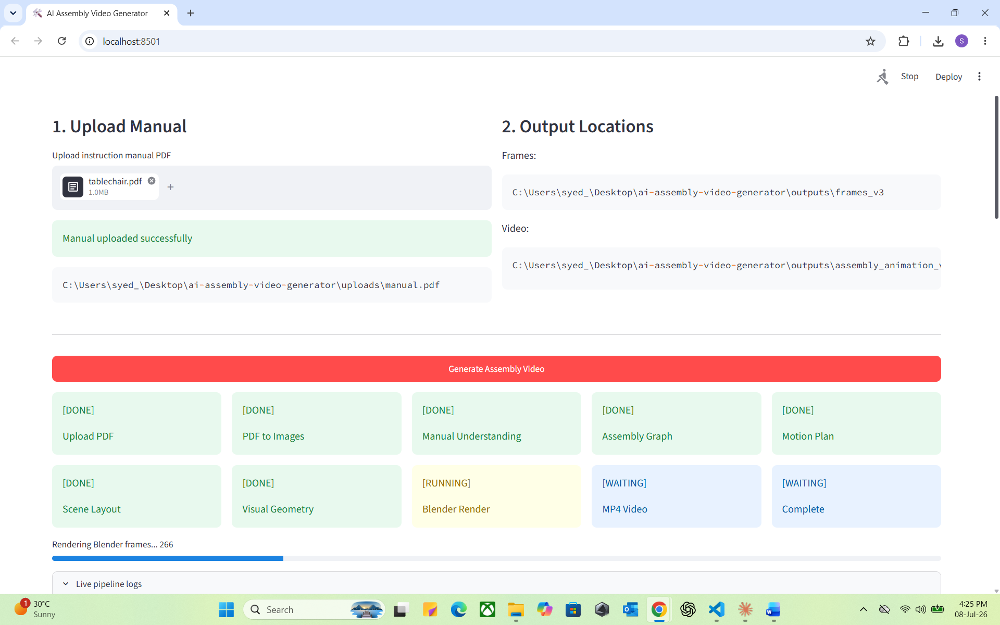

# 🚀 Azure AI Universal Assembly Video Generator

<p align="center">

**Upload any instructional manual → AI understands it → Generates a step-by-step animated assembly video**

*An experimental end-to-end AI pipeline for transforming static assembly manuals into animated visual instructions.*

</p>

---

## 💡 Why I Built This Project

When I moved to the UK, I quickly realised that many products I bought required self-assembly. Whether it was furniture, bicycles, shelving, children's toys, gym equipment, household appliances or other DIY products, they almost always arrived with only an instruction manual containing diagrams and very little text.

Although the manuals were technically correct, understanding the diagrams often took longer than assembling the product itself. If I misunderstood one step, I frequently had to undo the work and start again—wasting both time and effort.

Like most people, I searched YouTube for assembly videos. Sometimes they existed, but for many products they simply didn't.

That led me to ask a simple question:

> **What if AI could understand any instructional manual and automatically generate an animated assembly video?**

This project is my exploration of that idea.

The long-term vision is to help people assemble products more quickly and confidently by converting static manuals into AI-generated visual guidance.

---

# ✨ Current Capabilities

- Upload an instructional manual (PDF)
- Convert pages into images
- AI-based page understanding
- Extract parts, fasteners and tools
- Detect assembly actions
- Build a Universal Assembly Graph
- Generate a motion plan
- Create procedural proxy geometry
- Automatically generate Blender scenes
- Render an MP4 assembly animation
- Streamlit web interface

---

# 🏗 High-Level Architecture

```text
                    Upload PDF
                         │
                         ▼
                PDF → Page Images
                         │
                         ▼
              Azure GPT-4o Vision
                         │
                         ▼
               Page State Extraction
                         │
                         ▼
             Assembly Delta Detection
                         │
                         ▼
           Assembly Action Extraction
                         │
                         ▼
           Universal Assembly Graph
                         │
                         ▼
                Motion Planner
                         │
                         ▼
              Scene Layout Engine
                         │
                         ▼
        Diagram & Shape Extraction
                         │
                         ▼
          Procedural Geometry Builder
                         │
                         ▼
         Blender Python Script Builder
                         │
                         ▼
               Blender Rendering
                         │
                         ▼
                MP4 Assembly Video
```

---

# 🧠 Pipeline

1. Upload PDF
2. Convert PDF into page images
3. Analyse each page with AI
4. Identify parts, tools and fasteners
5. Detect assembly actions
6. Build assembly graph
7. Create motion plan
8. Generate scene layout
9. Generate proxy geometry
10. Generate Blender scene
11. Render animation
12. Export MP4

---

# 🛠 Technology Stack

- Azure AI Foundry
- Azure OpenAI GPT‑4o Vision
- Python
- Blender
- Streamlit
- MoviePy

---

# 📂 Project Structure

```text
app.py
config.py
uploads/
utils/
blender/
outputs/
v2/
 ├── agents/
 ├── builders/
 ├── rendering/
 ├── stabilize/
 └── outputs/
```

---

# ▶️ Running

```bash
pip install -r requirements.txt
streamlit run app.py
```

or

```bash
python v2/run_mvp_pipeline.py
```

---

# 📸 Demo

# 📸 Demo

The following screenshots demonstrate the complete AI pipeline, from uploading an assembly manual through AI understanding, Blender rendering, and the final generated animation.

---

## 🖥️ Streamlit Dashboard

### Home Screen


*Clean Streamlit interface for uploading any instructional manual.*

---

### Upload Manual


*Upload any PDF assembly manual and begin the AI pipeline.*

---

### AI Processing Pipeline


*Live pipeline showing progress through every AI stage.*

---

### Blender Rendering Progress


*Real-time Blender frame generation.*

---

### Pipeline Complete



*Successful completion of the full AI workflow.*

---

## 🎥 Generated Assembly Animation

### Final Generated Video


*AI-generated proxy assembly animation.*

---

### Frame Preview


*Preview of the first, middle and final rendered animation frames.*

---

### Animation GIF


*A short preview of the generated assembly animation.*

---

## 📄 AI JSON Outputs

### Downloadable AI Outputs


*Every AI stage exports structured JSON for transparency and debugging.*

---

### Individual JSON Downloads


*Download every intermediate AI artifact directly from the Streamlit interface.*

---

## 🧠 AI Pipeline

The project automatically executes the following pipeline:

```
Upload Manual PDF
        │
        ▼
PDF → Images
        │
        ▼
Azure GPT-4o Vision Analysis
        │
        ▼
Page Understanding
        │
        ▼
Assembly Action Extraction
        │
        ▼
Object Identity Resolution
        │
        ▼
Universal Assembly Graph
        │
        ▼
Motion Planning
        │
        ▼
Scene Layout Generation
        │
        ▼
Diagram Analysis
        │
        ▼
Part Shape Extraction
        │
        ▼
Proxy Geometry Generation
        │
        ▼
Automatic Blender Scene Generation
        │
        ▼
Frame Rendering
        │
        ▼
MoviePy Video Generation
        │
        ▼
Final MP4 Animation
```

---

## 🎬 Loom Walkthrough

A complete walkthrough explaining:

- Project motivation
- Overall architecture
- AI pipeline
- Universal Assembly Graph
- Motion Planning
- Blender rendering
- Streamlit application
- Current limitations
- Future roadmap

▶️ **Watch here**

```
https://www.loom.com/share/YOUR_LOOM_LINK
```

---

## 📂 Generated AI Artifacts

Each run generates downloadable JSON files including:

- page_states.json
- assembly_deltas.json
- assembly_actions.json
- object_identity_map.json
- resolved_assembly_actions.json
- universal_assembly_graph.json
- motion_plan.json
- scene_layout.json
- geometry_spec.json
- diagram_analysis.json
- part_shapes.json
- proxy_geometry.json

These intermediate outputs make the AI pipeline fully transparent, explainable, and easy to debug.

Add:

- Streamlit screenshots
- Pipeline screenshots
- Animation GIF
- Loom video

---

# ⚠️ Current Status

This repository represents an **experimental MVP (Minimum Viable Product)**.

The overall pipeline works from PDF upload through AI processing to Blender rendering and MP4 generation, but **it is not yet producing the level of assembly quality originally envisioned**.

Current limitations include:

- Generic proxy geometry instead of accurate product models
- Assembly motion that is functional but not yet realistic
- Limited understanding of complex manuals
- Some AI extraction errors on challenging diagrams
- Simplified procedural modelling
- Limited support for non-standard assembly sequences

These limitations are expected at this stage. The project was built to validate the complete AI pipeline and demonstrate the concept rather than provide a production-ready solution.

I intentionally chose to publish the project in its current state because I believe documenting the engineering journey—including the challenges and remaining work—is more valuable than presenting an unrealistic "finished" product.

---

# 🚀 Future Work

- More accurate AI understanding
- Better procedural 3D generation
- Realistic assembly sequencing
- Azure Speech narration
- Physics-aware animations
- Support for additional manual types
- Cloud deployment
- CAD-aware geometry generation

---

# 🤝 Contributing

Suggestions, ideas and pull requests are welcome.

---

# 📄 License

MIT License

---

# 👤 Author

**Syed Ali Haider**

This project is part of my Azure AI engineering portfolio and documents an ongoing exploration into using generative AI, computer vision and procedural graphics to make instructional manuals easier to understand.
