# 🚀 Azure AI Universal Assembly Video Generator

<p align="center">

**Upload any instructional manual → AI understands it → Generates a step-by-step animated assembly video**

*An experimental end-to-end AI pipeline for transforming static assembly manuals into animated visual instructions.*

</p>

---

## 💡 Why I Built This Project

When I moved to the UK, I quickly realised that many products I bought required self-assembly. Whether it was furniture, bicycles, shelving, children's toys, gym equipment, household appliances or other DIY products, they almost always arrived with only an instruction manual containing diagrams and very little text.

Although the manuals were technically correct, understanding the diagrams often took longer than assembling the product itself. If I misunderstood one step, I frequently had to undo the work and start again—wasting both time and effort.

Like most people, I searched YouTube for assembly videos. Sometimes they existed, but for many products they simply didn't.

That led me to ask a simple question:

> **What if AI could understand any instructional manual and automatically generate an animated assembly video?**

This project is my exploration of that idea.

The long-term vision is to help people assemble products more quickly and confidently by converting static manuals into AI-generated visual guidance.

---


# 🎯 Project Vision

The long-term vision of this project is to build a universal AI system capable of understanding **any instructional manual** and automatically generating an easy-to-follow animated assembly guide.

Unlike traditional rule-based systems that rely on manually authored 3D models or predefined animation sequences, this project attempts to reason directly from the assembly manual itself.

The system is designed to work with a wide range of products including:

- 🪑 Furniture
- 🚲 Bicycles
- 🏋️ Gym equipment
- 🧸 Children's toys
- 🏠 Household appliances
- 🧰 DIY kits
- 🏭 Industrial equipment

The objective is to bridge the gap between static instruction manuals and intuitive visual guidance using modern AI techniques including computer vision, reasoning, procedural graphics and automated animation generation.

---

# ✨ Current MVP Features

The current prototype demonstrates an end-to-end AI pipeline capable of:

- Uploading any instructional PDF
- Converting PDF pages into images
- Understanding diagrams using Azure GPT-4o Vision
- Detecting parts, fasteners and tools
- Tracking object identities across multiple pages
- Extracting assembly actions
- Building a Universal Assembly Graph
- Planning assembly motions
- Generating exploded assembly layouts
- Creating procedural proxy geometry
- Automatically generating Blender scenes
- Rendering MP4 assembly animations
- Exporting structured JSON outputs from every AI stage

---

# 🏗 Enterprise AI Pipeline Architecture

                        +--------------------+
                        |  Assembly PDF      |
                        +---------+----------+
                                  |
                                  v
                    +----------------------------+
                    | PDF Page Extraction        |
                    +-------------+--------------+
                                  |
                                  v
                    +----------------------------+
                    | Azure GPT-4o Vision        |
                    +-------------+--------------+
                                  |
                                  v
        +--------------------------------------------------+
        |      AI Understanding Pipeline                   |
        |--------------------------------------------------|
        | Diagram Detection                               |
        | Page State Extraction                           |
        | Assembly Delta Detection                        |
        | Object Identity Resolution                      |
        | Assembly Action Extraction                      |
        | Universal Assembly Graph Construction           |
        +----------------------+---------------------------+
                               |
                               v
        +--------------------------------------------------+
        |        Animation Planning Pipeline               |
        |--------------------------------------------------|
        | Motion Planner                                  |
        | Scene Layout Engine                             |
        | Procedural Geometry Generator                   |
        | Blender Script Generator                        |
        +----------------------+---------------------------+
                               |
                               v
                   +---------------------------+
                   | Blender Rendering Engine  |
                   +-------------+-------------+
                                 |
                                 v
                   +---------------------------+
                   | MP4 Assembly Animation    |
                   +---------------------------+

---

# ⚙️ How the AI Pipeline Works

The pipeline does not generate animations directly.

Instead, it gradually builds a digital understanding of the assembly process through multiple AI reasoning stages.

```
Assembly Manual
        │
        ▼
Visual Understanding
        │
        ▼
Object Recognition
        │
        ▼
Action Recognition
        │
        ▼
Object Identity Resolution
        │
        ▼
Universal Assembly Graph
        │
        ▼
Motion Planning
        │
        ▼
Scene Generation
        │
        ▼
Procedural Geometry
        │
        ▼
Blender Animation
        │
        ▼
Final MP4 Video
```

Each stage produces structured JSON outputs that are used by the following stage, making the entire AI pipeline transparent and explainable.

---

# 🧠 Pipeline

1. Upload PDF
2. Convert PDF into page images
3. Analyse each page with AI
4. Identify parts, tools and fasteners
5. Detect assembly actions
6. Build assembly graph
7. Create motion plan
8. Generate scene layout
9. Generate proxy geometry
10. Generate Blender scene
11. Render animation
12. Export MP4

---

## 📈 Current MVP

- ✅ 12+ AI processing stages
- ✅ 15+ JSON artifacts generated
- ✅ Blender automated rendering
- ✅ Streamlit interactive interface
- ✅ Azure GPT-4o Vision integration
- ✅ Universal Assembly Graph
- ✅ Motion Planning Engine
- ✅ Canonical Object Identity Resolution


---

# 🛠 Technology Stack

- Azure AI Foundry
- Azure OpenAI GPT‑4o Vision
- Python
- Blender
- Streamlit
- MoviePy

---

# 📂 Project Structure

```text
app.py
config.py
uploads/
utils/
blender/
outputs/
v2/
 ├── agents/
 ├── builders/
 ├── rendering/
 ├── stabilize/
 └── outputs/
```

---

# ▶️ Running

```bash
pip install -r requirements.txt
streamlit run app.py
```

or

```bash
python v2/run_mvp_pipeline.py
```

---

## 📂 Generated AI Artifacts

Each run generates downloadable JSON files including:

- page_states.json
- assembly_deltas.json
- assembly_actions.json
- object_identity_map.json
- resolved_assembly_actions.json
- universal_assembly_graph.json
- motion_plan.json
- scene_layout.json
- geometry_spec.json
- diagram_analysis.json
- part_shapes.json
- proxy_geometry.json

These intermediate outputs make the AI pipeline fully transparent, explainable, and easy to debug.


---
## ⭐ Key Features

- 🤖 Azure GPT-4o Vision powered manual understanding
- 📄 Accepts any instructional PDF
- 🧠 Universal Assembly Graph generation
- 🔄 Canonical Object Identity Resolution
- 🎯 Motion Planning Engine
- 📐 Procedural Scene Layout Generation
- 🧱 Automatic Proxy Geometry Creation
- 🎬 Blender Python Scene Generation
- 🎥 Automatic MP4 Rendering
- 🌐 Interactive Streamlit Dashboard
- 📊 Downloadable JSON outputs for every pipeline stage
- 🔍 Fully explainable AI pipeline

# 📸 Demo

The following screenshots demonstrate the complete AI pipeline, from uploading an assembly manual through AI understanding, Blender rendering, and the final generated animation.

---

# 🖥️ Streamlit Application

### Home Screen

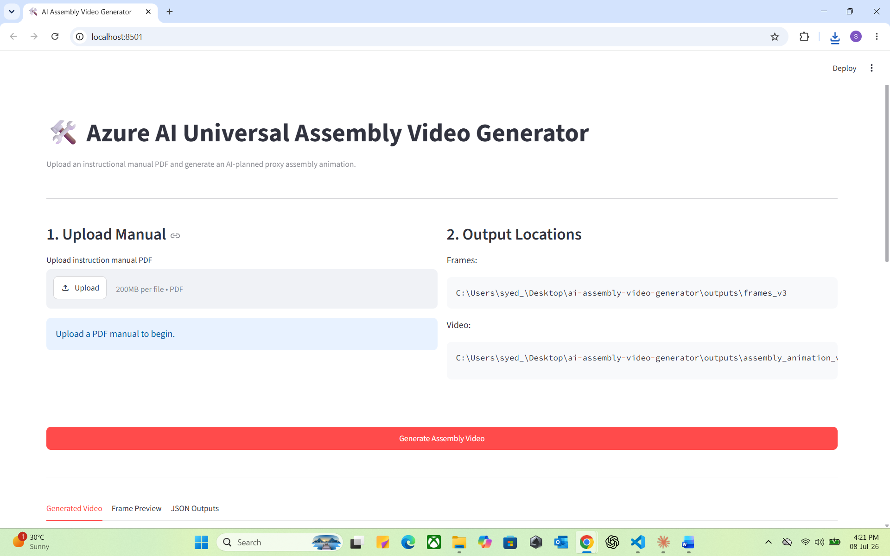

*Landing page of the Streamlit application.*

---

### Upload Manual

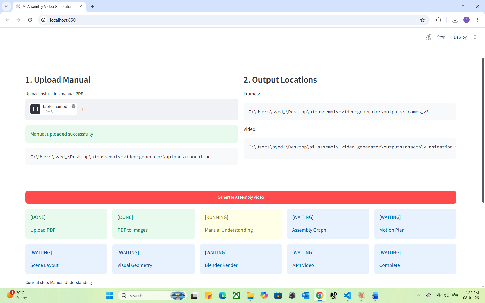

*Upload any instructional PDF to start the pipeline.*

---

### AI Processing

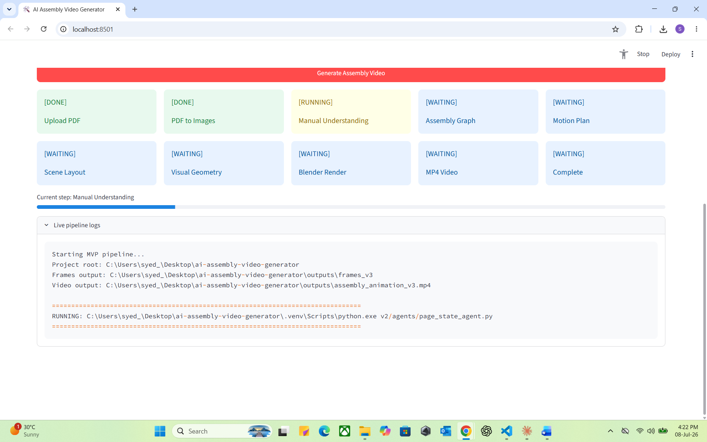

*Live AI pipeline showing every processing stage.*

---

# ⚙️ Pipeline Execution

### Live Pipeline Logs

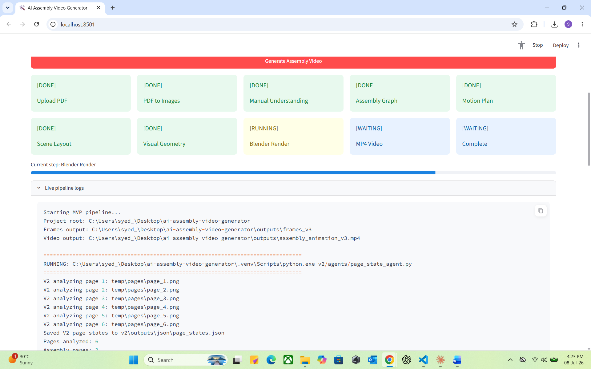

*Real-time logs from every AI agent.*

---

### Motion Planner

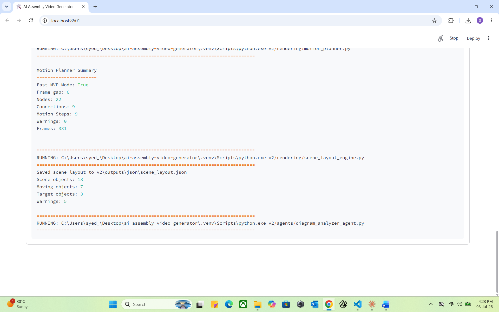

*Motion planning generated from the Universal Assembly Graph.*

---

### Blender Rendering

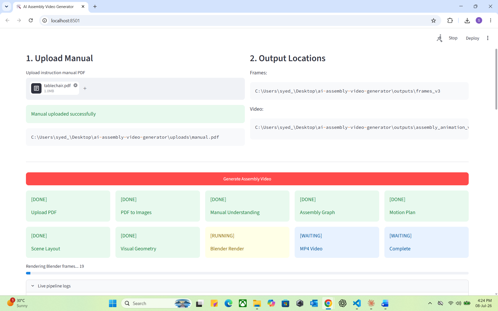

*Rendering frames inside Blender.*

---

### Live Frame Rendering Logs

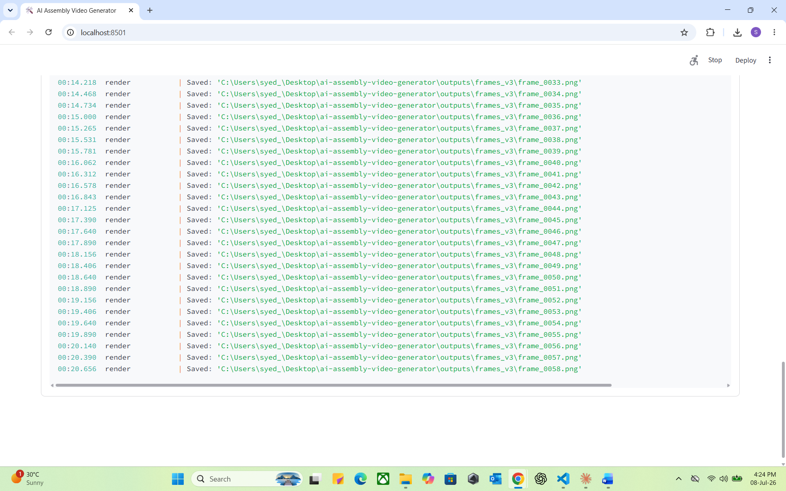

*Frame-by-frame rendering progress.*

---

### Pipeline Complete

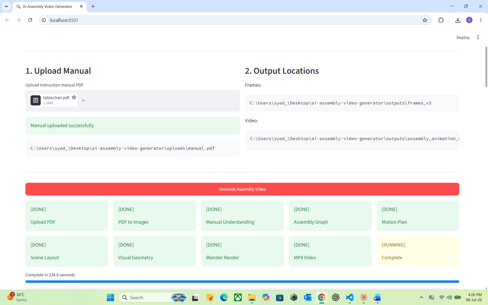

*Entire AI pipeline completed successfully.*

---

# 🎥 Generated Results

### Generated Assembly Video

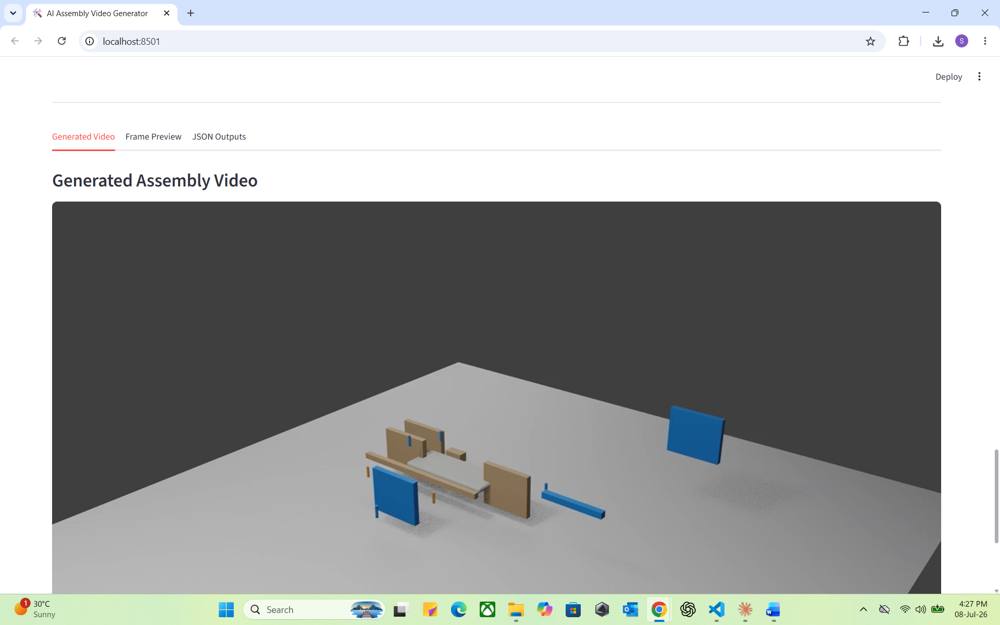

*Final AI-generated proxy assembly animation.*

---

### Frame Preview

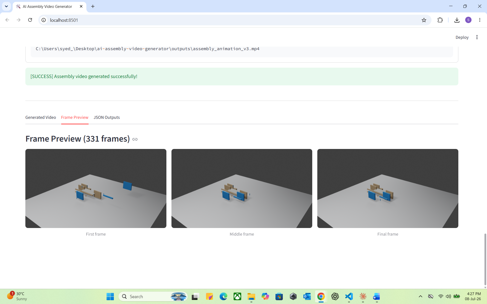

*Preview of the generated animation.*

---

### Animation Preview

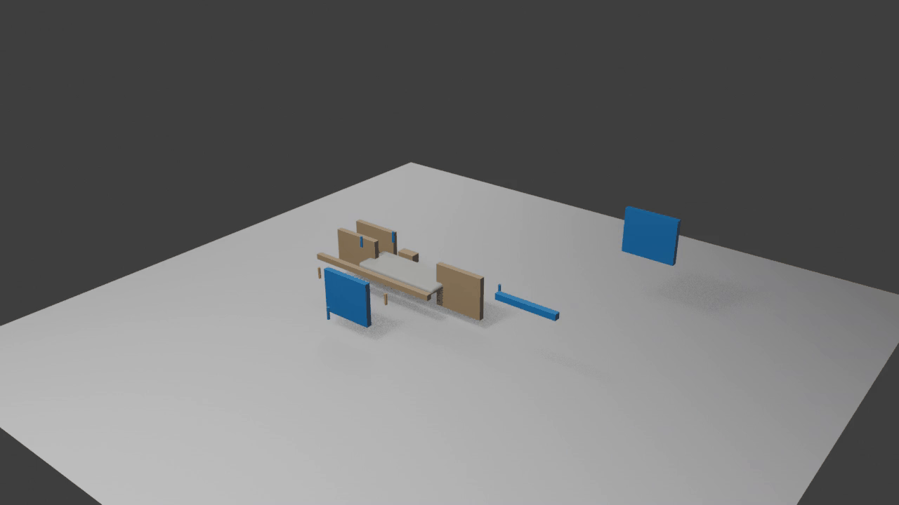

*A short GIF preview of the generated assembly video.*

---

### Download Individual JSON Files

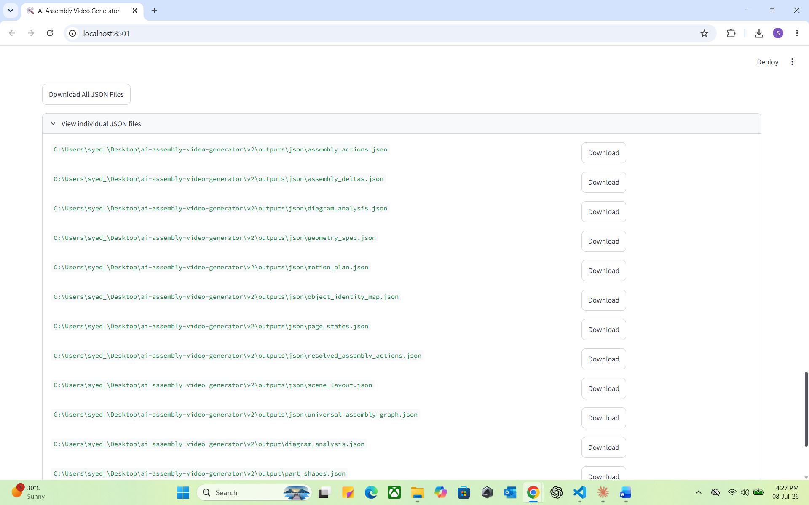

*Each intermediate AI artifact can be downloaded individually.*

---

# 🎬 Loom Walkthrough

A complete walkthrough explaining:

- Project motivation
- Architecture
- AI pipeline
- Universal Assembly Graph
- Motion Planner
- Blender rendering
- Streamlit application
- Current limitations
- Future roadmap

▶️ **Watch the complete demo**

```
https://www.loom.com/share/YOUR_LOOM_LINK
```
## 🚀 Repository Highlights

✔ End-to-end AI pipeline

✔ Azure GPT-4o Vision

✔ Blender automation

✔ Streamlit web application

✔ Explainable AI through downloadable JSON outputs

✔ Universal Assembly Graph

✔ Canonical Object Tracking

✔ Motion Planning Engine

✔ Procedural Geometry Generation

---

# ⚠️ Current Status

This repository represents an **experimental MVP (Minimum Viable Product)**.

The overall pipeline works from PDF upload through AI processing to Blender rendering and MP4 generation, but **it is not yet producing the level of assembly quality originally envisioned**.

Current limitations include:

- Generic proxy geometry instead of accurate product models
- Assembly motion that is functional but not yet realistic
- Limited understanding of complex manuals
- Some AI extraction errors on challenging diagrams
- Simplified procedural modelling
- Limited support for non-standard assembly sequences

These limitations are expected at this stage. The project was built to validate the complete AI pipeline and demonstrate the concept rather than provide a production-ready solution.

I intentionally chose to publish the project in its current state because I believe documenting the engineering journey—including the challenges and remaining work—is more valuable than presenting an unrealistic "finished" product.

---

# 🚀 Future Roadmap

## AI Improvements

- Better diagram understanding
- Multi-view reasoning
- Improved object tracking
- Higher confidence action extraction

## Graphics

- CAD-aware geometry generation
- Realistic materials
- Parametric modelling
- Better proxy objects

## Animation

- Physics-aware motion
- Collision detection
- Subassembly animation
- Camera path optimisation

## Cloud

- Azure Container Apps deployment
- Batch processing
- REST API
- Azure Blob integration

## User Experience

- Azure Speech narration
- Interactive playback
- Step-by-step controls
- Mobile-friendly interface


---

# 🤝 Contributing

Suggestions, ideas and pull requests are welcome.

---

# 📄 License

MIT License

---

# 👤 Author

**Syed Ali Haider**

This project is part of my Azure AI engineering portfolio and documents an ongoing exploration into using generative AI, computer vision and procedural graphics to make instructional manuals easier to understand.

---

# ⭐ Lessons Learned

This project demonstrates that generating assembly animations involves far more than simply rendering 3D objects.

The most challenging aspect is enabling AI to understand *how* a product is assembled through visual reasoning, object tracking and graph construction before any animation can be produced.

Although the current implementation remains an experimental MVP, it successfully validates the overall architecture and provides a strong foundation for future development toward a production-quality AI assembly system.

---

## ⚡ Disclaimer

This project is an experimental research prototype created for learning, exploration and portfolio purposes.

It demonstrates the feasibility of combining Azure OpenAI, computer vision and procedural graphics to automate assembly instruction generation. It should not yet be considered production-ready software.
